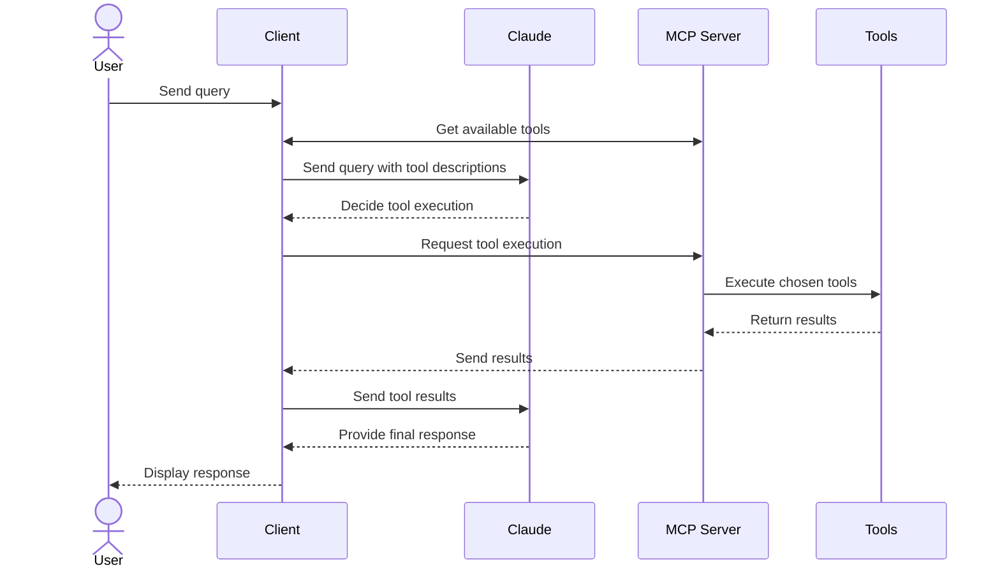

# 模型上下文协议

Source: https://mcp.gjxx.dev/llms-full.txt
Friendly site: MCP中文文档
Group: GJXX.DEV
Fetched: 2026-06-18T02:27:24.606Z
Status: 200
Content-Type: text/plain; charset=utf-8
Content-Status: captured

Note: page text was truncated by MAX_TEXT_CHARS_PER_PAGE.

## Content

# 模型上下文协议
Source: https://xiaom.mintlify.app/about/index

连接 AI 应用程序到上下文所在系统的开放协议

<div className="landing-page">
<section className="intro-video-section">
<div className="intro-logo">

</div>

<div className="intro-content">
<h2 className="intro-title">将您的 AI 应用程序连接到世界</h2>

<p className="intro-description">
AI 驱动的工具很强大，但它们通常局限于您手动提供的信息或需要定制集成。
</p>

<p className="intro-description">
无论是从您的计算机读取文件、搜索内部或外部知识库，还是在项目管理工具中更新任务，MCP 提供了一种安全、标准化、*简单*的方式来为 AI 系统提供所需的上下文。
</p>
</div>
</section>

<section className="how-section">
<h2 className="section-title">工作原理</h2>

<div className="steps-container">
<div className="step-number">1</div>

<div className="step-content">
<h3>选择 MCP 服务器</h3>

<p>
从预构建的服务器中选择热门工具，如 GitHub、Google Drive、Slack 等数百种工具。为完整工作流程组合多个服务器，或轻松构建自己的自定义集成。
</p>
</div>

<div className="step-number">2</div>

<div className="step-content">
<h3>连接您的 AI 应用程序</h3>

<p>
配置您的 AI 应用程序（如 Claude、VS Code 或 ChatGPT）以连接到您的 MCP 服务器。该应用程序现在可以看到所有连接服务器中可用的工具、资源和提示。
</p>
</div>

<div className="step-number">3</div>

<div className="step-content">
<h3>使用上下文工作</h3>

<p>
您的 AI 驱动应用程序现在可以访问真实数据、执行操作，并基于您的实际上下文提供更有帮助的响应。
</p>
</div>
</div>
</section>

<section className="ecosystem-section">
<h2 className="section-title">加入不断增长的生态系统</h2>

<div className="stats-grid">
<a href="/docs/sdk" target="_blank" className="stat-card">
<div className="stat-number">10</div>
<div className="stat-label">官方 SDK</div>
</a>

<a href="/clients" target="_blank" className="stat-card">
<div className="stat-number">80+</div>
<div className="stat-label">兼容客户端</div>
</a>

<a href="https://github.com/modelcontextprotocol/servers?tab=readme-ov-file#%EF%B8%8F-official-integrations" target="_blank" rel="noopener noreferrer" className="stat-card">
<div className="stat-number">1000+</div>
<div className="stat-label">可用服务器</div>
</a>
</div>
</section>

<section className="cta-buttons">
<a href="/docs/getting-started/intro" className="cta-primary">
开始使用
</a>
</section>
</div>

# 示例客户端
Source: https://xiaom.mintlify.app/clients

支持 MCP 集成的应用程序列表

此页面提供了支持模型上下文协议 (MCP) 的应用程序概述。每个客户端可能支持不同的 MCP 功能，从而允许与 MCP 服务器的不同级别的集成。

## 功能支持矩阵

<div id="feature-support-matrix-wrapper">
| 客户端 | [资源] | [提示] | [工具] | [发现] | [采样] | [根] | [引出] |
| ---------------------------------------------------------- | ---- | ---- | ---- | ---- | ---- | --- | ---- |
| [5ire][5ire] | ❌ | ❌ | ✅ | ❓ | ❌ | ❌ | ❓ |
| [AgentAI][AgentAI] | ❌ | ❌ | ✅ | ❓ | ❌ | ❌ | ❓ |
| [AgenticFlow][AgenticFlow] | ✅ | ✅ | ✅ | ✅ | ❌ | ❌ | ❓ |
| [AIQL TUUI][AIQL TUUI] | ✅ | ✅ | ✅ | ✅ | ✅ | ❌ | ✅ |
| [Amazon Q CLI][Amazon Q CLI] | ❌ | ✅ | ✅ | ❓ | ❌ | ❌ | ❓ |
| [Amazon Q IDE][Amazon Q IDE] | ❌ | ❌ | ✅ | ❌ | ❌ | ❌ | ❓ |
| [Amp][Amp] | ✅ | ✅ | ✅ | ❌ | ✅ | ❌ | ❓ |
| [Apify MCP Tester][Apify MCP Tester] | ❌ | ❌ | ✅ | ✅ | ❌ | ❌ | ❓ |
| [Augment Code][AugmentCode] | ❌ | ❌ | ✅ | ❌ | ❌ | ❌ | ❓ |
| [BeeAI Framework][BeeAI Framework] | ❌ | ❌ | ✅ | ❌ | ❌ | ❌ | ❓ |
| [BoltAI][BoltAI] | ❌ | ❌ | ✅ | ❓ | ❌ | ❌ | ❓ |
| [Call Chirp][Call Chirp] | ❌ | ✅ | ✅ | ❌ | ❌ | ❌ | ❓ |
| [Chatbox][Chatbox] | ❌ | ❌ | ✅ | ❌ | ❌ | ❌ | ❌ |
| [ChatFrame][ChatFrame] | ❌ | ❌ | ✅ | ❌ | ❌ | ❌ | ❌ |
| [ChatGPT][ChatGPT] | ❌ | ❌ | ✅ | ❌ | ❌ | ❌ | ❓ |
| [ChatWise][ChatWise] | ❌ | ❌ | ✅ | ❌ | ❌ | ❌ | ❓ |
| [Claude.ai][Claude.ai] | ✅ | ✅ | ✅ | ❌ | ❌ | ❌ | ❓ |
| [Claude Code][Claude Code] | ✅ | ✅ | ✅ | ❌ | ❌ | ✅ | ❓ |
| [Claude Desktop App][Claude Desktop] | ✅ | ✅ | ✅ | ❌ | ❌ | ❌ | ❓ |
| [Chorus][Chorus] | ❌ | ❌ | ✅ | ❓ | ❌ | ❌ | ❓ |
| [Cline][Cline] | ✅ | ❌ | ✅ | ✅ | ❌ | ❌ | ❓ |
| [CodeGPT][CodeGPT] | ❌ | ❌ | ✅ | ❓ | ❌ | ❌ | ❓ |
| [Continue][Continue] | ✅ | ✅ | ✅ | ❓ | ❌ | ❌ | ❓ |
| [Copilot-MCP][CopilotMCP] | ✅ | ❌ | ✅ | ❓ | ❌ | ❌ | ❓ |
| [Cursor][Cursor] | ✅ | ✅ | ✅ | ❌ | ❌ | ✅ | ✅ |
| [Daydreams Agents][Daydreams] | ✅ | ✅ | ✅ | ❌ | ❌ | ❌ | ❓ |
| [ECA][ECA] | ✅ | ✅ | ✅ | ❌ | ❌ | ✅ | ❓ |
| [Emacs Mcp][Mcp.el] | ❌ | ❌ | ✅ | ❌ | ❌ | ❌ | ❓ |
| [fast-agent][fast-agent] | ✅ | ✅ | ✅ | ✅ | ✅ | ✅ | ✅ |
| [FlowDown][FlowDown] | ❌ | ❌ | ✅ | ❓ | ❌ | ❌ | ❌ |
| [FLUJO][FLUJO] | ❌ | ❌ | ✅ | ❓ | ❌ | ❌ | ❓ |
| [Genkit][Genkit] | ⚠️ | ✅ | ✅ | ❓ | ❌ | ❌ | ❓ |
| [Glama][Glama] | ✅ | ✅ | ✅ | ❓ | ❌ | ❌ | ❓ |
| [Gemini CLI][Gemini CLI] | ❌ | ✅ | ✅ | ❓ | ❌ | ❌ | ❓ |
| [GenAIScript][GenAIScript] | ❌ | ❌ | ✅ | ❓ | ❌ | ❌ | ❓ |
| [GitHub Copilot coding agent][GitHubCopilotCodingAgent] | ❌ | ❌ | ✅ | ❌ | ❌ | ❌ | ❌ |
| [Goose][Goose] | ✅ | ✅ | ✅ | ❓ | ❌ | ❌ | ❓ |
| [gptme][gptme] | ❌ | ❌ | ✅ | ❓ | ❌ | ❌ | ❓ |
| [HyperAgent][HyperAgent] | ❌ | ❌ | ✅ | ❓ | ❌ | ❌ | ❓ |
| [Jenova][Jenova] | ❌ | ❌ | ✅ | ✅ | ❌ | ❌ | ❓ |
| [JetBrains AI Assistant][JetBrains AI Assistant] | ❌ | ❌ | ✅ | ❌ | ❌ | ❌ | ❓ |
| [JetBrains Junie][JetBrains Junie] | ❌ | ❌ | ✅ | ❌ | ❌ | ❌ | ❌ |
| [Kilo Code][Kilo Code] | ✅ | ❌ | ✅ | ✅ | ❌ | ❌ | ❓ |
| [Klavis AI Slack/Discord/Web][Klavis AI] | ✅ | ❌ | ✅ | ❓ | ❌ | ❌ | ❓ |
| [Langflow][Langflow] | ❌ | ❌ | ✅ | ❓ | ❌ | ❌ | ❓ |
| [LibreChat][LibreChat] | ❌ | ❌ | ✅ | ❓ | ❌ | ❌ | ❓ |
| [LM-Kit.NET][LM-Kit.NET] | ❌ | ❌ | ✅ | ❌ | ❌ | ❌ | ❌ |
| [LM Studio][LM Studio] | ❌ | ❌ | ✅ | ❓ | ❌ | ❌ | ❓ |
| [Lutra][Lutra] | ✅ | ✅ | ✅ | ❓ | ❌ | ❌ | ❓ |
| [MCP Bundler for MacOS][mcp-bundler] | ✅ | ✅ | ✅ | ❌ | ❌ | ❌ | ❌ |
| [mcp-agent][mcp-agent] | ✅ | ✅ | ✅ | ❓ | ⚠️ | ✅ | ✅ |
| [mcp-client-chatbot][mcp-client-chatbot] | ❌ | ❌ | ✅ | ❌ | ❌ | ❌ | ❓ |
| [MCPJam][MCPJam] | ✅ | ✅ | ✅ | ❓ | ❌ | ❌ | ✅ |
| [mcp-use][mcp-use] | ✅ | ✅ | ✅ | ✅ | ✅ | ❌ | ✅ |
| [modelcontextchat.com][modelcontextchat.com] | ❌ | ❌ | ✅ | ❓ | ❌ | ❌ | ❓ |
| [MCPHub][MCPHub] | ✅ | ✅ | ✅ | ❓ | ❌ | ❌ | ❓ |
| [MCPOmni-Connect][MCPOmni-Connect] | ✅ | ✅ | ✅ | ❓ | ✅ | ❌ | ❓ |
| [Memex][Memex] | ✅ | ✅ | ✅ | ❓ | ❌ | ❌ | ❓ |
| [Microsoft Copilot Studio] | ✅ | ❌ | ✅ | ✅ | ❌ | ❌ | ❓ |
| [MindPal][MindPal] | ❌ | ❌ | ✅ | ❓ | ❌ | ❌ | ❓ |
| [Mistral AI: Le Chat][Mistral AI: Le Chat] | ❌ | ❌ | ✅ | ❌ | ❌ | ❌ | ❓ |
| [MooPoint][MooPoint] | ❌ | ❌ | ✅ | ❓ | ✅ | ❌ | ❓ |
| [Msty Studio][Msty Studio] | ❌ | ❌ | ✅ | ❓ | ❌ | ❌ | ❓ |
| [Needle][Needle] | ✅ | ✅ | ✅ | ✅ | ❌ | ❌ | ❓ |
| [NVIDIA Agent Intelligence toolkit][AIQ toolkit] | ❌ | ❌ | ✅ | ❓ | ❌ | ❌ | ❓ |
| [OpenSumi][OpenSumi] | ❌ | ❌ | ✅ | ❓ | ❌ | ❌ | ❓ |
| [oterm][oterm] | ❌ | ✅ | ✅ | ❓ | ✅ | ❌ | ❓ |
| [Postman][postman] | ✅ | ✅ | ✅ | ❓ | ❌ | ❌ | ❓ |
| [RecurseChat][RecurseChat] | ❌ | ❌ | ✅ | ❓ | ❌ | ❌ | ❓ |
| [Roo Code][Roo Code] | ✅ | ❌ | ✅ | ❓ | ❌ | ❌ | ❓ |
| [Shortwave][Shortwave] | ❌ | ❌ | ✅ | ❓ | ❌ | ❌ | ❓ |
| [Simtheory][Simtheory] | ✅ | ✅ | ✅ | ✅ | ❌ | ❌ | ❓ |
| [Slack MCP Client][Slack MCP Client] | ❌ | ❌ | ✅ | ❓ | ❌ | ❌ | ❓ |
| [Smithery Playground][Smithery Playground] | ✅ | ✅ | ✅ | ❓ | ❌ | ❌ | ❓ |
| [SpinAI][SpinAI] | ❌ | ❌ | ✅ | ❓ | ❌ | ❌ | ❓ |
| [Superinterface][Superinterface] | ❌ | ❌ | ✅ | ❓ | ❌ | ❌ | ❓ |
| [Superjoin][Superjoin] | ❌ | ❌ | ✅ | ❓ | ❌ | ❌ | ❓ |
| [Swarms][Swarms] | ❌ | ❌ | ✅ | ✅ | ❌ | ❌ | ❓ |
| [systemprompt][systemprompt] | ✅ | ✅ | ✅ | ❓ | ✅ | ❌ | ❓ |
| [Tambo][Tambo] | ❌ | ❌ | ✅ | ❓ | ✅ | ❌ | ❓ |
| [Tencent CloudBase AI DevKit][Tencent CloudBase AI DevKit] | ❌ | ❌ | ✅ | ❓ | ❌ | ❌ | ❓ |
| [TheiaAI/TheiaIDE][TheiaAI/TheiaIDE] | ❌ | ❌ | ✅ | ❓ | ❌ | ❌ | ❓ |
| [Tome][Tome] | ❌ | ❌ | ✅ | ❓ | ❌ | ❌ | ❓ |
| [TypingMind App][TypingMind App] | ❌ | ❌ | ✅ | ❓ | ❌ | ❌ | ❓ |
| [VS Code GitHub Copilot][VS Code] | ✅ | ✅ | ✅ | ✅ | ✅ | ✅ | ✅ |
| [VT Code][VT Code] | ✅ | ✅ | ✅ | ✅ | ⚠️ | ✅ | ✅ |
| [Warp][Warp] | ✅ | ❌ | ✅ | ✅ | ❌ | ❌ | ❓ |
| [WhatsMCP][WhatsMCP] | ❌ | ❌ | ✅ | ❌ | ❌ | ❌ | ❓ |
| [Windsurf Editor][Windsurf] | ❌ | ❌ | ✅ | ✅ | ❌ | ❌ | ❓ |
| [Witsy][Witsy] | ❌ | ❌ | ✅ | ❓ | ❌ | ❌ | ❓ |
| [Zed][Zed] | ❌ | ✅ | ✅ | ❌ | ❌ | ❌ | ❓ |
| [Zencoder][Zencoder] | ❌ | ❌ | ✅ | ❌ | ❌ | ❌ | ❓ |

[资源]: /docs/concepts/resources

[提示]: /docs/concepts/prompts

[工具]: /docs/concepts/tools

[发现]: /docs/concepts/tools#tool-discovery-and-updates

[采样]: /docs/concepts/sampling

[根]: /docs/concepts/roots

[引出]: /docs/concepts/elicitation

[5ire]: https://github.com/nanbingxyz/5ire

[AgentAI]: https://github.com/AdamStrojek/rust-agentai

[AgenticFlow]: https://agenticflow.ai/mcp

[AIQ toolkit]: https://github.com/NVIDIA/AIQToolkit

[AIQL TUUI]: https://github.com/AI-QL/tuui

[Amazon Q CLI]: https://github.com/aws/amazon-q-developer-cli

[Amazon Q IDE]: https://aws.amazon.com/q/developer

[Amp]: https://ampcode.com

[Apify MCP Tester]: https://apify.com/jiri.spilka/tester-mcp-client

[AugmentCode]: https://augmentcode.com

[BeeAI Framework]: https://framework.beeai.dev

[BoltAI]: https://boltai.com

[Call Chirp]: https://www.call-chirp.com

[Chatbox]: https://chatboxai.app

[ChatFrame]: https://chatframe.co

[ChatGPT]: https://chatgpt.com

[ChatWise]: https://chatwise.app

[Claude.ai]: https://claude.ai

[Claude Code]: https://claude.com/product/claude-code

[Claude Desktop]: https://claude.ai/download

[Chorus]: https://chorus.sh

[Cline]: https://github.com/cline/cline

[CodeGPT]: https://codegpt.co

[Continue]: https://github.com/continuedev/continue

[CopilotMCP]: https://github.com/VikashLoomba/copilot-mcp

[Cursor]: https://cursor.com

[Daydreams]: https://github.com/daydreamsai/daydreams

[ECA]: https://eca.dev

[Klavis AI]: https://www.klavis.ai/

[Mcp.el]: https://github.com/lizqwerscott/mcp.el

[fast-agent]: https://github.com/evalstate/fast-agent

[FlowDown]: https://github.com/Lakr233/FlowDown

[FLUJO]: https://github.com/mario-andreschak/flujo

[Glama]: https://glama.ai/chat

[Gemini CLI]: https://goo.gle/gemini-cli

[Genkit]: https://github.com/firebase/genkit

[GenAIScript]: https://microsoft.github.io/genaiscript/reference/scripts/mcp-tools/

[GitHubCopilotCodingAgent]: https://docs.github.com/en/enterprise-cloud@latest/copilot/concepts/about-copilot-coding-agent

[Goose]: https://block.github.io/goose/docs/goose-architecture/#interoperability-with-extensions

[Jenova]: https://www.jenova.ai

[JetBrains AI Assistant]: https://plugins.jetbrains.com/plugin/22282-jetbrains-ai-assistant

[JetBrains Junie]: https://www.jetbrains.com/junie

[Kilo Code]: https://github.com/Kilo-Org/kilocode

[Langflow]: https://github.com/langflow-ai/langflow

[LibreChat]: https://github.com/danny-avila/LibreChat

[LM-Kit.NET]: https://lm-kit.com/products/lm-kit-net/

[LM Studio]: https://lmstudio.ai

[Lutra]: https://lutra.ai

[mcp-bundler]: https://mcp-bundler.maketry.xyz

[mcp-agent]: https://github.com/lastmile-ai/mcp-agent

[mcp-client-chatbot]: https://github.com/cgoinglove/mcp-client-chatbot

[MCPJam]: https://github.com/MCPJam/inspector

[mcp-use]: https://github.com/pietrozullo/mcp-use

[modelcontextchat.com]: https://modelcontextchat.com

[MCPHub]: https://github.com/ravitemer/mcphub.nvim

[MCPOmni-Connect]: https://github.com/Abiorh001/mcp_omni_connect

[Memex]: https://memex.tech/

[Microsoft Copilot Studio]: https://learn.microsoft.com/en-us/microsoft-copilot-studio/agent-extend-action-mcp

[MindPal]: https://mindpal.io

[Mistral AI: Le Chat]: https://chat.mistral.ai

[MooPoint]: https://moopoint.io

[Msty Studio]: https://msty.ai

[Needle]: https://needle.app

[OpenSumi]: https://github.com/opensumi/core

[oterm]: https://github.com/ggozad/oterm

[Postman]: https://postman.com/downloads

[RecurseChat]: https://recurse.chat/

[Roo Code]: https://roocode.com

[Shortwave]: https://www.shortwave.com

[Simtheory]: https://simtheory.ai

[Slack MCP Client]: https://github.com/tuannvm/slack-mcp-client

[Smithery Playground]: https://smithery.ai/playground

[SpinAI]: https://docs.spinai.dev

[Superinterface]: https://superinterface.ai

[Superjoin]: https://superjoin.ai

[Swarms]: https://github.com/kyegomez/swarms

[systemprompt]: https://systemprompt.io

[Tambo]: https://tambo.co

[Tencent CloudBase AI DevKit]: https://docs.cloudbase.net/ai/agent/mcp

[TheiaAI/TheiaIDE]: https://eclipsesource.com/blogs/2024/12/19/theia-ide-and-theia-ai-support-mcp/

[Tome]: https://github.com/runebookai/tome

[TypingMind App]: https://www.typingmind.com

[VS Code]: https://code.visualstudio.com/

[VT Code]: https://github.com/vinhnx/vtcode

[Windsurf]: https://codeium.com/windsurf

[gptme]: https://github.com/gptme/gptme

[Warp]: https://www.warp.dev/

[WhatsMCP]: https://wassist.app/mcp/

[Witsy]: https://github.com/nbonamy/witsy

[Zed]: https://zed.dev

[Zencoder]: https://zencoder.ai

[HyperAgent]: https://github.com/hyperbrowserai/HyperAgent
</div>

## 客户端详情

### 5ire

[5ire](https://github.com/nanbingxyz/5ire) is an open source cross-platform desktop AI assistant that supports tools through MCP servers.

**Key features:**

* Built-in MCP servers can be quickly enabled and disabled.
* Users can add more servers by modifying the configuration file.
* It is open-source and user-friendly, suitable for beginners.
* Future support for MCP will be continuously improved.

### AgentAI

[AgentAI](https://github.com/AdamStrojek/rust-agentai) is a Rust library designed to simplify the creation of AI agents. The library includes seamless integration with MCP Servers.

[Example of MCP Server integration](https://github.com/AdamStrojek/rust-agentai/blob/master/examples/tools_mcp.rs)

**Key features:**

* Multi-LLM – We support most LLM APIs (OpenAI, Anthropic, Gemini, Ollama, and all OpenAI API Compatible).
* Built-in support for MCP Servers.
* Create agentic flows in a type- and memory-safe language like Rust.

### AgenticFlow

[AgenticFlow](https://agenticflow.ai/) is a no-code AI platform that helps you build agents that handle sales, marketing, and creative tasks around the clock. Connect 2,500+ APIs and 10,000+ tools securely via MCP.

**Key features:**

* No-code AI agent creation and workflow building.
* Access a vast library of 10,000+ tools and 2,500+ APIs through MCP.
* Simple 3-step process to connect MCP servers.
* Securely manage connections and revoke access anytime.

**Learn more:**

* [AgenticFlow MCP Integration](https://agenticflow.ai/mcp)

### AIQL TUUI

[AIQL TUUI] is a native, cross-platform desktop AI chat application with MCP support. It supports multiple AI providers (e.g., Anthropic, Cloudflare, Deepseek, OpenAI, Qwen), local AI models (via vLLM, Ray, etc.), and aggregated API platforms (such as Deepinfra, Openrouter, and more).

**Key features:**

* **Dynamic LLM API & Agent Switching**: Seamlessly toggle between different LLM APIs and agents on the fly.
* **Comprehensive Capabilities Support**: Built-in support for tools, prompts, resources, and sampling methods.
* **Configurable Agents**: Enhanced flexibility with selectable and customizable tools via agent settings.
* **Advanced Sampling Control**: Modify sampling parameters and leverage multi-round sampling for optimal results.
* **Cross-Platform Compatibility**: Fully compatible with macOS, Windows, and Linux.
* **Free & Open-Source (FOSS)**: Permissive licensing allows modifications and custom app bundling.

**Learn more:**

* [TUUI document](https://www.tuui.com/)
* [AIQL GitHub repository](https://github.com/AI-QL)

### Amazon Q CLI

[Amazon Q CLI](https://github.com/aws/amazon-q-developer-cli) is an open-source, agentic coding assistant for terminals.

**Key features:**

* Full support for MCP servers.
* Edit prompts using your preferred text editor.
* Access saved prompts instantly with `@`.
* Control and organize AWS resources directly from your terminal.
* Tools, profiles, context management, auto-compact, and so much more!

**Get Started**

```bash theme={null}
brew install amazon-q
```

### Amazon Q IDE

[Amazon Q IDE](https://aws.amazon.com/q/developer) is an open-source, agentic coding assistant for IDEs.

**Key features:**

* Support for the VSCode, JetBrains, Visual Studio, and Eclipse IDEs.
* Control and organize AWS resources directly from your IDE.
* Manage permissions for each MCP tool via the IDE user interface.

### Apify MCP Tester

[Apify MCP Tester](https://github.com/apify/tester-mcp-client) is an open-source client that connects to any MCP server using Server-Sent Events (SSE).
It is a standalone Apify Actor designed for testing MCP servers over SSE, with support for Authorization headers.
It uses plain JavaScript (old-school style) and is hosted on Apify, allowing you to run it without any setup.

**Key features:**

* Connects to any MCP server via SSE.
* Works with the [Apify MCP Server](https://apify.com/apify/actors-mcp-server) to interact with one or more Apify [Actors](https://apify.com/store).
* Dynamically utilizes tools based on context and user queries (if supported by the server).

### Amp

[Amp](https://ampcode.com) is an agentic coding tool built by Sourcegraph. It runs in VS Code (and compatible forks like Cursor, Windsurf, and VSCodium), JetBrains IDEs, Neovim, and as a command-line tool. It’s also multiplayer — you can share threads and collaborate with your team.

**Key features:**

* Granular control over enabled tools and permissions
* Support for MCP servers defined in VS Code `mcp.json`

### Augment Code

[Augment Code](https://augmentcode.com) is an AI-powered coding platform for VS Code and JetBrains with autonomous agents, chat, and completions. Both local and remote agents are backed by full codebase awareness and native support for MCP, enabling enhanced context through external sources and tools.

**Key features:**

* Full MCP support in local and remote agents.
* Add additional context through MCP servers.
* Automate your development workflows with MCP tools.
* Works in VS Code and JetBrains IDEs.

### BeeAI Framework

[BeeAI Framework](https://framework.beeai.dev) is an open-source framework for building, deploying, and serving powerful agentic workflows at scale. The framework includes the **MCP Tool**, a native feature that simplifies the integration of MCP servers into agentic workflows.

**Key features:**

* Seamlessly incorporate MCP tools into agentic workflows.
* Quickly instantiate framework-native tools from connected MCP client(s).
* Planned future support for agentic MCP capabilities.

**Learn more:**

* [Example of using MCP tools in agentic workflow](https://i-am-bee.github.io/beeai-framework/#/typescript/tools?id=using-the-mcptool-class)

### BoltAI

[BoltAI](https://boltai.com) is a native, all-in-one AI chat client with MCP support. BoltAI supports multiple AI providers (OpenAI, Anthropic, Google AI...), including local AI models (via Ollama, LM Studio or LMX)

**Key features:**

* MCP Tool integrations: once configured, user can enable individual MCP server in each chat
* MCP quick setup: import configuration from Claude Desktop app or Cursor editor
* Invoke MCP tools inside any app with AI Command feature
* Integrate with remote MCP servers in the mobile app

**Learn more:**

* [BoltAI docs](https://boltai.com/docs/plugins/mcp-servers)
* [BoltAI website](https://boltai.com)

### Call Chirp

[Call Chirp] [https://www.call-chirp.com](https://www.call-chirp.com) uses AI to capture every critical detail from your business conversations, automatically syncing insights to your CRM and project tools so you never miss another deal-closing moment.

**Key features:**

* Save transcriptions from Zoom, Google Meet, and more
* MCP Tools for voice AI agents
* Remote MCP servers support

### Chatbox

Chatbox is a better UI and desktop app for ChatGPT, Claude, and other LLMs, available on Windows, Mac, Linux, and the web. It's open-source and has garnered 37K stars⭐ on GitHub.

**Key features:**

* Tools support for MCP servers
* Support both local and remote MCP servers
* Built-in MCP servers marketplace

### ChatFrame

A cross-platform desktop chatbot that unifies access to multiple AI language models, supports custom tool integration via MCP servers, and enables RAG conversations with your local files—all in a single, polished app for macOS and Windows.

**Key features:**

* Unified access to top LLM providers (OpenAI, Anthropic, DeepSeek, xAI, and more) in one interface
* Built-in retrieval-augmented generation (RAG) for instant, private search across your PDFs, text, and code files
* Plug-in system for custom tools via Model Context Protocol (MCP) servers
* Multimodal chat: supports images, text, and live interactive artifacts

### ChatGPT

ChatGPT is OpenAI's AI assistant that provides MCP support for remote servers to conduct deep research.

**Key features:**

* Support for MCP via connections UI in settings
* Access to search tools from configured MCP servers for deep research
* Enterprise-grade security and compliance features

### ChatWise

ChatWise is a desktop-optimized, high-performance chat application that lets you bring your own API keys. It supports a wide range of LLMs and integrates with MCP to enable tool workflows.

**Key features:**

* Tools support for MCP servers
* Offer built-in tools like web search, artifacts and image generation.

### Claude Code

Claude Code is an interactive agentic coding tool from Anthropic that helps you code faster through natural language commands. It supports MCP integration for resources, prompts, tools, and roots, and also functions as an MCP server to integrate with other clients.

**Key features:**

* Full support for resources, prompts, tools, and roots from MCP servers
* Offers its own tools through an MCP server for integrating with other MCP clients

### Claude.ai

[Claude.ai](https://claude.ai) is Anthropic's web-based AI assistant that provides MCP support for remote servers.

**Key features:**

* Support for remote MCP servers via integrations UI in settings
* Access to tools, prompts, and resources from configured MCP servers
* Seamless integration with Claude's conversational interface
* Enterprise-grade security and compliance features

### Claude Desktop App

The Claude desktop application provides comprehensive support for MCP, enabling deep integration with local tools and data sources.

**Key features:**

* Full support for resources, allowing attachment of local files and data
* Support for prompt templates
* Tool integration for executing commands and scripts
* Local server connections for enhanced privacy and security

### Chorus

[Chorus](https://chorus.sh) is a native Mac app for chatting with AIs. Chat with multiple models at once, run tools and MCPs, create projects, quick chat, bring your own key, all in a blazing fast, keyboard shortcut friendly app.

**Key features:**

* MCP support with one-click install
* Built in tools, like web search, terminal, and image generation
* Chat with multiple models at once (cloud or local)
* Create projects with scoped memory
* Quick chat with an AI that can see your screen

### Cline

[Cline](https://github.com/cline/cline) is an autonomous coding agent in VS Code that edits files, runs commands, uses a browser, and more–with your permission at each step.

**Key features:**

* Create and add tools through natural language (e.g. "add a tool that searches the web")
* Share custom MCP servers Cline creates with others via the `~/Documents/Cline/MCP` directory
* Displays configured MCP servers along with their tools, resources, and any error logs

### CodeGPT

[CodeGPT](https://codegpt.co) is a popular VS Code and Jetbrains extension that brings AI-powered coding assistance to your editor. It supports integration with MCP servers for tools, allowing users to leverage external AI capabilities directly within their development workflow.

**Key features:**

* Use MCP tools from any configured MCP server
* Seamless integration with VS Code and Jetbrains UI
* Supports multiple LLM providers and custom endpoints

**Learn more:**

* [CodeGPT Documentation](https://docs.codegpt.co/)

### Continue

[Continue](https://github.com/continuedev/continue) is an open-source AI code assistant, with built-in support for all MCP features.

**Key features:**

* Type "@" to mention MCP resources
* Prompt templates surface as slash commands
* Use both built-in and MCP tools directly in chat
* Supports VS Code and JetBrains IDEs, with any LLM

### Copilot-MCP

[Copilot-MCP](https://github.com/VikashLoomba/copilot-mcp) enables AI coding assistance via MCP.

**Key features:**

* Support for MCP tools and resources
* Integration with development workflows
* Extensible AI capabilities

### Cursor

[Cursor](https://docs.cursor.com/context/mcp#protocol-support) is an AI code editor.

**Key features:**

* Support for MCP tools in Cursor Composer
* Support for roots
* Support for prompts
* Support for elicitation
* Support for both STDIO and SSE

### Daydreams

[Daydreams](https://github.com/daydreamsai/daydreams) is a generative agent framework for executing anything onchain

**Key features:**

* Supports MCP Servers in config
* Exposes MCP Client

### ECA - Editor Code Assistant

[ECA](https://eca.dev) is a Free and open-source editor-agnostic tool that aims to easily link LLMs and Editors, giving the best UX possible for AI pair programming using a well-defined protocol

**Key features:**

* **Editor-agnostic**: protocol for any editor to integrate.
* **Single configuration**: Configure eca making it work the same in any editor via global or local configs.
* **Chat** interface: ask questions, review code, work together to code.
* **Agentic**: let LLM work as an agent with its native tools and MCPs you can configure.
* **Context**: support: giving more details about your code to the LLM, including MCP resources and prompts.
* **Multi models**: Login to OpenAI, Anthropic, Copilot, Ollama local models and many more.
* **OpenTelemetry**: Export metrics of tools, prompts, server usage.

**Learn more:**

* [ECA website](https://eca.dev)
* [ECA source code](https://github.com/editor-code-assistant/eca)

### Emacs Mcp

[Emacs Mcp](https://github.com/lizqwerscott/mcp.el) is an Emacs client designed to interface with MCP servers, enabling seamless connections and interactions. It provides MCP tool invocation support for AI plugins like [gptel](https://github.com/karthink/gptel) and [llm](https://github.com/ahyatt/llm), adhering to Emacs' standard tool invocation format. This integration enhances the functionality of AI tools within the Emacs ecosystem.

**Key features:**

* Provides MCP tool support for Emacs.

### fast-agent

[fast-agent](https://github.com/evalstate/fast-agent) is a Python Agent framework, with simple declarative support for creating Agents and Workflows, with full multi-modal support for Anthropic and OpenAI models.

**Key features:**

* PDF and Image support, based on MCP Native types
* Interactive front-end to develop and diagnose Agent applications, including passthrough and playback simulators
* Built in support for "Building Effective Agents" workflows.
* Deploy Agents as MCP Servers

### FlowDown

[FlowDown](https://github.com/Lakr233/FlowDown) is a blazing fast and smooth client app for using AI/LLM, with a strong emphasis on privacy and user experience. It supports MCP servers to extend its capabilities with external tools, allowing users to build powerful, customized workflows.

**Key features:**

* **Seamless MCP Integration**: Easily connect to MCP servers to utilize a wide range of external tools.
* **Privacy-First Design**: Your data stays on your device. We don't collect any user data, ensuring complete privacy.
* **Lightweight & Efficient**: A compact and optimized design ensures a smooth and responsive experience with any AI model.
* **Broad Compatibility**: Works with all OpenAI-compatible service providers and supports local offline models through MLX.
* **Rich User Experience**: Features beautifully formatted Markdown, blazing-fast text rendering, and intelligent, automated chat titling.

**Learn more:**

* [FlowDown website](https://flowdown.ai/)
* [FlowDown documentation](https://apps.qaq.wiki/docs/flowdown/)

### FLUJO

Think n8n + ChatGPT. FLUJO is an desktop application that integrates with MCP to provide a workflow-builder interface for AI interactions. Built with Next.js and React, it supports both online and offline (ollama) models, it manages API Keys and environment variables centrally and can install MCP Servers from GitHub. FLUJO has an ChatCompletions endpoint and flows can be executed from other AI applications like Cline, Roo or Claude.

**Key features:**

* Environment & API Key Management
* Model Management
* MCP Server Integration
* Workflow Orchestration
* Chat Interface

### Genkit

[Genkit](https://github.com/firebase/genkit) is a cross-language SDK for building and integrating GenAI features into applications. The [genkitx-mcp](https://github.com/firebase/genkit/tree/main/js/plugins/mcp) plugin enables consuming MCP servers as a client or creating MCP servers from Genkit tools and prompts.

**Key features:**

* Client support for tools and prompts (resources partially supported)
* Rich discovery with support in Genkit's Dev UI playground
* Seamless interoperability with Genkit's existing tools and prompts
* Works across a wide variety of GenAI models from top providers

### Glama

[Glama](https://glama.ai/chat) is a comprehensive AI workspace and integration platform that offers a unified interface to leading LLM providers, including OpenAI, Anthropic, and others. It supports the Model Context Protocol (MCP) ecosystem, enabling developers and enterprises to easily discover, build, and manage MCP servers.

**Key features:**

* Integrated [MCP Server Directory](https://glama.ai/mcp/servers)
* Integrated [MCP Tool Directory](https://glama.ai/mcp/tools)
* Host MCP servers and access them via the Chat or SSE endpoints
– Ability to chat with multiple LLMs and MCP servers at once
* Upload and analyze local files and data
* Full-text search across all your chats and data

### GenAIScript

Programmatically assemble prompts for LLMs using [GenAIScript](https://microsoft.github.io/genaiscript/) (in JavaScript). Orchestrate LLMs, tools, and data in JavaScript.

**Key features:**

* JavaScript toolbox to work with prompts
* Abstraction to make it easy and productive
* Seamless Visual Studio Code integration

### Goose

[Goose](https://github.com/block/goose) is an open source AI agent that supercharges your software development by automating coding tasks.

**Key features:**

* Expose MCP functionality to Goose through tools.
* MCPs can be installed directly via the [extensions directory](https://block.github.io/goose/v1/extensions/), CLI, or UI.
* Goose allows you to extend its functionality by [building your own MCP servers](https://block.github.io/goose/docs/tutorials/custom-extensions).
* Includes built-in tools for development, web scraping, automation, memory, and integrations with JetBrains and Google Drive.

### GitHub Copilot coding agent

Delegate tasks to [GitHub Copilot coding agent](https://docs.github.com/en/copilot/concepts/about-copilot-coding-agent) and let it work in the background while you stay focused on the highest-impact and most interesting work

**Key features:**

* Delegate tasks to Copilot from GitHub Issues, Visual Studio Code, GitHub Copilot Chat or from your favorite MCP host using the GitHub MCP Server
* Tailor Copilot to your project by [customizing the agent's development environment](https://docs.github.com/en/enterprise-cloud@latest/copilot/how-tos/agents/copilot-coding-agent/customizing-the-development-environment-for-copilot-coding-agent#preinstalling-tools-or-dependencies-in-copilots-environment) or [writing custom instructions](https://docs.github.com/en/enterprise-cloud@latest/copilot/how-tos/agents/copilot-coding-agent/best-practices-for-using-copilot-to-work-on-tasks#adding-custom-instructions-to-your-repository)
* [Augment Copilot's context and capabilities with MCP tools](https://docs.github.com/en/enterprise-cloud@latest/copilot/how-tos/agents/copilot-coding-agent/extending-copilot-coding-agent-with-mcp), with support for both local and remote MCP servers

### gptme

[gptme](https://github.com/gptme/gptme) is a open-source terminal-based personal AI assistant/agent, designed to assist with programming tasks and general knowledge work.

**Key features:**

* CLI-first design with a focus on simplicity and ease of use
* Rich set of built-in tools for shell commands, Python execution, file operations, and web browsing
* Local-first approach with support for multiple LLM providers
* Open-source, built to be extensible and easy to modify

### HyperAgent

[HyperAgent](https://github.com/hyperbrowserai/HyperAgent) is Playwright supercharged with AI. With HyperAgent, you no longer need brittle scripts, just powerful natural language commands. Using MCP servers, you can extend the capability of HyperAgent, without having to write any code.

**Key features:**

* AI Commands: Simple APIs like page.ai(), page.extract() and executeTask() for any AI automation
* Fallback to Regular Playwright: Use regular Playwright when AI isn't needed
* Stealth Mode – Avoid detection with built-in anti-bot patches
* Cloud Ready – Instantly scale to hundreds of sessions via [Hyperbrowser](https://www.hyperbrowser.ai/)
* MCP Client – Connect to tools like Composio for full workflows (e.g. writing web data to Google Sheets)

### Jenova

[Jenova](https://jenova.ai) is the best MCP client for non-technical users, especially on mobile.

**Key features:**

* 30+ pre-integrated MCP servers with one-click integration of custom servers
* MCP recommendation capability that suggests the best servers for specific tasks
* Multi-agent architecture with leading tool use reliability and scalability, supporting unlimited concurrent MCP server connections through RAG-powered server metadata
* Model agnostic platform supporting any leading LLMs (OpenAI, Anthropic, Google, etc.)
* Unlimited chat history and global persistent memory powered by RAG
* Easy creation of custom agents with custom models, instructions, knowledge bases, and MCP servers
* Local MCP server (STDIO) support coming soon with desktop apps

### JetBrains AI Assistant

[JetBrains AI Assistant](https://plugins.jetbrains.com/plugin/22282-jetbrains-ai-assistant) plugin provides AI-powered features for software development available in all JetBrains IDEs.

**Key features:**

* Unlimited code completion powered by Mellum, JetBrains’ proprietary AI model.
* Context-aware AI chat that understands your code and helps you in real time.
* Access to top-tier models from OpenAI, Anthropic, and Google.
* Offline mode with connected local LLMs via Ollama or LM Studio.
* Deep integration into IDE workflows, including code suggestions in the editor, VCS assistance, runtime error explanation, and more.

### JetBrains Junie

[Junie](https://www.jetbrains.com/junie) is JetBrains’ AI coding agent for JetBrains IDEs and Android Studio.

**Key features:**

* Connects to MCP servers over **stdio** to use external tools and data sources.
* Per-command approval with an optional allowlist.
* Config via `mcp.json` (global `~/.junie/mcp.json` or project `.junie/mcp/`).

### Kilo Code

[Kilo Code](https://github.com/Kilo-Org/kilocode) is an autonomous coding AI dev team in VS Code that edits files, runs commands, uses a browser, and more.

**Key features:**

* Create and add tools through natural language (e.g. "add a tool that searches the web")
* Discover MCP servers via the MCP Marketplace
* One click MCP server installs via MCP Marketplace
* Displays configured MCP servers along with their tools, resources, and any error logs

### Klavis AI Slack/Discord/Web

[Klavis AI](https://www.klavis.ai/) is an Open-Source Infra to Use, Build & Scale MCPs with ease.

**Key features:**

* Slack/Discord/Web MCP clients for using MCPs directly
* Simple web UI dashboard for easy MCP configuration
* Direct OAuth integration with Slack & Discord Clients and MCP Servers for secure user authentication
* SSE transport support
* Open-source infrastructure ([GitHub repository](https://github.com/Klavis-AI/klavis))

**Learn more:**

* [Demo video showing MCP usage in Slack/Discord](https://youtu.be/9-QQAhrQWw8)

### Langflow

Langflow is an open-source visual builder that lets developers rapidly prototype and build AI applications, it integrates with the Model Context Protocol (MCP) as both an MCP server and an MCP client.

**Key features:**

* Full support for using MCP server tools to build agents and flows.
* Export agents and flows as MCP server
* Local & remote server connections for enhanced privacy and security

**Learn more:**

* [Demo video showing how to use Langflow as both an MCP client & server](https://www.youtube.com/watch?v=pEjsaVVPjdI)

### LibreChat

[LibreChat](https://github.com/danny-avila/LibreChat) is an open-source, customizable AI chat UI that supports multiple AI providers, now including MCP integration.

**Key features:**

* Extend current tool ecosystem, including [Code Interpreter](https://www.librechat.ai/docs/features/code_interpreter) and Image generation tools, through MCP servers
* Add tools to customizable [Agents](https://www.librechat.ai/docs/features/agents), using a variety of LLMs from top providers
* Open-source and self-hostable, with secure multi-user support
* Future roadmap includes expanded MCP feature support

### LM-Kit.NET

[LM-Kit.NET] is a local-first Generative AI SDK for .NET (C# / VB.NET) that can act as an **MCP client**. Current MCP support: **Tools only**.

**Key features:**

* Consume MCP server tools over HTTP/JSON-RPC 2.0 (initialize, list tools, call tools).
* Programmatic tool discovery and invocation via `McpClient`.
* Easy integration in .NET agents and applications.

**Learn more:**

* [Docs: Using MCP in LM-Kit.NET](https://docs.lm-kit.com/lm-kit-net/api/LMKit.Mcp.Client.McpClient.html)
* [Creating AI agents](https://lm-kit.com/solutions/ai-agents)
* Product page: [LM-Kit.NET]

### LM Studio

[LM Studio](https://lmstudio.ai) is a cross-platform desktop app for discovering, downloading, and running open-source LLMs locally. You can now connect local models to tools via Model Context Protocol (MCP).

**Key features:**

* Use MCP servers with local models on your computer. Add entries to `mcp.json` and save to get started.
* Tool confirmation UI: when a model calls a tool, you can confirm the call in the LM Studio app.
* Cross-platform: runs on macOS, Windows, and Linux, one-click installer with no need to fiddle in the command line
* Supports GGUF (llama.cpp) or MLX models with GPU acceleration
* GUI & terminal mode: use the LM Studio app or CLI (lms) for scripting and automation

**Learn more:**

* [Docs: Using MCP in LM Studio](https://lmstudio.ai/docs/app/plugins/mcp)
* [Create a 'Add to LM Studio' button for your server](https://lmstudio.ai/docs/app/plugins/mcp/deeplink)
* [Announcement blog: LM Studio + MCP](https://lmstudio.ai/blog/mcp)

### Lutra

[Lutra](https://lutra.ai) is an AI agent that transforms conversations into actionable, automated workflows.

**Key features:**

* Easy MCP Integration: Connecting Lutra to MCP servers is as simple as providing the server URL; Lutra handles the rest behind the scenes.
* Chat to Take Action: Lutra understands your conversational context and goals, automatically integrating with your existing apps to perform tasks.
* Reusable Playbooks: After completing a task, save the steps as reusable, automated workflows—simplifying repeatable processes and reducing manual effort.
* Shareable Automations: Easily share your saved playbooks with teammates to standardize best practices and accelerate collaborative workflows.

**Learn more:**

* [Lutra AI agent explained](https://www.youtube.com/watch?v=W5ZpN0cMY70)

### MCP Bundler for MacOS

[MCP Bundler](https://mcp-bundler.maketry.xyz) is perfect local proxy for your MCP workflow. The app centralizes all your MCP servers — toggle, group, turn off capabilities instantly. Switch bundles on the fly inside the MCP Bundler.

**Key features:**

* Unified Control Panel: Manage all your MCP servers — both Local STDIO and Remote HTTP/SSE — from one clear macOS window. Start, stop, or edit them instantly without touching configs.
* One Click, All Connected: Launch or disable entire MCP setups with one toggle. Switch bundles per project or workspace and keep your AI tools synced automatically.
* Per-Tool Control: Enable or hide individual tools inside each server. Keep your bundles clean, lightweight, and tailored for every AI workflow.
* Instant Health & Logs: Real-time health indicators and request logs show exactly what’s running. Diagnose and fix connection issues without leaving the app.
* Auto-Generate MCP Config: Copy a ready-made JSON snippet for any client in seconds. No manual wiring — connect your Bundler as a single MCP endpoint.

**Learn more:**

* [MCP Bundler in action](https://www.youtube.com/watch?v=CEHVSShw_NU)

### mcp-agent

[mcp-agent] is a simple, composable framework to build agents using Model Context Protocol.

**Key features:**

* Automatic connection management of MCP servers.
* Expose tools from multiple servers to an LLM.
* Implements every pattern defined in [Building Effective Agents](https://www.anthropic.com/research/building-effective-agents).
* Supports workflow pause/resume signals, such as waiting for human feedback.

### mcp-client-chatbot

[mcp-client-chatbot](https://github.com/cgoinglove/mcp-client-chatbot) is a local-first chatbot built with Vercel's Next.js, AI SDK, and Shadcn UI.

**Key features:**

* It supports standard MCP tool calling and includes both a custom MCP server and a standalone UI for testing MCP tools outside the chat flow.
* All MCP tools are provided to the LLM by default, but the project also includes an optional `@toolname` mention feature to make tool invocation more explicit—particularly useful when connecting to multiple MCP servers with many tools.
* Visual workflow builder that lets you create custom tools by chaining LLM nodes and MCP tools together. Published workflows become callable as `@workflow_name` tools in chat, enabling complex multi-step automation sequences.

### MCPJam

[MCPJam] is an open source testing and debugging tool for MCP servers - Postman for MCP servers.

**Key features:**

* Test your MCP server's tools, resources, prompts, and OAuth. MCP spec compliant.
* LLM playground to test your server against different LLMs.
* Tracing and logging error messages.
* Connect and test multiple MCP servers simultaneously.
* Supports all transports - STDIO, SSE, and Streamable HTTP.

### mcp-use

[mcp-use] is an open source python library to very easily connect any LLM to any MCP server both locally and remotely.

**Key features:**

* Very simple interface to connect any LLM to any MCP.
* Support the creation of custom agents, workflows.
* Supports connection to multiple MCP servers simultaneously.
* Supports all langchain supported models, also locally.
* Offers efficient tool orchestration and search functionalities.

### modelcontextchat.com

[modelcontextchat.com](https://modelcontextchat.com) is a web-based MCP client designed for working with remote MCP servers, featuring comprehensive authentication support and integration with OpenRouter.

**Key features:**

* Web-based interface for remote MCP server connections
* Header-based Authorization support for secure server access
* OAuth authentication integration
* OpenRouter API Key support for accessing various LLM providers
* No installation required - accessible from any web browser

### MCPHub

[MCPHub] is a powerful Neovim plugin that integrates MCP (Model Context Protocol) servers into your workflow.

**Key features:**

* Install, configure and manage MCP servers with an intuitive UI.
* Built-in Neovim MCP server with support for file operations (read, write, search, replace), command execution, terminal integration, LSP integration, buffers, and diagnostics.
* Create Lua-based MCP servers directly in Neovim.
* Inegrates with popular Neovim chat plugins Avante.nvim and CodeCompanion.nvim

### MCPOmni-Connect

[MCPOmni-Connect](https://github.com/Abiorh001/mcp_omni_connect) is a versatile command-line interface (CLI) client designed to connect to various Model Context Protocol (MCP) servers using both stdio and SSE transport.

**Key features:**

* Support for resources, prompts, tools, and sampling
* Agentic mode with ReAct and orchestrator capabilities
* Seamless integration with OpenAI models and other LLMs
* Dynamic tool and resource management across multiple servers
* Support for both stdio and SSE transport protocols
* Comprehensive tool orchestration and resource analysis capabilities

### Memex

[Memex](https://memex.tech/) is the first MCP client and MCP server builder - all-in-one desktop app. Unlike traditional MCP clients that only consume existing servers, Memex can create custom MCP servers from natural language prompts, immediately integrate them into its toolkit, and use them to solve problems—all within a single conversation.

**Key features:**

* **Prompt-to-MCP Server**: Generate fully functional MCP servers from natural language descriptions
* **Self-Testing & Debugging**: Autonomously test, debug, and improve created MCP servers
* **Universal MCP Client**: Works with any MCP server through intuitive, natural language integration
* **Curated MCP Directory**: Access to tested, one-click installable MCP servers (Neon, Netlify, GitHub, Context7, and more)
* **Multi-Server Orchestration**: Leverage multiple MCP servers simultaneously for complex workflows

**Learn more:**

* [Memex Launch 2: MCP Teams and Agent API](https://memex.tech/blog/memex-launch-2-mcp-teams-and-agent-api-private-preview-125f)

### Microsoft Copilot Studio

[Microsoft Copilot Studio] is a robust SaaS platform designed for building custom AI-driven applications and intelligent agents, empowering developers to create, deploy, and manage sophisticated AI solutions.

**Key features:**

* Support for MCP tools
* Extend Copilot Studio agents with MCP servers
* Leveraging Microsoft unified, governed, and secure API management solutions

### MindPal

[MindPal](https://mindpal.io) is a no-code platform for building and running AI agents and multi-agent workflows for business processes.

**Key features:**

* Build custom AI agents with no-code
* Connect any SSE MCP server to extend agent tools
* Create multi-agent workflows for complex business processes
* User-friendly for both technical and non-technical professionals
* Ongoing development with continuous improvement of MCP support

**Learn more:**

* [MindPal MCP Documentation](https://docs.mindpal.io/agent/mcp)

### MooPoint

[MooPoint](https://moopoint.io)

MooPoint is a web-based AI chat platform built for developers and advanced users, letting you interact with multiple large language models (LLMs) through a single, unified interface. Connect your own API keys (OpenAI, Anthropic, and more) and securely manage custom MCP server integrations.

**Key features:**

* Accessible from any PC or smartphone—no installation required
* Choose your preferred LLM provider
* Supports `SSE`, `Streamable HTTP`, `npx`, and `uvx` MCP servers
* OAuth and sampling support
* New features added daily

### Mistral AI: Le Chat

[Mistral AI: Le Chat](https://mistral.ai) is Mistral AI assistant with MCP support for remote servers and enterprise workflows.

**Key features:**

* Remote MCP server integration
* Enterprise-grade security
* Low-latency, high-throughput interactions with structured data

**Learn more:**

* [Mistral MCP Documentation](https://help.mistral.ai/en/collections/911943-connectors)

### Msty Studio

[Msty Studio](https://msty.ai) is a privacy-first AI productivity platform that seamlessly integrates local and online language models (LLMs) into customizable workflows. Designed for both technical and non-technical users, Msty Studio offers a suite of tools to enhance AI interactions, automate tasks, and maintain full control over data and model behavior.

**Key features:**

* **Toolbox & Toolsets**: Connect AI models to local tools and scripts using MCP-compliant configurations. Group tools into Toolsets to enable dynamic, multi-step workflows within conversations.
* **Turnstiles**: Create automated, multi-step AI interactions, allowing for complex data processing and decision-making flows.
* **Real-Time Data Integration**: Enhance AI responses with up-to-date information by integrating real-time web search capabilities.
* **Split Chats & Branching**: Engage in parallel conversations with multiple models simultaneously, enabling comparative analysis and diverse perspectives.

**Learn more:**

* [Msty Studio Documentation](https://docs.msty.studio/features/toolbox/tools)

### Needle

[Needle](https://needle.app) is a RAG workflow platform that also works as an MCP client, letting you connect and use MCP servers in seconds.

**Key features:**

* **Instant MCP integration:** Connect any remote MCP server to your collection in seconds
* **Built-in RAG:** Automatically get retrieval-augmented generation out of the box
* **Secure OAuth:** Safe, token-based authorization when connecting to servers
* **Smart previews:** See what each MCP server can do and selectively enable the tools you need

**Learn more:**

* [Getting Started](https://docs.needle.app/docs/guides/hello-needle/getting-started/)
* [Needle MCP Client](https://docs.needle.app/docs/guides/mcp/getting-started/)

### NVIDIA Agent Intelligence (AIQ) toolkit

[NVIDIA Agent Intelligence (AIQ) toolkit](https://github.com/NVIDIA/AIQToolkit) is a flexible, lightweight, and unifying library that allows you to easily connect existing enterprise agents to data sources and tools across any framework.

**Key features:**

* Acts as an MCP **client** to consume remote tools
* Acts as an MCP **server** to expose tools
* Framework agnostic and compatible with LangChain, CrewAI, Semantic Kernel, and custom agents
* Includes built-in observability and evaluation tools

**Learn more:**

* [AIQ toolkit GitHub repository](https://github.com/NVIDIA/AIQToolkit)
* [AIQ toolkit MCP documentation](https://docs.nvidia.com/aiqtoolkit/latest/workflows/mcp/index.html)

### OpenSumi

[OpenSumi](https://github.com/opensumi/core) is a framework helps you quickly build AI Native IDE products.

**Key features:**

* Supports MCP tools in OpenSumi
* Supports built-in IDE MCP servers and custom MCP servers

### oterm

[oterm] is a terminal client for Ollama allowing users to create chats/agents.

**Key features:**

* Support for multiple fully customizable chat sessions with Ollama connected with tools.
* Support for MCP tools.

### Roo Code

[Roo Code](https://roocode.com) enables AI coding assistance via MCP.

**Key features:**

* Support for MCP tools and resources
* Integration with development workflows
* Extensible AI capabilities

### Postman

[Postman](https://postman.com/downloads) is the most popular API client and now supports MCP server testing and debugging.

**Key features:**

* Full support of all major MCP features (tools, prompts, resources, and subscriptions)
* Fast, seamless UI for debugging MCP capabilities
* MCP config integration (Claude, VSCode, etc.) for fast first-time experience in testing MCPs
* Integration with history, variables, and collections for reuse and collaboration

### RecurseChat

[RecurseChat](https://recurse.chat) is a powerful, fast, local-first chat client with MCP support. RecurseChat supports multiple AI providers including LLaMA.cpp, Ollama, and OpenAI, Anthropic.

**Key features:**

* Local AI: Support MCP with Ollama models.
* MCP Tools: Individual MCP server management. Easily visualize the connection states of MCP servers.
* MCP Import: Import configuration from Claude Desktop app or JSON

**Learn more:**

* [RecurseChat docs](https://recurse.chat/docs/features/mcp/)

### Shortwave

[Shortwave](https://www.shortwave.com) is an AI-powered email client that supports MCP tools to enhance email productivity and workflow automation.

**Key features:**

* MCP tool integration for enhanced email workflows
* Rich UI for adding, managing and interacting with a wide range of MCP servers
* Support for both remote (Streamable HTTP and SSE) and local (Stdio) MCP servers
* AI assistance for managing your emails, calendar, tasks and other third-party services

### Simtheory

Simtheory is an agentic AI workspace that unifies multiple AI models, tools, and capabilities under a single subscription. It provides comprehensive MCP support through its MCP Store, allowing users to extend their workspace with productivity tools and integrations.

**Key features:**

* **MCP Store**: Marketplace for productivity tools and MCP server integrations
* **Parallel Tasking**: Run multiple AI tasks simultaneously with MCP tool support
* **Model Catalogue**: Access to frontier models with MCP tool integration
* **Hosted MCP Servers**: Plug-and-play MCP integrations with no technical setup
* **Advanced MCPs**: Specialized tools like Tripo3D (3D creation), Podcast Maker, and Video Maker
* **Enterprise Ready**: Flexible workspaces with granular access control for MCP tools

**Learn more:**

* [Simtheory website](https://simtheory.ai)

### Slack MCP Client

[Slack MCP Client](https://github.com/tuannvm/slack-mcp-client) acts as a bridge between Slack and Model Context Protocol (MCP) servers. Using Slack as the interface, it enables large language models (LLMs) to connect and interact with various MCP servers through standardized MCP tools.

**Key features:**

* **Supports Popular LLM Providers:** Integrates seamlessly with leading large language model providers such as OpenAI, Anthropic, and Ollama, allowing users to leverage advanced conversational AI and orchestration capabilities within Slack.
* **Dynamic and Secure Integration:** Supports dynamic registration of MCP tools, works in both channels and direct messages and manages credentials securely via environment variables or Kubernetes secrets.
* **Easy Deployment and Extensibility:** Offers official Docker images, a Helm chart for Kubernetes, and Docker Compose for local development, making it simple to deploy, configure, and extend with additional MCP servers or tools.

### Smithery Playground

Smithery Playground is a developer-first MCP client for exploring, testing and debugging MCP servers against LLMs. It provides detailed traces of MCP RPCs to help troubleshoot implementation issues.

**Key features:**

* One-click connect to MCP servers via URL or from Smithery's registry
* Develop MCP servers that are running on localhost
* Inspect tools, prompts, resources, and sampling configurations with live previews
* Run conversational or raw tool calls to verify MCP behavior before shipping
* Full OAuth MCP-spec support

### SpinAI

[SpinAI](https://docs.spinai.dev) is an open-source TypeScript framework for building observable AI agents. The framework provides native MCP compatibility, allowing agents to seamlessly integrate with MCP servers and tools.

**Key features:**

* Built-in MCP compatibility for AI agents
* Open-source TypeScript framework
* Observable agent architecture
* Native support for MCP tools integration

### Superinterface

[Superinterface](https://superinterface.ai) is AI infrastructure and a developer platform to build in-app AI assistants with support for MCP, interactive components, client-side function calling and more.

**Key features:**

* Use tools from MCP servers in assistants embedded via React components or script tags
* SSE transport support
* Use any AI model from any AI provider (OpenAI, Anthropic, Ollama, others)

### Superjoin

[Superjoin](https://superjoin.ai) brings the power of MCP directly into Google Sheets extension. With Superjoin, users can access and invoke MCP tools and agents without leaving their spreadsheets, enabling powerful AI workflows and automation right where their data lives.

**Key features:**

* Native Google Sheets add-on providing effortless access to MCP capabilities
* Supports OAuth 2.1 and header-based authentication for secure and flexible connections
* Compatible with both SSE and Streamable HTTP transport for efficient, real-time streaming communication
* Fully web-based, cross-platform client requiring no additional software installation

### Swarms

[Swarms](https://github.com/kyegomez/swarms) is a production-grade multi-agent orchestration framework that supports MCP integration for dynamic tool discovery and execution.

**Key features:**

* Connects to MCP servers via SSE transport for real-time tool integration
* Automatic tool discovery and loading from MCP servers
* Support for distributed tool functionality across multiple agents
* Enterprise-ready with high availability and observability features
* Modular architecture supporting multiple AI model providers

**Learn more:**

* [Swarms MCP Integration Documentation](https://docs.swarms.world/en/latest/swarms/tools/tools_examples/)
* [GitHub Repository](https://github.com/kyegomez/swarms)

### systemprompt

[systemprompt](https://systemprompt.io) is a voice-controlled mobile app that manages your MCP servers. Securely leverage MCP agents from your pocket. Available on iOS and Android.

**Key features:**

* **Native Mobile Experience**: Access and manage your MCP servers anytime, anywhere on both Android and iOS devices
* **Advanced AI-Powered Voice Recognition**: Sophisticated voice recognition engine enhanced with cutting-edge AI and Natural Language Processing (NLP), specifically tuned to understand complex developer terminology and command structures
* **Unified Multi-MCP Server Management**: Effortlessly manage and interact with multiple Model Context Protocol (MCP) servers from a single, centralized mobile application

### Tambo

[Tambo](https://tambo.co) is a platform for building custom chat experiences in React, with integrated custom user interface components.

**Key features:**

* Hosted platform with React SDK for integrating chat or other LLM-based experiences into your own app.
* Support for selection of arbitrary React components in the chat experience, with state management and tool calling.
* Support for MCP servers, from Tambo's servers or directly from the browser.
* Supports OAuth 2.1 and custom header-based authentication.
* Support for MCP tools and sampling, with additional MCP features coming soon.

### Tencent CloudBase AI DevKit

[Tencent CloudBase AI DevKit](https://docs.cloudbase.net/ai/agent/mcp) is a tool for building AI agents in minutes, featuring zero-code tools, secure data integration, and extensible plugins via MCP.

**Key features:**

* Support for MCP tools
* Extend agents with MCP servers
* MCP servers hosting: serverless hosting and authentication support

### TheiaAI/TheiaIDE

[Theia AI](https://eclipsesource.com/blogs/2024/10/07/introducing-theia-ai/) is a framework for building AI-enhanced tools and IDEs. The [AI-powered Theia IDE](https://eclipsesource.com/blogs/2024/10/08/introducting-ai-theia-ide/) is an open and flexible development environment built on Theia AI.

**Key features:**

* **Tool Integration**: Theia AI enables AI agents, including those in the Theia IDE, to utilize MCP servers for seamless tool interaction.
* **Customizable Prompts**: The Theia IDE allows users to define and adapt prompts, dynamically integrating MCP servers for tailored workflows.
* **Custom agents**: The Theia IDE supports creating custom agents that leverage MCP capabilities, enabling users to design dedicated workflows on the fly.

Theia AI and Theia IDE's MCP integration provide users with flexibility, making them powerful platforms for exploring and adapting MCP.

**Learn more:**

* [Theia IDE and Theia AI MCP Announcement](https://eclipsesource.com/blogs/2024/12/19/theia-ide-and-theia-ai-support-mcp/)
* [Download the AI-powered Theia IDE](https://theia-ide.org/)

### Tome

[Tome](https://github.com/runebookai/tome) is an open source cross-platform desktop app designed for working with local LLMs and MCP servers. It is designed to be beginner friendly and abstract away the nitty gritty of configuration for people getting started with MCP.

**Key features:**

* MCP servers are managed by Tome so there is no need to install uv or npm or configure JSON
* Users can quickly add or remove MCP servers via UI
* Any tool-supported local model on Ollama is compatible

### TypingMind App

[TypingMind](https://www.typingmind.com) is an advanced frontend for LLMs with MCP support. TypingMind supports all popular LLM providers like OpenAI, Gemini, Claude, and users can use with their own API keys.

**Key features:**

* **MCP Tool Integration**: Once MCP is configured, MCP tools will show up as plugins that can be enabled/disabled easily via the main app interface.
* **Assign MCP Tools to Agents**: TypingMind allows users to create AI agents that have a set of MCP servers assigned.
* **Remote MCP servers**: Allows users to customize where to run the MCP servers via its MCP Connector configuration, allowing the use of MCP tools across multiple devices (laptop, mobile devices, etc.) or control MCP servers from a remote private server.

**Learn more:**

* [TypingMind MCP Document](https://www.typingmind.com/mcp)
* [Download TypingMind (PWA)](https://www.typingmind.com/)

### VS Code GitHub Copilot

[VS Code](https://code.visualstudio.com/) integrates MCP with GitHub Copilot through [agent mode](https://code.visualstudio.com/docs/copilot/chat/chat-agent-mode), allowing direct interaction with MCP-provided tools within your agentic coding workflow. Configure servers in Claude Desktop, workspace or user settings, with guided MCP installation and secure handling of keys in input variables to avoid leaking hard-coded keys.

**Key features:**

* Support for stdio and server-sent events (SSE) transport
* Per-session selection of tools per agent session for optimal performance
* Easy server debugging with restart commands and output logging
* Tool calls with editable inputs and always-allow toggle
* Integration with existing VS Code extension system to register MCP servers from extensions

### VT Code

[VT Code](https://github.com/vinhnx/vtcode) is a terminal coding agent that integrates with Model Context Protocol (MCP) servers, focusing on predictable tool permissions and robust transport controls.

**Key features:**

* Connect to MCP servers over stdio; optional experimental RMCP/streamable HTTP support
* Configurable per-provider concurrency, startup/tool timeouts, and retries via `vtcode.toml`
* Pattern-based allowlists for tools, resources, and prompts with provider-level overrides

**Learn more:**

* [MCP Integration Guide](https://github.com/vinhnx/vtcode/blob/main/docs/guides/mcp-integration.md)

### Warp

[Warp](https://www.warp.dev/) is the intelligent terminal with AI and your dev team's knowledge built-in. With natural language capabilities integrated directly into an agentic command line, Warp enables developers to code, automate, and collaborate more efficiently -- all within a terminal that features a modern UX.

**Key features:**

* **Agent Mode with MCP support**: invoke tools and access data from MCP servers using natural language prompts
* **Flexible server management**: add and manage CLI or SSE-based MCP servers via Warp's built-in UI
* **Live tool/resource discovery**: view tools and resources from each running MCP server
* **Configurable startup**: set MCP servers to start automatically with Warp or launch them manually as needed

### WhatsMCP

[WhatsMCP](https://wassist.app/mcp/) is an MCP client for WhatsApp. WhatsMCP lets you interact with your AI stack from the comfort of a WhatsApp chat.

**Key features:**

* Supports MCP tools
* SSE transport, full OAuth2 support
* Chat flow management for WhatsApp messages
* One click setup for connecting to your MCP servers
* In chat management of MCP servers
* Oauth flow natively supported in WhatsApp

### Windsurf Editor

[Windsurf Editor](https://codeium.com/windsurf) is an agentic IDE that combines AI assistance with developer workflows. It features an innovative AI Flow system that enables both collaborative and independent AI interactions while maintaining developer control.

**Key features:**

* Revolutionary AI Flow paradigm for human-AI collaboration
* Intelligent code generation and understanding
* Rich development tools with multi-model support

### Witsy

[Witsy](https://github.com/nbonamy/witsy) is an AI desktop assistant, supporting Anthropic models and MCP servers as LLM tools.

**Key features:**

* Multiple MCP servers support
* Tool integration for executing commands and scripts
* Local server connections for enhanced privacy and security
* Easy-install from Smithery.ai
* Open-source, available for macOS, Windows and Linux

### Zed

[Zed](https://zed.dev/docs/assistant/model-context-protocol) is a high-performance code editor with built-in MCP support, focusing on prompt templates and tool integration.

**Key features:**

* Prompt templates surface as slash commands in the editor
* Tool integration for enhanced coding workflows
* Tight integration with editor features and workspace context
* Does not support MCP resources

### Zencoder

[Zencoder](https://zecoder.ai) is a coding agent that's available as an extension for VS Code and JetBrains family of IDEs, meeting developers where they already work. It comes with RepoGrokking (deep contextual codebase understanding), agentic pipeline, and the ability to create and share custom agents.

**Key features:**

* RepoGrokking - deep contextual understanding of codebases
* Agentic pipeline - runs, tests, and executes code before outputting it
* Zen Agents platform - ability to build and create custom agents and share with the team
* Integrated MCP tool library with one-click installations
* Specialized agents for Unit and E2E Testing

**Learn more:**

* [Zencoder Documentation](https://docs.zencoder.ai)

## 为您的应用程序添加 MCP 支持

如果您已将 MCP 支持添加到您的应用程序，我们鼓励您提交拉取请求以将其添加到此列表。MCP 集成可以为您的用户提供强大的上下文 AI 功能，并使您的应用程序成为不断增长的 MCP 生态系统的一部分。

好处包括：

* 启用用户自带上下文和工具
* 加入不断增长的互操作 AI 应用程序生态系统
* 为用户提供灵活的集成选项
* 支持本地优先 AI 工作流程

要开始在您的应用程序中实现 MCP，请查看我们的 [Python](https://github.com/modelcontextprotocol/python-sdk) 或 [TypeScript SDK 文档](https://github.com/modelcontextprotocol/typescript-sdk)

## 更新和更正

此列表由社区维护。如果您注意到任何不准确之处或想更新有关您的应用程序中 MCP 支持的信息，请提交拉取请求或 [在我们的文档仓库中打开问题](https://github.com/modelcontextprotocol/modelcontextprotocol/issues)。

# 反垄断政策
Source: https://xiaom.mintlify.app/community/antitrust

MCP 项目参与者和贡献者的反垄断政策

**生效日期：2025年9月29日**

## 引言

模型上下文协议开源项目（"项目"）的目标是开发模型到世界交互的通用标准，包括使 LLM 和代理能够无缝连接和利用外部数据源和工具。本反垄断政策（"政策"）的目的在于在执行这一促进竞争的使命时避免反垄断风险。

项目参与者和贡献者（统称"参与者"）将尽最大合理努力遵守所有适用的州和联邦反垄断和贸易法规，以及其他国家的适用的反垄断/竞争法（统称"反垄断法"）。

反垄断法的目标是鼓励激烈的竞争。本政策中没有任何内容禁止或限制参与者制造、销售或使用任何产品，或以其他方式在市场上竞争。本政策提供遵守反垄断法的通用指导。参与者应联系各自的法律顾问来解决具体问题。

本政策是保守的，旨在促进遵守反垄断法，而不是创造超出反垄断法实际要求的义务或责任。如果本政策与反垄断法之间存在任何不一致，反垄断法优先并控制。

## 参与

项目的技术参与对所有人开放，仅受项目章程和其他治理文件的规定约束。

## 会议行为

在实际或潜在竞争者之间的会议中，存在参与者可能不当披露或讨论违反反垄断法的信息或以其他反竞争方式行事风险。为避免此风险，参与者在参与项目相关或赞助的会议、电话会议或其他论坛（统称"项目会议"）时必须遵守以下政策。

参与者不得事实上或表面上讨论或交换有关以下信息：

* 单个公司的当前或预计价格、价格变化、价格差异、加价、折扣、津贴、销售条款和条件，包括信贷条款等，或与价格相关的数据，包括利润、利润率或成本。
* 行业范围内的定价政策、价格水平、价格变化、差异等。
* 行业生产、产能或库存的实际或预计变化。
* 与特定产品的投标或投标意向相关的事项、响应投标邀请的程序或具体的合同安排。
* 单个公司关于特定产品的设计、特性、生产、分销、营销或发布日期的计划，包括拟议的地区或客户。
* 与可能排除任何市场中的实际或潜在供应商或影响公司对这些供应商的商业行为相关的供应商相关事项。
* 与可能影响公司对这些客户的商业行为的实际或潜在客户相关事项。
* 任何产品的单个公司采购、开发或制造的当前或预计成本。
* 任何产品或所有产品的单个公司市场份额。
* 机密或其他敏感的商业计划或战略。

在所有项目会议中，参与者必须执行以下操作：

* 遵守准备好的议程。
* 坚持准备和分发会议纪要给所有参与者，并确保会议纪要准确反映发生的事项。
* 就与项目会议相关的所有反垄断问题咨询各自的顾问。
* 抗议任何似乎违反这些政策或反垄断法的讨论，离开继续此类讨论的任何会议，并坚持在纪要中记录此类抗议。

## 要求/标准设置

项目可以建立使用标准、技术要求和/或规范（统称"要求"）。参与者不得签订禁止或限制任何参与者建立或采用任何其他要求的协议。参与者不得直接或间接地进行任何努力，以防止任何公司制造、销售或供应不符合要求的任何产品。

项目不得促进商业条款的标准化，例如许可和销售条款。

## 联系信息

要联系项目关于本反垄断政策所涉及的事项，请发送电子邮件至 [antitrust@modelcontextprotocol.io](mailto:antitrust@modelcontextprotocol.io)，并在主题行中引用"反垄断政策"。

# 贡献者沟通
Source: https://xiaom.mintlify.app/community/communication

模型上下文协议社区的沟通策略和框架

本文档解释了如何在模型上下文协议 (MCP) 项目中进行沟通和协作。

## 沟通渠道

简而言之：

* **[Discord][discord-join]**：用于实时或临时讨论。
* **[GitHub Discussions](https://github.com/modelcontextprotocol/modelcontextprotocol/discussions)**：用于结构化的、较长形式的讨论。
* **[GitHub Issues](https://github.com/modelcontextprotocol/modelcontextprotocol/issues)**：用于可操作的任务、错误报告和功能请求。
* **对于安全敏感问题**：遵循 [SECURITY.md](https://github.com/modelcontextprotocol/modelcontextprotocol/blob/main/SECURITY.md) 中的流程。

所有沟通均受我们的[行为准则](https://github.com/modelcontextprotocol/modelcontextprotocol/blob/main/CODE_OF_CONDUCT.md)约束。我们期望所有参与者在所有渠道中保持尊重、专业和包容性的互动。

### Discord

用于实时贡献者讨论和协作。该服务器围绕**MCP 贡献者**设计，不打算作为一般 MCP 支持的地方。

Discord 服务器将同时拥有公共和私人频道。

[在此加入 Discord 服务器][discord-join]。

#### 公共频道（默认）

* **目的**：开放社区参与、协作开发和透明项目协调。
* 主要用例：
* **公共 SDK 和工具开发**：从构思到发布规划的所有开发都在公共频道中进行（例如，`#typescript-sdk-dev`、`#inspector-dev`）。
* **[工作组和兴趣小组](/community/working-interest-groups) 讨论**
* **社区入门**和贡献指导。
* **社区反馈**和协作头脑风暴。
* 公共**办公时间**和**维护者可用性**。
* 避免：
* MCP 用户支持：参与者应阅读官方文档，并为问题或支持启动新的 GitHub Discussions。
* 服务或产品营销：此 Discord 上的互动应保持供应商中立，不用于品牌建设或销售。除用作示例或对以规范为重点的对话的回应外，不鼓励提及品牌或产品。

#### 私人频道（例外）

* **目的**：机密协调和无法公开讨论的敏感事务。访问将限于指定的维护者。
* **私人使用的严格标准**：
* **安全事件**（CVE、协议漏洞）。
* **人员事务**（维护者相关讨论、行为准则政策）。
* 某些频道将被配置为**只读**。例如，这对于维护者决策制定很有用。
* 需要**立即**或以其他方式**集中响应**的协调，面向有限受众。
* **透明度**：
* **所有影响社区的技术和治理决策**必须在 GitHub Discussions 和/或 Issues 中记录，并标有 `notes` 标签。
* **某些与个别贡献者相关的事务**在适当情况下可能保持私密（例如，个人情况、纪律行动或其他敏感个人事务）。
* 私人频道应作为\*\*临时"事件室"\*\*使用，而不是常规开发。

Discord 上任何可能导致潜在决策或提案的重要讨论必须移至 GitHub Discussion 或 GitHub Issue，以创建持久、可搜索的记录。然后，提案将根据需要提升为完整的 PR，并关联工作项（GitHub Issues）。

### GitHub Discussions

用于结构化的、长形式的讨论和辩论，涉及项目方向、功能、改进和社区主题。

何时使用：

* 项目路线图规划和里程碑讨论
* 公告和发布沟通
* 社区投票和共识构建过程
* 带有上下文和理由的功能请求
* 如果特定仓库未启用 GitHub Discussions，请随时打开 GitHub Issue。

### GitHub Issues

用于错误报告、功能跟踪和可操作的开发任务。

何时使用：

* 提交 SEP 提案（遵循 [SEP 指南](./sep-guidelines)）
* 带有可重现步骤的错误报告
* 具有特定范围的文档改进
* CI/CD 问题和基础设施问题
* 发布任务和里程碑跟踪

### 安全问题

**不要公开发布安全问题。** 相反：

1. 使用私人安全报告流程。对于协议级安全问题，请遵循 [modelcontextprotocol GitHub 仓库中的 SECURITY.md](https://github.com/modelcontextprotocol/modelcontextprotocol/blob/main/SECURITY.md) 中的流程。
2. 直接联系首席维护者和/或[核心维护者](./governance#current-core-maintainers)。
3. 遵循负责任披露指南。

## 决策记录

所有 MCP 决策均在公共渠道中记录和捕获。

* **技术决策**：[GitHub Issues](https://github.com/modelcontextprotocol/modelcontextprotocol/issues) 和 SEP。
* **规范变更**：[模型上下文协议网站](https://modelcontextprotocol.io/specification/draft/changelog)。
* **流程变更**：[社区文档](https://modelcontextprotocol.io/community/governance)。
* **治理决策和更新**：[GitHub Issues](https://github.com/modelcontextprotocol/modelcontextprotocol/issues) 和 SEP。

记录决策时，我们将保留尽可能多的上下文：

* 决策制定者
* 背景上下文和动机
* 考虑的选项
* 选择方法的理由
* 实施步骤

[discord-join]: https://discord.gg/6CSzBmMkjX

# 治理和管理
Source: https://xiaom.mintlify.app/community/governance

了解模型上下文协议的治理结构以及如何参与社区

模型上下文协议 (MCP) 遵循正式的治理模型，以确保透明的决策制定和社区参与。本文档概述了项目的组织方式以及决策的制定方式。

## 技术治理

MCP 项目采用分层结构，类似于 Python、PyTorch 和其他开源项目：

* **贡献者**社区，他们提交问题、创建拉取请求并为项目做出贡献。
* 一小组**维护者**驱动 MCP 项目内的组件，例如 SDK、文档等。
* 贡献者和维护者由**核心维护者**监督，他们驱动整体项目方向。
* 核心维护者有两位**首席核心维护者**，他们是包罗万象的决策制定者。
* 维护者、核心维护者和首席核心维护者组成**MCP 指导小组**。

所有维护者都应强烈倾向于 MCP 的设计理念。技术治理过程中的成员资格是针对个人的，而不是公司的。也就是说，没有为特定公司保留席位，成员资格与个人相关联，而不是雇用该人的公司。这确保维护者为协议本身和开源社区的最佳利益行事。

### 渠道

技术治理通过所有**维护者、核心维护者和首席维护者**共享的 [Discord 服务器](/community/communication#discord) 进行协调。每个维护者小组可以选择额外的沟通渠道，但所有决策及其支持讨论必须在 Discord 服务器上记录并透明公开。

### 维护者

维护者负责 MCP 项目内的[工作组或兴趣小组](/community/working-interest-groups)。这些通常是独立的仓库，例如特定语言的 SDK，但也可以扩展到仓库的子目录，例如 MCP 文档。维护者可以采用自己的规则和程序来做出决策。维护者应独立为各自项目做出决策，但可在需要时推迟或升级到核心维护者。

维护者负责：

* 与社区贡献者进行深思熟虑和富有成效的互动，
* 维护和改进 MCP 项目的各自领域，
* 支持文档、路线图和其他 MCP 项目的相邻部分，
* 将社区想法呈现给核心。

维护者应在需要时提出额外维护者。维护者只能由核心维护者或首席核心维护者随时任命和移除，无需理由。

维护者对各自仓库拥有写入和/或管理员访问权限。

### 核心维护者

核心维护者应深入了解模型上下文协议及其规范。他们的职责包括：

* 设计、审查和指导 MCP 规范的演进，以及 MCP 项目的其他所有部分，例如文档，
* 阐明项目的连贯长期愿景，
* 以公平和透明的方式调解和解决有争议的问题，在可能的情况下寻求共识，同时在必要时做出果断选择，
* 任命或移除维护者，
* 以 MCP 的最佳利益为宗旨管理 MCP 项目。

核心维护者作为一个小组，有权通过多数票否决维护者做出的任何决策。核心维护者有权自行解决争议。核心维护者应公开阐明他们的决策制定。核心小组负责采用自己的决策程序。

核心维护者通常对所有 MCP 仓库拥有写入和管理员访问权限，但应使用与外部贡献者相同的贡献机制（通常是拉取请求）。基于安全考虑可以例外。

### 首席维护者 (BDFL)

MCP 有两位首席维护者：Justin Spahr-Summers 和 David Soria Parra。首席维护者可以否决核心维护者或维护者的任何决策。这种模型在开源社区中也常称为仁慈独裁者终身 (BDFL)。首席维护者应公开阐明他们的决策制定，并为他们的决策提供清晰理由。首席维护者是核心维护者小组的一部分。

首席维护者负责确认或移除核心维护者。

首席维护者尽可能成为 MCP 项目所有基础设施的管理员。这包括但不限于所有沟通渠道、GitHub 组织和仓库。

### 决策流程

核心维护者小组每两周开会讨论和投票提案，以及讨论任何需要的主题。如有需要，可以使用共享的 Discord 服务器讨论和投票较小的提案。

首席维护者、核心维护者和维护者小组应尝试每三到六个月面对面开会。

## 流程

核心和首席维护者负责模型上下文协议的所有方面，包括文档、问题、内容建议，以及 [MCP 项目](https://github.com/modelcontextprotocol) 下的所有其他部分。维护者负责 MCP 项目的各自领域文档、问题和内容建议，但鼓励参与 MCP 项目的总体维护。维护者、核心维护者和首席维护者应使用与外部贡献者相同的贡献流程，而不是直接更改仓库。这提供了意图洞察和讨论机会。

### 工作组和兴趣小组

MCP 协作和贡献围绕两个结构组织：[工作组和兴趣小组](/community/working-interest-groups)。

兴趣小组负责识别和阐明 MCP 应解决的问题，主要通过促进社区内的开放讨论。相比之下，工作组专注于通过协作生产可交付成果来开发具体解决方案，例如 SEP 或规范的社区所有实现。虽然兴趣小组的输入可以帮助证明形成工作组的合理性，但这不是严格要求。同样，在提交 SEP 或其他社区提案时，鼓励但不强制来自兴趣小组或工作组的贡献。

我们强烈鼓励所有对特定 SEP 感兴趣的贡献者首先在兴趣小组内协作。这种协作过程有助于确保提议的 SEP 与协议需求一致，并为其采用者指明正确方向。

#### 治理原则

所有小组在遵守这些核心原则的同时自我治理：

1. 明确的贡献和决策制定流程
2. 开放沟通和透明决策

两者都必须：

* 记录他们的贡献流程
* 维护透明沟通
* 公开做出决策（小组必须发布会议记录和提案）

没有指定流程的项目和工作组默认为：

* 通过 GitHub 拉取请求和问题进行贡献
* 官方 [MCP 贡献者 Discord](/community/communication#discord) 中的公共频道

#### 维护职责

没有专用维护者的组件（例如文档）属于核心维护者责任。这些遵循通过拉取请求的标准贡献指南，维护者处理审查，并将任何重大变更升级到核心维护者审查。

核心维护者和维护者应改进 MCP 项目的任何部分，无论正式维护分配如何。

### 规范项目

#### 规范增强提案 (SEP)

对规范的提议变更必须以书面形式提出，首先是提案摘要，概述它试图解决的**问题**，提出**解决方案**、**替代方案**、**考虑因素、结果**和**风险**。[SEP 指南](/community/sep-guidelines) 概述了 SEP 的预期结构信息。SEP 应在[规范仓库](https://github.com/modelcontextprotocol/specification)中作为问题创建，并标有标签 `proposal, sep`。

所有提案必须有来自 MCP 指导小组（维护者、核心维护者或首席核心维护者）的**赞助者**。赞助者负责确保提案积极开发，满足提案质量标准，并负责在核心维护者会议中提出和讨论它。维护者和核心维护者小组应定期审查没有赞助者的开放提案。六个月内未找到赞助者的提案自动被拒绝。

一旦提案有赞助者，它们被分配给赞助者并标有 `draft`。

## 沟通

### 核心维护者会议

核心维护者小组每两周开会讨论提案和项目。提案记录应公开。核心维护者小组将努力每 3-6 个月面对面开会。

### 公共聊天

MCP 项目维护一个带有兴趣小组开放聊天的[公共 Discord 服务器](/community/communication#discord)。MCP 项目可能为某些沟通拥有私人频道。

## 提名、确认和移除维护者

### 原则

* 模块维护者小组的成员资格基于功绩给予**个人**，在他们通过贡献、审查和讨论展示了其工作领域的强大专业知识后，并与整体 MCP 方向一致。
* 对于**维护者**小组的成员资格，个人必须展示与整体 MCP 原则的强大和持续一致性。
* 模块维护者或核心维护者没有任期限制
* 如果他们长期不积极参与，轻度标准将工作组或子项目维护移至"名誉"状态。每个维护者小组可以为其领域定义适当的不活跃期。
* 成员资格是针对个人的，而不是公司。

### 提名和移除

* 核心维护者负责添加和移除维护者。他们将考虑现有维护者的意见。
* 首席维护者负责添加和移除核心维护者。

#### 提名流程

如果维护者（或核心/首席维护者）希望为核心/首席维护者的考虑提出提名，他们应遵循以下流程：

1. 收集提名的证据。这通常以被考虑维护的仓库上合并的 PR 历史形式出现。
2. 在相关小组的维护者之间讨论他们是否会支持批准提名。
3. DM 社区版主或核心维护者，在 Discord 中创建一个私人频道，格式为 `nomination-{name}-{group}`。添加所有核心维护者、首席维护者和相关小组的共同维护者。
4. 为被提名者提供上下文。见下文了解在此处包含的内容建议。
5. 创建 Discord 民意调查，并要求核心/首席维护者对提名投票是/否。鼓励但不要求达成共识。
6. 在核心/首席维护者讨论和/或投票后，如果提名有利，相关有权限更新 GitHub 和 Discord 角色的成员将提名人添加到适当小组。提名者应在相关 Discord 频道中宣布新的维护身份。
7. 临时 Discord 频道将在一周后删除。

在提名某人时与核心维护者分享的信息类型建议：

* GitHub 个人资料链接、LinkedIn 个人资料链接、Discord 用户名
* 您正在为哪些小组提名该人担任维护者
* 该小组是否同意此人应提升为维护者
* 迄今为止他们的贡献描述（包括最重要贡献的链接）
* 未来预期贡献的描述（例如：他们是否渴望成为维护者？他们是否有能力这样做？）
* 关于该人的其他上下文（例如：当前雇主、参与 MCP 的动机）
* 您认为可能与提名相关的任何其他内容

## 当前核心维护者

* Inna Harper
* Basil Hosmer
* Paul Carleton
* Nick Cooper
* Nick Aldridge
* Che Liu
* Den Delimarsky

## 当前维护者和工作组

请参阅[维护者列表](https://github.com/modelcontextprotocol/modelcontextprotocol/blob/main/MAINTAINERS.md)。

# SEP 指南
Source: https://xiaom.mintlify.app/community/sep-guidelines

模型上下文协议规范增强提案 (SEP) 指南，用于提出对协议的变更

## 什么是 SEP？

SEP 代表规范增强提案。SEP 是为 MCP 社区提供信息或描述模型上下文协议新功能的文档，或描述其流程或环境的文档。SEP 应提供功能的简洁技术规范和功能的理由。

我们希望 SEP 成为提议主要新功能、收集社区对问题的输入以及记录 MCP 设计决策的主要机制。SEP 作者负责在社区内建立共识并记录不同意见。

由于 SEP 作为版本化仓库（GitHub Issues）中的文本文件维护，它们的修订历史是功能提案的历史记录。

## 什么符合 SEP？

目标是为需要广泛社区讨论、正式设计文档和决策过程历史记录的重大变更保留 SEP 流程。常规 GitHub issue 或拉取请求通常更适合较小、更直接的变更。

如果您的变更涉及以下任何一项，请考虑提议 SEP：

* **新功能或协议变更**：任何添加、修改或移除模型上下文协议中的功能。这包括：
* 添加新的 API 端点或方法。
* 更改现有数据结构或消息的语法或语义。
* 引入不同 MCP 兼容工具之间互操作性的新标准。
* 对规范本身的定义、呈现或验证的重大变更。
* **破坏性变更**：任何不向后兼容的变更。
* **治理或流程变更**：任何改变项目决策制定、贡献指南（像本文档本身）的提案。
* **复杂或有争议的话题**：如果变更可能有多个有效解决方案或产生重大辩论，SEP 流程提供了探索替代方案、记录理由和在实施开始前建立社区共识的必要框架。

## SEP 类型

有三种 SEP：

1. **标准跟踪** SEP 描述模型上下文协议的新功能或实现。它还可以描述将在核心协议规范之外支持的互操作性标准。
2. **信息性** SEP 描述模型上下文协议设计问题，或为 MCP 社区提供一般指南或信息，但不提议新功能。信息性 SEP 不一定代表 MCP 社区共识或推荐。
3. **流程** SEP 描述围绕 MCP 的流程，或提议对流程的变更（或流程中的事件）。流程 SEP 类似于标准跟踪 SEP，但适用于 MCP 协议本身以外的领域。

## 提交 SEP

SEP 流程从模型上下文协议的新想法开始。强烈推荐单个 SEP 包含单个关键提案或新想法。小增强或补丁通常不需要 SEP，可以通过拉取请求注入到 MCP 开发工作流中。SEP 越聚焦，往往越成功。

每个 SEP 必须有**SEP 作者**——使用下面描述的样式和格式编写 SEP、在适当论坛中引导讨论并尝试围绕想法建立社区共识的人。SEP 作者应首先尝试确定想法是否适合 SEP。在 MCP 社区论坛（Discord、GitHub Discussions）发布是最好的方式。

### SEP 工作流

SEP 应作为 [规范仓库](https://github.com/modelcontextprotocol/specification) 中的 GitHub Issue 提交。 标准 SEP 工作流是：

1. 您，SEP 作者，使用 `SEP` 和 `proposal` 标签创建一个[格式良好的](#sep-format) GitHub Issue。SEP 编号与 GitHub Issue 编号相同，两者可以互换使用。
2. 找到核心维护者或维护者来赞助您的提案。核心维护者和维护者将定期检查开放提案列表以确定要赞助哪些提案。您可以在提案中标记[维护者列表](https://github.com/modelcontextprotocol/modelcontextprotocol/blob/main/MAINTAINERS.md)中的相关维护者。
3. 一旦找到赞助者，GitHub Issue 被分配给赞助者。赞助者将添加 `draft` 标签，确保 SEP 编号在标题中，并分配里程碑。
4. 赞助者将非正式审查提案，并可能根据社区反馈请求变更。当准备好进行正式审查时，赞助者将添加 `in-review` 标签。
5. 添加 `in-review` 标签后，SEP 进入核心维护者团队的正式审查。SEP 可能被接受、拒绝或退回修订。
6. 如果 SEP 在三个月内未找到赞助者，核心维护者可能会将其关闭为 `dormant`。

### SEP 格式

每个 SEP 应有以下部分：

1. **序言** -- 一个简短描述性标题，每个作者的姓名和联系信息，当前状态。
2. **摘要** -- 对正在解决的技术问题的简短（\~200 字）描述。
3. **动机** -- 动机应清楚解释为什么现有协议规范不足以解决 SEP 解决的问题。对于想要改变模型上下文协议的 SEP，动机至关重要。没有足够动机的 SEP 提交可能会被直接拒绝。
4. **规范** -- 技术规范应描述任何新协议功能的语法和语义。规范应足够详细以允许竞争性、互操作性实现。应提供对规范的变更的 PR。
5. **理由** -- 理由解释为什么做出特定设计决策。它应描述考虑的替代设计和相关工作。理由应提供社区内共识的证据，并讨论讨论期间提出的重要反对意见或担忧。
6. **向后兼容性** -- 所有引入向后不兼容的 SEP 必须包含描述这些不兼容及其严重性的部分。SEP 必须解释作者提议如何处理这些不兼容。
7. **参考实现** -- 参考实现必须在任何 SEP 被赋予"最终"状态之前完成，但它不需要在 SEP 被接受之前完成。虽然在编写代码之前就规范和理由达成共识的方法有其优点，但"粗略共识和运行代码"的原则在解决许多协议细节讨论时仍然有用。
8. **安全影响** -- 如果 SEP 存在安全担忧，这些担忧应明确写出以确保 SEP 的审查者意识到它们。

### SEP 状态

SEP 可以是以下状态之一

* `proposal`：没有赞助者的 SEP 提案。
* `draft`：有赞助者的 SEP 提案。
* `in-review`：准备审查的 SEP 提案。
* `accepted`：核心维护者接受的 SEP，但仍需要最终措辞和参考实现。
* `rejected`：核心维护者拒绝的 SEP。
* `withdrawn`：撤回的 SEP。
* `final`：最终化的 SEP。
* `superseded`：已被较新 SEP 替换的 SEP。
* `dormant`：未找到赞助者随后关闭的 SEP。

### SEP 审查和解决

SEP 由 MCP 核心维护者团队每两周审查一次。

要接受 SEP，它必须满足某些最低标准：

* 演示提案的原型实现
* 对 MCP 生态系统的明确益处
* 社区支持和共识

一旦 SEP 被接受，必须完成参考实现。当参考实现完成并纳入主源代码仓库时，状态将更改为"最终"。

SEP 也可以被"拒绝"或"撤回"。被"撤回"的 SEP 可以在以后重新提交。

## 报告 SEP 错误或提交 SEP 更新

您报告错误或提交 SEP 更新的方式取决于几个因素，例如 SEP 的成熟度、SEP 作者的偏好以及您的评论性质。对于尚未达到 `final` 状态的 SEP，最好直接将您的评论和变更发送给 SEP 作者。一旦 SEP 最终确定，您可能希望将更正作为 GitHub 评论提交到 issue 或对参考实现的拉取请求。

## 转让 SEP 所有权

偶尔需要将 SEP 的所有权转让给新的 SEP 作者。一般来说，我们希望保留原作者作为转让 SEP 的共同作者，但这真的取决于原作者。转让所有权的一个好原因是原作者不再有时间或兴趣更新它或遵循 SEP 流程，或已从网上消失（即无法联系或不回复电子邮件）。转让所有权的一个坏原因是您不同意 SEP 的方向。我们尝试围绕 SEP 建立共识，但如果不可能，您总是可以提交竞争性 SEP。

## 版权

本文档置于公共领域或 CC0-1.0-Universal 许可证下，以更宽松者为准。

# 工作组和兴趣小组
Source: https://xiaom.mintlify.app/community/working-interest-groups

了解模型上下文协议治理结构中的两种协作小组形式 - 工作组和兴趣小组。

在 MCP 贡献者社区中，我们维护两种类型的协作格式 - **兴趣**和**工作**小组。

**兴趣小组**负责识别和阐明 MCP 应解决的问题，主要通过促进社区内的开放讨论。相比之下，**工作组**专注于通过协作生产可交付成果来开发具体解决方案，例如 SEP 或规范的社区所有实现。

虽然兴趣小组的输入可以帮助证明形成工作组的合理性，但这不是严格要求。同样，在提交 SEP 或其他社区提案时，鼓励但不强制来自兴趣小组或工作组的贡献。

我们强烈鼓励所有对特定 SEP 感兴趣的贡献者首先在兴趣小组内协作。这种协作过程有助于确保提议的 SEP 与社区需求一致，并为协议指明正确方向。

MCP 生态系统中的长期项目，例如 SDK、Inspector 或 Registry，由专门的工作组维护。

## 目的

这些小组的存在是为了：

* **促进高信号空间以进行专注讨论** - 选择加入通知、专业知识共享和定期会议的贡献者可以参与对他们高度相关的主题，从而实现有意义的贡献并有机会向他人学习。
* **建立明确的期望和领导角色** - 指导协作工作，确保朝着推进 MCP 演进和采用的具体可交付成果稳步前进。

## 机制

## 会议日历

所有兴趣小组和工作组会议都在公共 MCP 社区日历上发布，地址为 [meet.modelcontextprotocol.io](https://meet.modelcontextprotocol.io/)。

协调者负责提前将他们的会议安排发布到此日历，以确保可发现性和更广泛的社区参与。

### 兴趣小组 (IGs)

\*\*目标：\*\*促进 MCP 贡献者之间的讨论和知识共享，他们对特定的 MCP 子主题或上下文有共同兴趣。主要重点是识别和收集可能值得通过 SEP 或其他社区工件解决的问题，同时鼓励对协议问题和机会的开放探索。

**期望**：

* 在兴趣小组 Discord 频道中进行定期对话
* **和/或** 兴趣小组成员定期参加的定期现场会议
* 会议日期和时间在适当时提前发布在 [MCP 社区日历](https://meet.modelcontextprotocol.io/) 上，并标有其主要主题和兴趣小组 Discord 频道名称（例如 `auth-ig`）
* 会议后公开分享笔记，作为 GitHub issue（[示例](https://github.com/modelcontextprotocol/modelcontextprotocol/issues/1629)）和/或公共 Google Doc

**示例**：

* MCP 中的安全
* MCP 中的认证
* 在企业环境中使用 MCP
* 围绕托管 MCP 服务器的工具和实践
* 围绕实现 MCP 客户端的工具和实践

**生命周期**：

* 通过在 #wg-ig-group-creation [Discord](/community/communication#discord) 频道中填写模板开始创建
* 社区版主将审查并在（私人）#community-moderators Discord 频道中呼吁投票。在 72 小时内成员多数积极投票批准创建小组。
* 小组的创建可以随时逆转（例如，在新信息出现后）。核心和首席维护者可以否决。
* 协调者和维护者负责将 IG 组织到会议期望中
* 协调者是一个非正式角色，负责引导或代表小组发言
* 维护者是来自 MCP 指导小组的官方代表。每个小组不需要维护者，但可以帮助倡导特定变更或倡议。
* IG 只有在社区版主或核心或首席维护者确定它不再活跃和/或需要时才被淘汰
* 成功的 IG 没有时间限制或到期日期 - 只要它们活跃并得到维护，它们将保持可用

**创建模板**：

* 协调者
* 维护者（可选）
* 与潜在类似目标/讨论的 IG
* 此 IG 如何与相关 IG 区分开来
* 您要在 IG 内讨论的第一个主题

参与兴趣小组 (IG) 不是启动工作组 (WG) 或创建 SEP 的要求。然而，在证明形成 WG 的合理性时，在 IG 内建立共识可能很有价值。同样，在加强 SEP 及其成功机会时，引用来自 IG 或 WG 的支持可能很有价值。

### 工作组 (WG)

\*\*目标：\*\*促进 MCP 社区内对 SEP、一系列主题 SEP 或其他官方认可项目的协作。

**期望**：

* 朝着至少一个 SEP 或规范相关实现取得有意义进展 **或** 承担项目的维护责任（例如，Inspector、Registry、SDK）
* 协调者负责跟踪进展并在适当时沟通状态
* 会议日期和时间在适当时提前发布在 [MCP 社区日历](https://meet.modelcontextprotocol.io/) 上，并标有其主要主题和工作组 Discord 频道名称（例如 `agents-wg`）
* 会议后公开分享笔记，作为 GitHub issue（[示例](https://github.com/modelcontextprotocol/modelcontextprotocol/issues/1629)）和/或公共 Google Doc

**示例**：

* Registry
* Inspector
* Tool Filtering
* Server Identity

**生命周期**：

* 通过在 #wg-ig-group-creation Discord 频道中填写模板开始创建
* 社区版主将审查并在（私人）#community-moderators Discord 频道中呼吁投票。在 72 小时内成员多数积极投票批准创建小组。
* 小组的创建可以随时逆转（例如，在新信息出现后）。核心和首席维护者可以否决。
* 协调者和维护者负责将 WG 组织到会议期望中
* 协调者是一个非正式角色，负责引导或代表小组发言
* 维护者是来自 MCP 指导小组的官方代表。每个小组不需要维护者，但可以帮助倡导特定变更或倡议
* WG 在以下情况下被淘汰：
* 社区版主或核心和首席维护者决定它不再活跃和/或需要
* WG 一个月或更长时间没有活跃的 Issue/PR，或已完成其打算追求的所有 Issue/PR。

**创建模板**：

* 协调者
* 维护者（可选）
* 兴趣/用例的解释，最好来自 IG 讨论；然而这不是要求
* WG 将工作的第一个 Issue/PR/SEP

## WG/IG 协调者

WG 或 IG 中的**协调者**角色不会导致跨 MCP 组织的[维护者角色](https://github.com/modelcontextprotocol/modelcontextprotocol/blob/main/MAINTAINERS.md)。这是一个非正式角色，任何人都可以自我提名。

协调者负责帮助引导兴趣或工作小组内的讨论和协作。

首席和核心维护者保留随时修改任何 WG/IG 的协调者和维护者列表的权利。

## 常见问题

### 我如何参与贡献 MCP？

这些 IG 和 WG 抽象有助于提供优雅的入门途径：

1. [加入 Discord](/community/communication#discord) 并关注与您相关的 IG 中的对话。参加[现场通话](https://meet.modelcontextprotocol.io/)。参与。
2. 提供协调通话。贡献您的用例到 SEP 提案和其他工作中。
3. 当您 comfortable 贡献可交付成果时，加入 WG 工作贡献。
4. 活跃和有价值的贡献者将被 WG 维护者提名为新的维护者。

### 我在哪里可以找到所有当前 WG 和 IG 的列表？

在 [MCP 贡献者 Discord](/community/communication#discord) 上，有一个为每个工作和兴趣小组划分的频道部分。

# 路线图
Source: https://xiaom.mintlify.app/development/roadmap

我们对模型上下文协议演进的计划

<Info>最后更新：**2025-07-22**</Info>

模型上下文协议正在快速发展。本页面概述了我们对大约**未来六个月**的关键优先事项和方向的当前思考，尽管随着项目的发展，这些可能会发生重大变化。要查看最近的变化，请查看\*\*[规范变更日志](/specification/2025-06-18/changelog/)\*\*。

<Note>
这里提出的想法不是承诺 — 我们可能以不同于描述的方式解决这些挑战，或者有些可能根本不会实现。这也不是一个\_详尽\_的列表；我们可能纳入这里未提及的工作。
</Note>

我们重视社区参与！每个部分都链接到相关讨论，您可以在那里了解更多并贡献您的想法。

有关我们标准化过程的技术视图，请访问 GitHub 上的[标准跟踪](https://github.com/orgs/modelcontextprotocol/projects/2/views/2)，它跟踪提案如何进展到包含在官方[MCP 规范](https://spec.modelcontextprotocol.io)中。

## 代理

随着 MCP 越来越多地成为代理工作流程的一部分，我们专注于关键改进：

* **异步操作**：支持可能需要延长时间的长时间运行操作，具有对断开连接和重新连接的弹性处理

## 认证和安全

我们正在演进我们的授权和安全资源，以改善用户安全并提供更好的开发者体验：

* **指南和最佳实践**：以指南和最佳实践的形式记录关于安全部署 MCP 的具体信息，帮助开发者避免常见陷阱。
* **动态客户端注册 (DCR) 的替代方案**：探索 DCR 的替代方案，尝试在保持流畅用户体验的同时解决运营挑战。
* **细粒度授权**：为敏感操作开发机制和指南
* **企业管理授权**：为企业添加使用单点登录 (SSO) 帮助简化 MCP 服务器授权的能力
* **安全授权引出**：使开发者能够为主 MCP 服务器授权之外的下游 API 集成安全授权流程

## 验证

为了培养强大的开发者生态系统，我们计划投资于：

* **参考客户端实现**：使用高质量 AI 应用程序演示协议功能
* **参考服务器实现**：展示认证模式和远程部署最佳实践
* **合规测试套件**：自动化验证客户端、服务器和 SDK 是否正确实现规范

这些工具将帮助开发者自信地实现 MCP，同时确保生态系统中的一致行为。

## 注册表

为了让 MCP 发挥其全部潜力，我们需要简化的方式来分发和发现 MCP 服务器。

我们计划开发一个[**MCP 注册表**](https://github.com/orgs/modelcontextprotocol/discussions/159)，它将启用集中式服务器发现和元数据。这个注册表将主要作为第三方市场和发现服务可以构建的 API 层。

## 多模态

在 MCP 中支持 AI 能力的完整范围，包括：

* **附加模态**：视频和其他媒体类型
* **[流式传输](https://github.com/modelcontextprotocol/specification/issues/117)**：多部分、分块消息和双向通信，用于交互式体验

## 参与其中

我们欢迎您为 MCP 的未来做出贡献！加入我们的 [GitHub 讨论](https://github.com/orgs/modelcontextprotocol/discussions) 来分享想法、提供反馈或参与开发过程。

# 构建 MCP 客户端
Source: https://xiaom.mintlify.app/docs/develop/build-client

开始构建您自己的客户端，可以与所有 MCP 服务器集成。

在本教程中，您将学习如何构建一个连接到 MCP 服务器的 LLM 驱动聊天机器人客户端。

在开始之前，通过我们的[构建 MCP 服务器](/docs/develop/build-server)教程会有帮助，这样您就可以理解客户端和服务器如何通信。

<Tabs>
<Tab title="Python">
[您可以在此处找到本教程的完整代码。](https://github.com/modelcontextprotocol/quickstart-resources/tree/main/mcp-client-python)

## 系统要求

在开始之前，确保您的系统满足这些要求：

* Mac 或 Windows 计算机
* 已安装最新 Python 版本
* 已安装最新版本的 `uv`

## 设置您的环境

首先，使用 `uv` 创建一个新的 Python 项目：

<CodeGroup>
```bash macOS/Linux theme={null}
# 创建项目目录
uv init mcp-client
cd mcp-client

# 创建虚拟环境
uv venv

# 激活虚拟环境
source .venv/bin/activate

# 安装所需包
uv add mcp anthropic python-dotenv

# 删除样板文件
rm main.py

# 创建我们的主文件
touch client.py
```

```powershell Windows theme={null}
# 创建项目目录
uv init mcp-client
cd mcp-client

# 创建虚拟环境
uv venv

# 激活虚拟环境
.venv\Scripts\activate

# 安装所需包
uv add mcp anthropic python-dotenv

# 删除样板文件
del main.py

# 创建我们的主文件
new-item client.py
```
</CodeGroup>

## 设置您的 API 密钥

您需要从 [Anthropic Console](https://console.anthropic.com/settings/keys) 获取 Anthropic API 密钥。

创建一个 `.env` 文件来存储它：

```bash theme={null}
echo "ANTHROPIC_API_KEY=your-api-key-goes-here" > .env
```

将 `.env` 添加到您的 `.gitignore`：

```bash theme={null}
echo ".env" >> .gitignore
```

<Warning>
确保您保持 `ANTHROPIC_API_KEY` 的安全！
</Warning>

## 创建客户端

### 基本客户端结构

首先，让我们设置导入并创建基本客户端类：

```python theme={null}
import asyncio
from typing import Optional
from contextlib import AsyncExitStack

from mcp import ClientSession, StdioServerParameters
from mcp.client.stdio import stdio_client

from anthropic import Anthropic
from dotenv import load_dotenv

load_dotenv() # load environment variables from .env

class MCPClient:
def __init__(self):
# Initialize session and client objects
self.session: Optional[ClientSession] = None
self.exit_stack = AsyncExitStack()
self.anthropic = Anthropic()
# methods will go here
```

### 服务器连接管理

接下来，我们将实现连接到 MCP 服务器的方法：

```python theme={null}
async def connect_to_server(self, server_script_path: str):
"""连接到 MCP 服务器

Args:
server_script_path: 服务器脚本路径（.py 或 .js）
"""
is_python = server_script_path.endswith('.py')
is_js = server_script_path.endswith('.js')
if not (is_python or is_js):
raise ValueError("Server script must be a .py or .js file")

command = "python" if is_python else "node"
server_params = StdioServerParameters(
command=command,
args=[server_script_path],
env=None
)

stdio_transport = await self.exit_stack.enter_async_context(stdio_client(server_params))
self.stdio, self.write = stdio_transport
self.session = await self.exit_stack.enter_async_context(ClientSession(self.stdio, self.write))

await self.session.initialize()

# List available tools
response = await self.session.list_tools()
tools = response.tools
print("\nConnected to server with tools:", [tool.name for tool in tools])
```

### 查询处理逻辑

现在让我们添加处理查询和处理工具调用的核心功能：

```python theme={null}
async def process_query(self, query: str) -> str:
"""使用 Claude 和可用工具处理查询"""
messages = [
{
"role": "user",
"content": query
}
]

response = await self.session.list_tools()
available_tools = [{
"name": tool.name,
"description": tool.description,
"input_schema": tool.inputSchema
} for tool in response.tools]

# 初始 Claude API 调用
response = self.anthropic.messages.create(
model="claude-3-5-sonnet-20241022",
max_tokens=1000,
messages=messages,
tools=available_tools
)

# 处理响应并处理工具调用
final_text = []

assistant_message_content = []
for content in response.content:
if content.type == 'text':
final_text.append(content.text)
assistant_message_content.append(content)
elif content.type == 'tool_use':
tool_name = content.name
tool_args = content.input

# 执行工具调用
result = await self.session.call_tool(tool_name, tool_args)
final_text.append(f"[Calling tool {tool_name} with args {tool_args}]")

assistant_message_content.append(content)
messages.append({
"role": "assistant",
"content": assistant_message_content
})
messages.append({
"role": "user",
"content": [
{
"type": "tool_result",
"tool_use_id": content.id,
"content": result.content
}
]
})

# Get next response from Claude
response = self.anthropic.messages.create(
model="claude-3-5-sonnet-20241022",
max_tokens=1000,
messages=messages,
tools=available_tools
)

final_text.append(response.content[0].text)

return "\n".join(final_text)
```

### 交互式聊天界面

现在我们将添加聊天循环和清理功能：

```python theme={null}
async def chat_loop(self):
"""运行交互式聊天循环"""
print("\nMCP 客户端已启动！")
print("输入您的查询或输入 'quit' 退出。")

while True:
try:
query = input("\n查询: ").strip()

if query.lower() == 'quit':
break

response = await self.process_query(query)
print("\n" + response)

except Exception as e:
print(f"\n错误: {str(e)}")

async def cleanup(self):
"""清理资源"""
await self.exit_stack.aclose()
```

### 主入口点

最后，我们将添加主执行逻辑：

```python theme={null}
async def main():
if len(sys.argv) < 2:
print("用法: python client.py <服务器脚本路径>")
sys.exit(1)

client = MCPClient()
try:
await client.connect_to_server(sys.argv[1])
await client.chat_loop()
finally:
await client.cleanup()

if __name__ == "__main__":
import sys
asyncio.run(main())
```

您可以在[此处](https://github.com/modelcontextprotocol/quickstart-resources/blob/main/mcp-client-python/client.py)找到完整的 `client.py` 文件。

## 关键组件解释

### 1. 客户端初始化

* `MCPClient` 类使用会话管理和 API 客户端进行初始化
* 使用 `AsyncExitStack` 进行适当的资源管理
* 配置 Anthropic 客户端用于 Claude 交互

### 2. 服务器连接

* 支持 Python 和 Node.js 服务器
* 验证服务器脚本类型
* 设置适当的通信通道
* 初始化会话并列出可用工具

### 3. 查询处理

* 维护对话上下文
* 处理 Claude 的响应和工具调用
* 管理 Claude 和工具之间的消息流
* 将结果组合成连贯的响应

### 4. 交互式界面

* 提供简单的命令行界面
* 处理用户输入并显示响应
* 包括基本的错误处理
* 允许优雅退出

### 5. 资源管理

* 适当清理资源
* 处理连接问题的错误处理
* 优雅的关闭过程

## 常见自定义点

1. **工具处理**
* 修改 `process_query()` 以处理特定工具类型
* 为工具调用添加自定义错误处理
* 实现工具特定的响应格式化

2. **响应处理**
* 自定义工具结果的格式化方式
* 添加响应过滤或转换
* 实现自定义日志记录

3. **用户界面**
* 添加 GUI 或 Web 界面
* 实现丰富的控制台输出
* 添加命令历史记录或自动补全

## 运行客户端

要使用任何 MCP 服务器运行您的客户端：

```bash theme={null}
uv run client.py path/to/server.py # python 服务器
uv run client.py path/to/build/index.js # node 服务器
```

<Note>
如果您正在继续[服务器快速入门中的天气教程](https://github.com/modelcontextprotocol/quickstart-resources/tree/main/weather-server-python)，您的命令可能如下所示：`python client.py .../quickstart-resources/weather-server-python/weather.py`
</Note>

客户端将：

1. 连接到指定的服务器
2. 列出可用工具
3. 开始交互式聊天会话，您可以：
* 输入查询
* 查看工具执行
* 从 Claude 获取响应

以下是连接到服务器快速入门中的天气服务器时应该的样子示例：

<Frame>

</Frame>

## 工作原理

当您提交查询时：

1. 客户端从服务器获取可用工具列表
2. 您的查询连同工具描述一起发送给 Claude
3. Claude 决定使用哪些工具（如果有）
4. 客户端通过服务器执行任何请求的工具调用
5. 结果发送回 Claude
6. Claude 提供自然语言响应
7. 响应显示给您

## 最佳实践

1. **错误处理**
* 始终在 try-catch 块中包装工具调用
* 提供有意义的错误消息
* 优雅地处理连接问题

2. **资源管理**
* 使用 `AsyncExitStack` 进行适当清理
* 完成后关闭连接
* 处理服务器断开连接

3. **安全性**
* 将 API 密钥安全存储在 `.env` 中
* 验证服务器响应
* 对工具权限保持谨慎

4. **工具名称**
* 工具名称可以根据[此处](/specification/draft/server/tools#tool-names)指定的格式进行验证
* 如果工具名称符合指定格式，它不应该被 MCP 客户端验证失败

## 故障排除

### 服务器路径问题

* 仔细检查服务器脚本的路径是否正确
* 如果相对路径不起作用，请使用绝对路径
* 对于 Windows 用户，确保在路径中使用正斜杠 (/) 或转义的反斜杠 (\\)
* 验证服务器文件具有正确的扩展名（Python 为 .py，Node.js 为 .js）

正确路径使用示例：

```bash theme={null}
# 相对路径
uv run client.py ./server/weather.py

# 绝对路径
uv run client.py /Users/username/projects/mcp-server/weather.py

# Windows 路径（任一格式都有效）
uv run client.py C:/projects/mcp-server/weather.py
uv run client.py C:\\projects\\mcp-server\\weather.py
```

### 响应时间

* 第一个响应可能需要长达 30 秒才能返回
* 这是正常的，会发生以下情况：
* 服务器正在初始化
* Claude 正在处理查询
* 工具正在执行
* 后续响应通常更快
* 在这个初始等待期间不要中断进程

### 常见错误消息

如果您看到：

* `FileNotFoundError`：检查您的服务器路径
* `Connection refused`：确保服务器正在运行且路径正确
* `Tool execution failed`：验证工具所需的环境变量已设置
* `Timeout error`：考虑在客户端配置中增加超时时间
</Tab>

<Tab title="Node">
[您可以在此处找到本教程的完整代码。](https://github.com/modelcontextprotocol/quickstart-resources/tree/main/mcp-client-typescript)

## 系统要求

在开始之前，确保您的系统满足这些要求：

* Mac 或 Windows 计算机
* 已安装 Node.js 17 或更高版本
* 已安装最新版本的 `npm`
* Anthropic API 密钥（Claude）

## 设置您的环境

首先，让我们创建并设置项目：

<CodeGroup>
```bash macOS/Linux theme={null}
# 创建项目目录
mkdir mcp-client-typescript
cd mcp-client-typescript

# 初始化 npm 项目
npm init -y

# 安装依赖
npm install @anthropic-ai/sdk @modelcontextprotocol/sdk dotenv

# 安装开发依赖
npm install -D @types/node typescript

# 创建源文件
touch index.ts
```

```powershell Windows theme={null}
# 创建项目目录
md mcp-client-typescript
cd mcp-client-typescript

# 初始化 npm 项目
npm init -y

# 安装依赖
npm install @anthropic-ai/sdk @modelcontextprotocol/sdk dotenv

# 安装开发依赖
npm install -D @types/node typescript

# 创建源文件
new-item index.ts
```
</CodeGroup>

更新您的 `package.json` 以设置 `type: "module"` 和构建脚本：

```json package.json theme={null}
{
"type": "module",
"scripts": {
"build": "tsc && chmod 755 build/index.js"
}
}
```

在项目根目录创建 `tsconfig.json`：

```json tsconfig.json theme={null}
{
"compilerOptions": {
"target": "ES2022",
"module": "Node16",
"moduleResolution": "Node16",
"outDir": "./build",
"rootDir": "./",
"strict": true,
"esModuleInterop": true,
"skipLibCheck": true,
"forceConsistentCasingInFileNames": true
},
"include": ["index.ts"],
"exclude": ["node_modules"]
}
```

## 设置您的 API 密钥

您需要从 [Anthropic Console](https://console.anthropic.com/settings/keys) 获取 Anthropic API 密钥。

创建一个 `.env` 文件来存储它：

```bash theme={null}
echo "ANTHROPIC_API_KEY=<您的密钥>" > .env
```

将 `.env` 添加到您的 `.gitignore`：

```bash theme={null}
echo ".env" >> .gitignore
```

<Warning>
确保您保持 `ANTHROPIC_API_KEY` 的安全！
</Warning>

## 创建客户端

### 基本客户端结构

首先，让我们在 `index.ts` 中设置导入并创建基本客户端类：

```typescript theme={null}
import { Anthropic } from "@anthropic-ai/sdk";
import {
MessageParam,
Tool,
} from "@anthropic-ai/sdk/resources/messages/messages.mjs";
import { Client } from "@modelcontextprotocol/sdk/client/index.js";
import { StdioClientTransport } from "@modelcontextprotocol/sdk/client/stdio.js";
import readline from "readline/promises";
import dotenv from "dotenv";

dotenv.config();

const ANTHROPIC_API_KEY = process.env.ANTHROPIC_API_KEY;
if (!ANTHROPIC_API_KEY) {
throw new Error("ANTHROPIC_API_KEY 未设置");
}

class MCPClient {
private mcp: Client;
private anthropic: Anthropic;
private transport: StdioClientTransport | null = null;
private tools: Tool[] = [];

constructor() {
this.anthropic = new Anthropic({
apiKey: ANTHROPIC_API_KEY,
});
this.mcp = new Client({ name: "mcp-client-cli", version: "1.0.0" });
}
// 方法将放在这里
}
```

### 服务器连接管理

接下来，我们将实现连接到 MCP 服务器的方法：

```typescript theme={null}
async connectToServer(serverScriptPath: string) {
try {
const isJs = serverScriptPath.endsWith(".js");
const isPy = serverScriptPath.endsWith(".py");
if (!isJs && !isPy) {
throw new Error("服务器脚本必须是 .js 或 .py 文件");
}
const command = isPy
? process.platform === "win32"
? "python"
: "python3"
: process.execPath;

this.transport = new StdioClientTransport({
command,
args: [serverScriptPath],
});
await this.mcp.connect(this.transport);

const toolsResult = await this.mcp.listTools();
this.tools = toolsResult.tools.map((tool) => {
return {
name: tool.name,
description: tool.description,
input_schema: tool.inputSchema,
};
});
console.log(
"已连接到服务器，工具：",
this.tools.map(({ name }) => name)
);
} catch (e) {
console.log("连接到 MCP 服务器失败：", e);
throw e;
}
}
```

### 查询处理逻辑

现在让我们添加处理查询和处理工具调用的核心功能：

```typescript theme={null}
async processQuery(query: string) {
const messages: MessageParam[] = [
{
role: "user",
content: query,
},
];

const response = await this.anthropic.messages.create({
model: "claude-3-5-sonnet-20241022",
max_tokens: 1000,
messages,
tools: this.tools,
});

const finalText = [];

for (const content of response.content) {
if (content.type === "text") {
finalText.push(content.text);
} else if (content.type === "tool_use") {
const toolName = content.name;
const toolArgs = content.input as { [x: string]: unknown } | undefined;

const result = await this.mcp.callTool({
name: toolName,
arguments: toolArgs,
});
finalText.push(
`[调用工具 ${toolName} 参数 ${JSON.stringify(toolArgs)}]`
);

messages.push({
role: "user",
content: result.content as string,
});

const response = await this.anthropic.messages.create({
model: "claude-3-5-sonnet-20241022",
max_tokens: 1000,
messages,
});

finalText.push(
response.content[0].type === "text" ? response.content[0].text : ""
);
}
}

return finalText.join("\n");
}
```

### 交互式聊天界面

现在我们将添加聊天循环和清理功能：

```typescript theme={null}
async chatLoop() {
const rl = readline.createInterface({
input: process.stdin,
output: process.stdout,
});

try {
console.log("\nMCP Client Started!");
console.log("Type your queries or 'quit' to exit.");

while (true) {
const message = await rl.question("\nQuery: ");
if (message.toLowerCase() === "quit") {
break;
}
const response = await this.processQuery(message);
console.log("\n" + response);
}
} finally {
rl.close();
}
}

async cleanup() {
await this.mcp.close();
}
```

### Main Entry Point

Finally, we'll add the main execution logic:

```typescript theme={null}
async function main() {
if (process.argv.length < 3) {
console.log("Usage: node index.ts <path_to_server_script>");
return;
}
const mcpClient = new MCPClient();
try {
await mcpClient.connectToServer(process.argv[2]);
await mcpClient.chatLoop();
} finally {
await mcpClient.cleanup();
process.exit(0);
}
}

main();
```

## Running the Client

To run your client with any MCP server:

```bash theme={null}
# Build TypeScript
npm run build

# Run the client
node build/index.js path/to/server.py # python server
node build/index.js path/to/build/index.js # node server
```

<Note>
If you're continuing [the weather tutorial from the server quickstart](https://github.com/modelcontextprotocol/quickstart-resources/tree/main/weather-server-typescript), your command might look something like this: `node build/index.js .../quickstart-resources/weather-server-typescript/build/index.js`
</Note>

**The client will:**

1. Connect to the specified server
2. List available tools
3. Start an interactive chat session where you can:
* Enter queries
* See tool executions
* Get responses from Claude

## How It Works

When you submit a query:

1. The client gets the list of available tools from the server
2. Your query is sent to Claude along with tool descriptions
3. Claude decides which tools (if any) to use
4. The client executes any requested tool calls through the server
5. Results are sent back to Claude
6. Claude provides a natural language response
7. The response is displayed to you

## Best practices

1. **Error Handling**
* Use TypeScript's type system for better error detection
* Wrap tool calls in try-catch blocks
* Provide meaningful error messages
* Gracefully handle connection issues

2. **Security**
* Store API keys securely in `.env`
* Validate server responses
* Be cautious with tool permissions

## Troubleshooting

### Server Path Issues

* Double-check the path to your server script is correct
* Use the absolute path if the relative path isn't working
* For Windows users, make sure to use forward slashes (/) or escaped backslashes (\\) in the path
* Verify the server file has the correct extension (.js for Node.js or .py for Python)

Example of correct path usage:

```bash theme={null}
# Relative path
node build/index.js ./server/build/index.js

# Absolute path
node build/index.js /Users/username/projects/mcp-server/build/index.js

# Windows path (either format works)
node build/index.js C:/projects/mcp-server/build/index.js
node build/index.js C:\\projects\\mcp-server\\build\\index.js
```

### Response Timing

* The first response might take up to 30 seconds to return
* This is normal and happens while:
* The server initializes
* Claude processes the query
* Tools are being executed
* Subsequent responses are typically faster
* Don't interrupt the process during this initial waiting period

### Common Error Messages

If you see:

* `Error: Cannot find module`: Check your build folder and ensure TypeScript compilation succeeded
* `Connection refused`: Ensure the server is running and the path is correct
* `Tool execution failed`: Verify the tool's required environment variables are set
* `ANTHROPIC_API_KEY is not set`: Check your .env file and environment variables
* `TypeError`: Ensure you're using the correct types for tool arguments
</Tab>

<Tab title="Java">
<Note>
This is a quickstart demo based on Spring AI MCP auto-configuration and boot starters.
To learn how to create sync and async MCP Clients manually, consult the [Java SDK Client](/sdk/java/mcp-client) documentation
</Note>

This example demonstrates how to build an interactive chatbot that combines Spring AI's Model Context Protocol (MCP) with the [Brave Search MCP Server](https://github.com/modelcontextprotocol/servers-archived/tree/main/src/brave-search). The application creates a conversational interface powered by Anthropic's Claude AI model that can perform internet searches through Brave Search, enabling natural language interactions with real-time web data.
[You can find the complete code for this tutorial here.](https://github.com/spring-projects/spring-ai-examples/tree/main/model-context-protocol/web-search/brave-chatbot)

## System Requirements

Before starting, ensure your system meets these requirements:

* Java 17 or higher
* Maven 3.6+
* npx package manager
* Anthropic API key (Claude)
* Brave Search API key

## Setting Up Your Environment

1. Install npx (Node Package eXecute):
First, make sure to install [npm](https://docs.npmjs.com/downloading-and-installing-node-js-and-npm)
and then run:

```bash theme={null}
npm install -g npx
```

2. Clone the repository:

```bash theme={null}
git clone https://github.com/spring-projects/spring-ai-examples.git
cd model-context-protocol/brave-chatbot
```

3. Set up your API keys:

```bash theme={null}
export ANTHROPIC_API_KEY='your-anthropic-api-key-here'
export BRAVE_API_KEY='your-brave-api-key-here'
```

4. Build the application:

```bash theme={null}
./mvnw clean install
```

5. Run the application using Maven:
```bash theme={null}
./mvnw spring-boot:run
```

<Warning>
Make sure you keep your `ANTHROPIC_API_KEY` and `BRAVE_API_KEY` keys secure!
</Warning>

## How it Works

The application integrates Spring AI with the Brave Search MCP server through several components:

### MCP Client Configuration

1. Required dependencies in pom.xml:

```xml theme={null}
<dependency>
<groupId>org.springframework.ai</groupId>
<artifactId>spring-ai-starter-mcp-client</artifactId>
</dependency>
<dependency>
<groupId>org.springframework.ai</groupId>
<artifactId>spring-ai-starter-model-anthropic</artifactId>
</dependency>
```

2. Application properties (application.yml):

```yml theme={null}
spring:
ai:
mcp:
client:
enabled: true
name: brave-search-client
version: 1.0.0
type: SYNC
request-timeout: 20s
stdio:
root-change-notification: true
servers-configuration: classpath:/mcp-servers-config.json
toolcallback:
enabled: true
anthropic:
api-key: ${ANTHROPIC_API_KEY}
```

This activates the `spring-ai-starter-mcp-client` to create one or more `McpClient`s based on the provided server configuration.
The `spring.ai.mcp.client.toolcallback.enabled=true` property enables the tool callback mechanism, that automatically registers all MCP tool as spring ai tools.
It is disabled by default.

3. MCP Server Configuration (`mcp-servers-config.json`):

```json theme={null}
{
"mcpServers": {
"brave-search": {
"command": "npx",
"args": ["-y", "@modelcontextprotocol/server-brave-search"],
"env": {
"BRAVE_API_KEY": "<PUT YOUR BRAVE API KEY>"
}
}
}
}
```

### Chat Implementation

The chatbot is implemented using Spring AI's ChatClient with MCP tool integration:

```java theme={null}
var chatClient = chatClientBuilder
.defaultSystem("You are useful assistant, expert in AI and Java.")
.defaultToolCallbacks((Object[]) mcpToolAdapter.toolCallbacks())
.defaultAdvisors(new MessageChatMemoryAdvisor(new InMemoryChatMemory()))
.build();
```

Key features:

* Uses Claude AI model for natural language understanding
* Integrates Brave Search through MCP for real-time web search capabilities
* Maintains conversation memory using InMemoryChatMemory
* Runs as an interactive command-line application

### Build and run

```bash theme={null}
./mvnw clean install
java -jar ./target/ai-mcp-brave-chatbot-0.0.1-SNAPSHOT.jar
```

or

```bash theme={null}
./mvnw spring-boot:run
```

The application will start an interactive chat session where you can ask questions. The chatbot will use Brave Search when it needs to find information from the internet to answer your queries.

The chatbot can:

* Answer questions using its built-in knowledge
* Perform web searches when needed using Brave Search
* Remember context from previous messages in the conversation
* Combine information from multiple sources to provide comprehensive answers

### Advanced Configuration

The MCP client supports additional configuration options:

* Client customization through `McpSyncClientCustomizer` or `McpAsyncClientCustomizer`
* Multiple clients with multiple transport types: `STDIO` and `SSE` (Server-Sent Events)
* Integration with Spring AI's tool execution framework
* Automatic client initialization and lifecycle management

For WebFlux-based applications, you can use the WebFlux starter instead:

```xml theme={null}
<dependency>
<groupId>org.springframework.ai</groupId>
<artifactId>spring-ai-mcp-client-webflux-spring-boot-starter</artifactId>
</dependency>
```

This provides similar functionality but uses a WebFlux-based SSE transport implementation, recommended for production deployments.
</Tab>

<Tab title="Kotlin">
[You can find the complete code for this tutorial here.](https://github.com/modelcontextprotocol/kotlin-sdk/tree/main/samples/kotlin-mcp-client)

## System Requirements

Before starting, ensure your system meets these requirements:

* Java 17 or higher
* Anthropic API key (Claude)

## Setting up your environment

First, let's install `java` and `gradle` if you haven't already.
You can download `java` from [official Oracle JDK website](https://www.oracle.com/java/technologies/downloads/).
Verify your `java` installation:

```bash theme={null}
java --version
```

Now, let's create and set up your project:

<CodeGroup>
```bash macOS/Linux theme={null}
# Create a new directory for our project
mkdir kotlin-mcp-client
cd kotlin-mcp-client

# Initialize a new kotlin project
gradle init
```

```powershell Windows theme={null}
# Create a new directory for our project
md kotlin-mcp-client
cd kotlin-mcp-client
# Initialize a new kotlin project
gradle init
```
</CodeGroup>

After running `gradle init`, you will be presented with options for creating your project.
Select **Application** as the project type, **Kotlin** as the programming language, and **Java 17** as the Java version.

Alternatively, you can create a Kotlin application using the [IntelliJ IDEA project wizard](https://kotlinlang.org/docs/jvm-get-started.html).

After creating the project, add the following dependencies:

<CodeGroup>
```kotlin build.gradle.kts theme={null}
val mcpVersion = "0.4.0"
val slf4jVersion = "2.0.9"
val anthropicVersion = "0.8.0"

dependencies {
implementation("io.modelcontextprotocol:kotlin-sdk:$mcpVersion")
implementation("org.slf4j:slf4j-nop:$slf4jVersion")
implementation("com.anthropic:anthropic-java:$anthropicVersion")
}
```

```groovy build.gradle theme={null}
def mcpVersion = '0.3.0'
def slf4jVersion = '2.0.9'
def anthropicVersion = '0.8.0'
dependencies {
implementation "io.modelcontextprotocol:kotlin-sdk:$mcpVersion"
implementation "org.slf4j:slf4j-nop:$slf4jVersion"
implementation "com.anthropic:anthropic-java:$anthropicVersion"
}
```
</CodeGroup>

Also, add the following plugins to your build script:

<CodeGroup>
```kotlin build.gradle.kts theme={null}
plugins {
id("com.github.johnrengelman.shadow") version "8.1.1"
}
```

```groovy build.gradle theme={null}
plugins {
id 'com.github.johnrengelman.shadow' version '8.1.1'
}
```
</CodeGroup>

## Setting up your API key

You'll need an Anthropic API key from the [Anthropic Console](https://console.anthropic.com/settings/keys).

Set up your API key:

```bash theme={null}
export ANTHROPIC_API_KEY='your-anthropic-api-key-here'
```

<Warning>
Make sure your keep your `ANTHROPIC_API_KEY` secure!
</Warning>

## Creating the Client

### Basic Client Structure

First, let's create the basic client class:

```kotlin theme={null}
class MCPClient : AutoCloseable {
private val anthropic = AnthropicOkHttpClient.fromEnv()
private val mcp: Client = Client(clientInfo = Implementation(name = "mcp-client-cli", version = "1.0.0"))
private lateinit var tools: List<ToolUnion>

// methods will go here

override fun close() {
runBlocking {
mcp.close()
anthropic.close()
}
}
```

### Server connection management

Next, we'll implement the method to connect to an MCP server:

```kotlin theme={null}
suspend fun connectToServer(serverScriptPath: String) {
try {
val command = buildList {
when (serverScriptPath.substringAfterLast(".")) {
"js" -> add("node")
"py" -> add(if (System.getProperty("os.name").lowercase().contains("win")) "python" else "python3")
"jar" -> addAll(listOf("java", "-jar"))
else -> throw IllegalArgumentException("Server script must be a .js, .py or .jar file")
}
add(serverScriptPath)
}

val process = ProcessBuilder(command).start()
val transport = StdioClientTransport(
input = process.inputStream.asSource().buffered(),
output = process.outputStream.asSink().buffered()
)

mcp.connect(transport)

val toolsResult = mcp.listTools()
tools = toolsResult?.tools?.map { tool ->
ToolUnion.ofTool(
Tool.builder()
.name(tool.name)
.description(tool.description ?: "")
.inputSchema(
Tool.InputSchema.builder()
.type(JsonValue.from(tool.inputSchema.type))
.properties(tool.inputSchema.properties.toJsonValue())
.putAdditionalProperty("required", JsonValue.from(tool.inputSchema.required))
.build()
)
.build()
)
} ?: emptyList()
println("Connected to server with tools: ${tools.joinToString(", ") { it.tool().get().name() }}")
} catch (e: Exception) {
println("Failed to connect to MCP server: $e")
throw e
}
}
```

Also create a helper function to convert from `JsonObject` to `JsonValue` for Anthropic:

```kotlin theme={null}
private fun JsonObject.toJsonValue(): JsonValue {
val mapper = ObjectMapper()
val node = mapper.readTree(this.toString())
return JsonValue.fromJsonNode(node)
}
```

### Query processing logic

Now let's add the core functionality for processing queries and handling tool calls:

```kotlin theme={null}
private val messageParamsBuilder: MessageCreateParams.Builder = MessageCreateParams.builder()
.model(Model.CLAUDE_3_5_SONNET_20241022)
.maxTokens(1024)

suspend fun processQuery(query: String): String {
val messages = mutableListOf(
MessageParam.builder()
.role(MessageParam.Role.USER)
.content(query)
.build()
)

val response = anthropic.messages().create(
messageParamsBuilder
.messages(messages)
.tools(tools)
.build()
)

val finalText = mutableListOf<String>()
response.content().forEach { content ->
when {
content.isText() -> finalText.add(content.text().getOrNull()?.text() ?: "")

content.isToolUse() -> {
val toolName = content.toolUse().get().name()
val toolArgs =
content.toolUse().get()._input().convert(object : TypeReference<Map<String, JsonValue>>() {})

val result = mcp.callTool(
name = toolName,
arguments = toolArgs ?: emptyMap()
)
finalText.add("[Calling tool $toolName with args $toolArgs]")

messages.add(
MessageParam.builder()
.role(MessageParam.Role.USER)
.content(
"""
"type": "tool_result",
"tool_name": $toolName,
"result": ${result?.content?.joinToString("\n") { (it as TextContent).text ?: "" }}
""".trimIndent()
)
.build()
)

val aiResponse = anthropic.messages().create(
messageParamsBuilder
.messages(messages)
.build()
)

finalText.add(aiResponse.content().first().text().getOrNull()?.text() ?: "")
}
}
}

return finalText.joinToString("\n", prefix = "", postfix = "")
}
```

### Interactive chat

We'll add the chat loop:

```kotlin theme={null}
suspend fun chatLoop() {
println("\nMCP Client Started!")
println("Type your queries or 'quit' to exit.")

while (true) {
print("\nQuery: ")
val message = readLine() ?: break
if (message.lowercase() == "quit") break
val response = processQuery(message)
println("\n$response")
}
}
```

### Main entry point

Finally, we'll add the main execution function:

```kotlin theme={null}
fun main(args: Array<String>) = runBlocking {
if (args.isEmpty()) throw IllegalArgumentException("Usage: java -jar <your_path>/build/libs/kotlin-mcp-client-0.1.0-all.jar <path_to_server_script>")
val serverPath = args.first()
val client = MCPClient()
client.use {
client.connectToServer(serverPath)
client.chatLoop()
}
}
```

## Running the client

To run your client with any MCP server:

```bash theme={null}
./gradlew build

# Run the client
java -jar build/libs/<your-jar-name>.jar path/to/server.jar # jvm server
java -jar build/libs/<your-jar-name>.jar path/to/server.py # python server
java -jar build/libs/<your-jar-name>.jar path/to/build/index.js # node server
```

<Note>
If you're continuing the weather tutorial from the server quickstart, your command might look something like this: `java -jar build/libs/kotlin-mcp-client-0.1.0-all.jar .../samples/weather-stdio-server/build/libs/weather-stdio-server-0.1.0-all.jar`
</Note>

**The client will:**

1. Connect to the specified server
2. List available tools
3. Start an interactive chat session where you can:
* Enter queries
* See tool executions
* Get responses from Claude

## How it works

Here's a high-level workflow schema:



When you submit a query:

1. The client gets the list of available tools from the server
2. Your query is sent to Claude along with tool descriptions
3. Claude decides which tools (if any) to use
4. The client executes any requested tool calls through the server
5. Results are sent back to Claude
6. Claude provides a natural language response
7. The response is displayed to you

## Best practices

1. **Error Handling**
* Leverage Kotlin's type system to model errors explicitly
* Wrap external tool and API calls in `try-catch` blocks when exceptions are possible
* Provide clear and meaningful error messages
* Handle network timeouts and connection issues gracefully

2. **Security**
* Store API keys and secrets securely in `local.properties`, environment variables, or secret managers
* Validate all external responses to avoid unexpected or unsafe data usage
* Be cautious with permissions and trust boundaries when using tools

## Troubleshooting

### Server Path Issues

* Double-check the path to your server script is correct
* Use the absolute path if the relative path isn't working
* For Windows users, make sure to use forward slashes (/) or escaped backslashes (\\) in the path
* Make sure that the required runtime is installed (java for Java, npm for Node.js, or uv for Python)
* Verify the server file has the correct extension (.jar for Java, .js for Node.js or .py for Python)

Example of correct path usage:

```bash theme={null}
# Relative path
java -jar build/libs/client.jar ./server/build/libs/server.jar

# Absolute path
java -jar build/libs/client.jar /Users/username/projects/mcp-server/build/libs/server.jar

# Windows path (either format works)
java -jar build/libs/client.jar C:/projects/mcp-server/build/libs/server.jar
java -jar build/libs/client.jar C:\\projects\\mcp-server\\build\\libs\\server.jar
```

### Response Timing

* The first response might take up to 30 seconds to return
* This is normal and happens while:
* The server initializes
* Claude processes the query
* Tools are being executed
* Subsequent responses are typically faster
* Don't interrupt the process during this initial waiting period

### Common Error Messages

If you see:

* `Connection refused`: Ensure the server is running and the path is correct
* `Tool execution failed`: Verify the tool's required environment variables are set
* `ANTHROPIC_API_KEY is not set`: Check your environment variables
</Tab>

<Tab title="C#">
[You can find the complete code for this tutorial here.](https://github.com/modelcontextprotocol/csharp-sdk/tree/main/samples/QuickstartClient)

## System Requirements

Before starting, ensure your system meets these requirements:

* .NET 8.0 or higher
* Anthropic API key (Claude)
* Windows, Linux, or macOS

## Setting up your environment

First, create a new .NET project:

```bash theme={null}
dotnet new console -n QuickstartClient
cd QuickstartClient
```

Then, add the required dependencies to your project:

```bash theme={null}
dotnet add package ModelContextProtocol --prerelease
dotnet add package Anthropic.SDK
dotnet add package Microsoft.Extensions.Hosting
dotnet add package Microsoft.Extensions.AI
```

## Setting up your API key

You'll need an Anthropic API key from the [Anthropic Console](https://console.anthropic.com/settings/keys).

```bash theme={null}
dotnet user-secrets init
dotnet user-secrets set "ANTHROPIC_API_KEY" "<your key here>"
```

## Creating the Client

### Basic Client Structure

First, let's setup the basic client class in the file `Program.cs`:

```csharp theme={null}
using Anthropic.SDK;
using Microsoft.Extensions.AI;
using Microsoft.Extensions.Configuration;
using Microsoft.Extensions.Hosting;
using ModelContextProtocol.Client;
using ModelContextProtocol.Protocol.Transport;

var builder = Host.CreateApplicationBuilder(args);

builder.Configuration
.AddEnvironmentVariables()
.AddUserSecrets<Program>();
```

This creates the beginnings of a .NET console application that can read the API key from user secrets.

Next, we'll setup the MCP Client:

```csharp theme={null}
var (command, arguments) = GetCommandAndArguments(args);

var clientTransport = new StdioClientTransport(new()
{
Name = "Demo Server",
Command = command,
Arguments = arguments,
});

await using var mcpClient = await McpClientFactory.CreateAsync(clientTransport);

var tools = await mcpClient.ListToolsAsync();
foreach (var tool in tools)
{
Console.WriteLine($"Connected to server with tools: {tool.Name}");
}
```

Add this function at the end of the `Program.cs` file:

```csharp theme={null}
static (string command, string[] arguments) GetCommandAndArguments(string[] args)
{
return args switch
{
[var script] when script.EndsWith(".py") => ("python", args),
[var script] when script.EndsWith(".js") => ("node", args),
[var script] when Directory.Exists(script) || (File.Exists(script) && script.EndsWith(".csproj")) => ("dotnet", ["run", "--project", script, "--no-build"]),
_ => throw new NotSupportedException("An unsupported server script was provided. Supported scripts are .py, .js, or .csproj")
};
}
```

This creates an MCP client that will connect to a server that is provided as a command line argument. It then lists the available tools from the connected server.

### Query processing logic

Now let's add the core functionality for processing queries and handling tool calls:

```csharp theme={null}
using var anthropicClient = new AnthropicClient(new APIAuthentication(builder.Configuration["ANTHROPIC_API_KEY"]))
.Messages
.AsBuilder()
.UseFunctionInvocation()
.Build();

var options = new ChatOptions
{
MaxOutputTokens = 1000,
ModelId = "claude-3-5-sonnet-20241022",
Tools = [.. tools]
};

Console.ForegroundColor = ConsoleColor.Green;
Console.WriteLine("MCP Client Started!");
Console.ResetColor();

PromptForInput();
while(Console.ReadLine() is string query && !"exit".Equals(query, StringComparison.OrdinalIgnoreCase))
{
if (string.IsNullOrWhiteSpace(query))
{
PromptForInput();
continue;
}

await foreach (var message in anthropicClient.GetStreamingResponseAsync(query, options))
{
Console.Write(message);
}
Console.WriteLine();

PromptForInput();
}

static void PromptForInput()
{
Console.WriteLine("Enter a command (or 'exit' to quit):");
Console.ForegroundColor = ConsoleColor.Cyan;
Console.Write("> ");
Console.ResetColor();
}
```

## Key Components Explained

### 1. Client Initialization

* The client is initialized using `McpClientFactory.CreateAsync()`, which sets up the transport type and command to run the server.

### 2. Server Connection

* Supports Python, Node.js, and .NET servers.
* The server is started using the command specified in the arguments.
* Configures to use stdio for communication with the server.
* Initializes the session and available tools.

### 3. Query Processing

* Leverages [Microsoft.Extensions.AI](https://learn.microsoft.com/dotnet/ai/ai-extensions) for the chat client.
* Configures the `IChatClient` to use automatic tool (function) invocation.
* The client reads user input and sends it to the server.
* The server processes the query and returns a response.
* The response is displayed to the user.

## Running the Client

To run your client with any MCP server:

```bash theme={null}
dotnet run -- path/to/server.csproj # dotnet server
dotnet run -- path/to/server.py # python server
dotnet run -- path/to/server.js # node server
```

<Note>
If you're continuing the weather tutorial from the server quickstart, your command might look something like this: `dotnet run -- path/to/QuickstartWeatherServer`.
</Note>

The client will:

1. Connect to the specified server
2. List available tools
3. Start an interactive chat session where you can:
* Enter queries
* See tool executions
* Get responses from Claude
4. Exit the session when done

Here's an example of what it should look like it connected to a weather server quickstart:

<Frame>

</Frame>
</Tab>
</Tabs>

## Next steps

<CardGroup cols={2}>
<Card title="Example servers" icon="grid" href="/examples">
Check out our gallery of official MCP servers and implementations
</Card>

<Card title="Example clients" icon="cubes" href="/clients">
View the list of clients that support MCP integrations
</Card>
</CardGroup>

# 构建 MCP 服务器
Source: https://xiaom.mintlify.app/docs/develop/build-server

开始构建您自己的服务器，用于 Claude for Desktop 和其他客户端。

在本教程中，我们将构建一个简单的 MCP 天气服务器并将其连接到主机 Claude for Desktop。

### 我们将构建什么

我们将构建一个服务器，暴露两个工具：`get_alerts` 和 `get_forecast`。然后我们将服务器连接到 MCP 主机（在本例中是 Claude for Desktop）：

<Frame>

</Frame>

<Note>
服务器可以连接到任何客户端。我们在这里选择 Claude for Desktop 是为了简单起见，但我们也有关于[构建您自己的客户端](/docs/develop/build-client)的指南以及[此处其他客户端的列表](/clients)。
</Note>

### 核心 MCP 概念

MCP 服务器可以提供三种主要类型的功能：

1. **[资源](/docs/learn/server-concepts#resources)**：客户端可以读取的文件式数据（如 API 响应或文件内容）
2. **[工具](/docs/learn/server-concepts#tools)**：LLM 可以调用的函数（需要用户批准）
3. **[提示](/docs/learn/server-concepts#prompts)**：帮助用户完成特定任务的预写模板

本教程将主要关注工具。

<Tabs>
<Tab title="Python">
让我们开始构建我们的天气服务器！[您可以在此处找到我们将构建的完整代码。](https://github.com/modelcontextprotocol/quickstart-resources/tree/main/weather-server-python)

### 先决知识

此快速入门假设您熟悉：

* Python
* Claude 等 LLM

### MCP 服务器中的日志记录

在实现 MCP 服务器时，请注意如何处理日志记录：

**对于基于 STDIO 的服务器：** 永远不要写入标准输出（stdout）。这包括：

* Python 中的 `print()` 语句
* `console.log()` in JavaScript
* `fmt.Println()` in Go
* Similar stdout functions in other languages

Writing to stdout will corrupt the JSON-RPC messages and break your server.

**For HTTP-based servers:** Standard output logging is fine since it doesn't interfere with HTTP responses.

### Best Practices

1. 使用写入 stderr 或文件的日志库。
2. 工具名称应遵循[此处](/specification/draft/server/tools#tool-names)指定的格式。

### Quick Examples

```python theme={null}
# ❌ Bad (STDIO)
print("Processing request")

# ✅ Good (STDIO)
import logging
logging.info("Processing request")
```

### System requirements

* 已安装 Python 3.10 或更高版本。
* 您必须使用 Python MCP SDK 1.2.0 或更高版本。

### Set up your environment

首先，让我们安装 `uv` 并设置我们的 Python 项目和环境：

<CodeGroup>
```bash macOS/Linux theme={null}
curl -LsSf https://astral.sh/uv/install.sh | sh
```

```powershell Windows theme={null}
powershell -ExecutionPolicy ByPass -c "irm https://astral.sh/uv/install.ps1 | iex"
```
</CodeGroup>

之后请确保重启终端，以确保 `uv` 命令被识别。

现在，让我们创建并设置项目：

<CodeGroup>
```bash macOS/Linux theme={null}
# 为我们的项目创建一个新目录
uv init weather
cd weather

# 创建虚拟环境并激活它
uv venv
source .venv/bin/activate

# 安装依赖
uv add "mcp[cli]" httpx

# 创建我们的服务器文件
touch weather.py
```

```powershell Windows theme={null}
# 为我们的项目创建一个新目录
uv init weather
cd weather

# 创建虚拟环境并激活它
uv venv
.venv\Scripts\activate

# 安装依赖
uv add mcp[cli] httpx

# 创建我们的服务器文件
new-item weather.py
```
</CodeGroup>

现在让我们深入构建您的服务器。

## Building your server

### Importing packages and setting up the instance

将这些添加到您的 `weather.py` 顶部：

```python theme={null}
from typing import Any
import httpx
from mcp.server.fastmcp import FastMCP

# Initialize FastMCP server
mcp = FastMCP("weather")

# Constants
NWS_API_BASE = "https://api.weather.gov"
USER_AGENT = "weather-app/1.0"
```

FastMCP 类使用 Python 类型提示和文档字符串来自动生成工具定义，使创建和维护 MCP 工具变得容易。

### Helper functions

接下来，让我们添加用于查询和格式化美国国家气象局 API 数据的辅助函数：

```python theme={null}
async def make_nws_request(url: str) -> dict[str, Any] | None:
"""Make a request to the NWS API with proper error handling."""
headers = {
"User-Agent": USER_AGENT,
"Accept": "application/geo+json"
}
async with httpx.AsyncClient() as client:
try:
response = await client.get(url, headers=headers, timeout=30.0)
response.raise_for_status()
return response.json()
except Exception:
return None

def format_alert(feature: dict) -> str:
"""Format an alert feature into a readable string."""
props = feature["properties"]
return f"""
Event: {props.get('event', 'Unknown')}
Area: {props.get('areaDesc', 'Unknown')}
Severity: {props.get('severity', 'Unknown')}
Description: {props.get('description', 'No description available')}
Instructions: {props.get('instruction', 'No specific instructions provided')}
"""
```

### Implementing tool execution

工具执行处理器负责实际执行每个工具的逻辑。让我们添加它：

```python theme={null}
@mcp.tool()
async def get_alerts(state: str) -> str:
"""Get weather alerts for a US state.

Args:
state: Two-letter US state code (e.g. CA, NY)
"""
url = f"{NWS_API_BASE}/alerts/active/area/{state}"
data = await make_nws_request(url)

if not data or "features" not in data:
return "Unable to fetch alerts or no alerts found."

if not data["features"]:
return "No active alerts for this state."

alerts = [format_alert(feature) for feature in data["features"]]
return "\n---\n".join(alerts)

@mcp.tool()
async def get_forecast(latitude: float, longitude: float) -> str:
"""Get weather forecast for a location.

Args:
latitude: Latitude of the location
longitude: Longitude of the location
"""
# First get the forecast grid endpoint
points_url = f"{NWS_API_BASE}/points/{latitude},{longitude}"
points_data = await make_nws_request(points_url)

if not points_data:
return "Unable to fetch forecast data for this location."

# Get the forecast URL from the points response
forecast_url = points_data["properties"]["forecast"]
forecast_data = await make_nws_request(forecast_url)

if not forecast_data:
return "Unable to fetch detailed forecast."

# Format the periods into a readable forecast
periods = forecast_data["properties"]["periods"]
forecasts = []
for period in periods[:5]: # Only show next 5 periods
forecast = f"""
{period['name']}:
Temperature: {period['temperature']}°{period['temperatureUnit']}
Wind: {period['windSpeed']} {period['windDirection']}
Forecast: {period['detailedForecast']}
"""
forecasts.append(forecast)

return "\n---\n".join(forecasts)
```

### Running the server

最后，让我们初始化并运行服务器：

```python theme={null}
def main():
# Initialize and run the server
mcp.run(transport='stdio')

if __name__ == "__main__":
main()
```

您的服务器完成了！运行 `uv run weather.py` 来启动 MCP 服务器，它将监听来自 MCP 主机的消息。

现在让我们使用现有的 MCP 主机 Claude for Desktop 来测试您的服务器。

## Testing your server with Claude for Desktop

<Note>
Claude for Desktop 尚未在 Linux 上可用。Linux 用户可以继续进行[构建客户端](/docs/develop/build-client)教程来构建连接到我们刚构建的服务器的 MCP 客户端。
</Note>

首先，确保您已安装 Claude for Desktop。[您可以在此处安装最新版本。](https://claude.ai/download)如果您已经安装了 Claude for Desktop，**请确保它已更新到最新版本。**

我们需要为要使用的任何 MCP 服务器配置 Claude for Desktop。为此，请在文本编辑器中打开您的 Claude for Desktop 应用程序配置，位于 `~/Library/Application Support/Claude/claude_desktop_config.json`。如果文件不存在，请确保创建它。

例如，如果您安装了 [VS Code](https://code.visualstudio.com/)：

<CodeGroup>
```bash macOS/Linux theme={null}
code ~/Library/Application\ Support/Claude/claude_desktop_config.json
```

```powershell Windows theme={null}
code $env:AppData\Claude\claude_desktop_config.json
```
</CodeGroup>

然后，您将在 `mcpServers` 键中添加您的服务器。只有在至少配置了一个服务器时，MCP UI 元素才会显示在 Claude for Desktop 中。

在这种情况下，我们将像这样添加我们的单个天气服务器：

<CodeGroup>
```json macOS/Linux theme={null}
{
"mcpServers": {
"weather": {
"command": "uv",
"args": [
"--directory",
"/ABSOLUTE/PATH/TO/PARENT/FOLDER/weather",
"run",
"weather.py"
]
}
}
}
```

```json Windows theme={null}
{
"mcpServers": {
"weather": {
"command": "uv",
"args": [
"--directory",
"C:\\ABSOLUTE\\PATH\\TO\\PARENT\\FOLDER\\weather",
"run",
"weather.py"
]
}
}
}
```
</CodeGroup>

<Warning>
您可能需要在 `command` 字段中放置 `uv` 可执行文件的完整路径。您可以通过运行 `which uv` 在 macOS/Linux 上或 `where uv` 在 Windows 上获取此路径。
</Warning>

<Note>
确保传入服务器的绝对路径。您可以通过运行 `pwd` 在 macOS/Linux 上或 `cd` 在 Windows 命令提示符上获取此路径。在 Windows 上，请记住要在 JSON 路径中使用双反斜杠 (`\\`) 或正斜杠 (`/`)。
</Note>

这告诉 Claude for Desktop：

1. 有一个名为 "weather" 的 MCP 服务器
2. 通过运行 `uv --directory /ABSOLUTE/PATH/TO/PARENT/FOLDER/weather run weather.py` 来启动它

保存文件，然后重新启动 **Claude for Desktop**。
</Tab>

<Tab title="Node">
让我们开始构建我们的天气服务器！[您可以在此处找到我们将构建的完整代码。](https://github.com/modelcontextprotocol/quickstart-resources/tree/main/weather-server-typescript)

### Prerequisite knowledge

此快速入门假设您熟悉：

* TypeScript
* Claude 等 LLM

### Logging in MCP Servers

在实现 MCP 服务器时，请注意如何处理日志记录：

**对于基于 STDIO 的服务器：** 永远不要写入标准输出（stdout）。这包括：

* Python 中的 `print()` 语句
* JavaScript 中的 `console.log()`
* Go 中的 `fmt.Println()`
* 其他语言中类似的 stdout 函数

写入 stdout 将破坏 JSON-RPC 消息并破坏您的服务器。

**对于基于 HTTP 的服务器：** 标准输出日志记录是可以的，因为它不会干扰 HTTP 响应。

### Best Practices

1. 使用写入 stderr 或文件的日志库，例如 Python 中的 `logging`。
2. 对于 JavaScript，请特别小心 - `console.log()` 默认写入 stdout

### Quick Examples

```javascript theme={null}
// ❌ Bad (STDIO)
console.log("Server started");

// ✅ Good (STDIO)
console.error("Server started"); // stderr is safe
```

### System requirements

对于 TypeScript，请确保安装了最新版本的 Node。

### Set up your environment

首先，如果您还没有安装 Node.js 和 npm，请从 [nodejs.org](https://nodejs.org/) 下载它们。
验证您的 Node.js 安装：

```bash theme={null}
node --version
npm --version
```

对于本教程，您需要 Node.js 版本 16 或更高版本。

现在，让我们创建并设置项目：

<CodeGroup>
```bash macOS/Linux theme={null}
# 为我们的项目创建一个新目录
mkdir weather
cd weather

# 初始化一个新的 npm 项目
npm init -y

# 安装依赖
npm install @modelcontextprotocol/sdk zod@3
npm install -D @types/node typescript

# 创建我们的文件
mkdir src
touch src/index.ts
```

```powershell Windows theme={null}
# 为我们的项目创建一个新目录
md weather
cd weather

# 初始化一个新的 npm 项目
npm init -y

# 安装依赖
npm install @modelcontextprotocol/sdk zod@3
npm install -D @types/node typescript

# 创建我们的文件
md src
new-item src\index.ts
```
</CodeGroup>

更新您的 package.json 以添加 type: "module" 和构建脚本：

```json package.json theme={null}
{
"type": "module",
"bin": {
"weather": "./build/index.js"
},
"scripts": {
"build": "tsc && chmod 755 build/index.js"
},
"files": ["build"]
}
```

在项目的根目录中创建 `tsconfig.json`：

```json tsconfig.json theme={null}
{
"compilerOptions": {
"target": "ES2022",
"module": "Node16",
"moduleResolution": "Node16",
"outDir": "./build",
"rootDir": "./src",
"strict": true,
"esModuleInterop": true,
"skipLibCheck": true,
"forceConsistentCasingInFileNames": true
},
"include": ["src/**/*"],
"exclude": ["node_modules"]
}
```

现在让我们深入构建您的服务器。

## Building your server

### Importing packages and setting up the instance

将这些添加到您的 `src/index.ts` 顶部：

```typescript theme={null}
import { McpServer } from "@modelcontextprotocol/sdk/server/mcp.js";
import { StdioServerTransport } from "@modelcontextprotocol/sdk/server/stdio.js";
import { z } from "zod";

const NWS_API_BASE = "https://api.weather.gov";
const USER_AGENT = "weather-app/1.0";

// Create server instance
const server = new McpServer({
name: "weather",
version: "1.0.0",
capabilities: {
resources: {},
tools: {},
},
});
```

### Helper functions

接下来，让我们添加用于查询和格式化美国国家气象局 API 数据的辅助函数：

```typescript theme={null}
// Helper function for making NWS API requests
async function makeNWSRequest<T>(url: string): Promise<T | null> {
const headers = {
"User-Agent": USER_AGENT,
Accept: "application/geo+json",
};

try {
const response = await fetch(url, { headers });
if (!response.ok) {
throw new Error(`HTTP error! status: ${response.status}`);
}
return (await response.json()) as T;
} catch (error) {
console.error("Error making NWS request:", error);
return null;
}
}

interface AlertFeature {
properties: {
event?: string;
areaDesc?: string;
severity?: string;
status?: string;
headline?: string;
};
}

// Format alert data
function formatAlert(feature: AlertFeature): string {
const props = feature.properties;
return [
`Event: ${props.event || "Unknown"}`,
`Area: ${props.areaDesc || "Unknown"}`,
`Severity: ${props.severity || "Unknown"}`,
`Status: ${props.status || "Unknown"}`,
`Headline: ${props.headline || "No headline"}`,
"---",
].join("\n");
}

interface ForecastPeriod {
name?: string;
temperature?: number;
temperatureUnit?: string;
windSpeed?: string;
windDirection?: string;
shortForecast?: string;
}

interface AlertsResponse {
features: AlertFeature[];
}

interface PointsResponse {
properties: {
forecast?: string;
};
}

interface ForecastResponse {
properties: {
periods: ForecastPeriod[];
};
}
```

### Implementing tool execution

工具执行处理器负责实际执行每个工具的逻辑。让我们添加它：

```typescript theme={null}
// Register weather tools
server.tool(
"get_alerts",
"Get weather alerts for a state",
{
state: z.string().length(2).describe("Two-letter state code (e.g. CA, NY)"),
},
async ({ state }) => {
const stateCode = state.toUpperCase();
const alertsUrl = `${NWS_API_BASE}/alerts?area=${stateCode}`;
const alertsData = await makeNWSRequest<AlertsResponse>(alertsUrl);

if (!alertsData) {
return {
content: [
{
type: "text",
text: "Failed to retrieve alerts data",
},
],
};
}

const features = alertsData.features || [];
if (features.length === 0) {
return {
content: [
{
type: "text",
text: `No active alerts for ${stateCode}`,
},
],
};
}

const formattedAlerts = features.map(formatAlert);
const alertsText = `Active alerts for ${stateCode}:\n\n${formattedAlerts.join("\n")}`;

return {
content: [
{
type: "text",
text: alertsText,
},
],
};
},
);

server.tool(
"get_forecast",
"Get weather forecast for a location",
{
latitude: z.number().min(-90).max(90).describe("Latitude of the location"),
longitude: z
.number()
.min(-180)
.max(180)
.describe("Longitude of the location"),
},
async ({ latitude, longitude }) => {
// Get grid point data
const pointsUrl = `${NWS_API_BASE}/points/${latitude.toFixed(4)},${longitude.toFixed(4)}`;
const pointsData = await makeNWSRequest<PointsResponse>(pointsUrl);

if (!pointsData) {
return {
content: [
{
type: "text",
text: `Failed to retrieve grid point data for coordinates: ${latitude}, ${longitude}. This location may not be supported by the NWS API (only US locations are supported).`,
},
],
};
}

const forecastUrl = pointsData.properties?.forecast;
if (!forecastUrl) {
return {
content: [
{
type: "text",
text: "Failed to get forecast URL from grid point data",
},
],
};
}

// Get forecast data
const forecastData = await makeNWSRequest<ForecastResponse>(forecastUrl);
if (!forecastData) {
return {
content: [
{
type: "text",
text: "Failed to retrieve forecast data",
},
],
};
}

const periods = forecastData.properties?.periods || [];
if (periods.length === 0) {
return {
content: [
{
type: "text",
text: "No forecast periods available",
},
],
};
}

// Format forecast periods
const formattedForecast = periods.map((period: ForecastPeriod) =>
[
`${period.name || "Unknown"}:`,
`Temperature: ${period.temperature || "Unknown"}°${period.temperatureUnit || "F"}`,
`Wind: ${period.windSpeed || "Unknown"} ${period.windDirection || ""}`,
`${period.shortForecast || "No forecast available"}`,
"---",
].join("\n"),
);

const forecastText = `Forecast for ${latitude}, ${longitude}:\n\n${formattedForecast.join("\n")}`;

return {
content: [
{
type: "text",
text: forecastText,
},
],
};
},
);
```

### Running the server

最后，实现运行服务器的主函数：

```typescript theme={null}
async function main() {
const transport = new StdioServerTransport();
await server.connect(transport);
console.error("Weather MCP Server running on stdio");
}

main().catch((error) => {
console.error("Fatal error in main():", error);
process.exit(1);
});
```

确保运行 `npm run build` 来构建您的服务器！这是让您的服务器连接的重要步骤。

现在让我们使用现有的 MCP 主机 Claude for Desktop 来测试您的服务器。

## Testing your server with Claude for Desktop

<Note>
Claude for Desktop 尚未在 Linux 上可用。Linux 用户可以继续进行[构建客户端](/docs/develop/build-client)教程来构建连接到我们刚构建的服务器的 MCP 客户端。
</Note>

首先，确保您已安装 Claude for Desktop。[您可以在此处安装最新版本。](https://claude.ai/download)如果您已经安装了 Claude for Desktop，**请确保它已更新到最新版本。**

我们需要为要使用的任何 MCP 服务器配置 Claude for Desktop。为此，请在文本编辑器中打开您的 Claude for Desktop 应用程序配置，位于 `~/Library/Application Support/Claude/claude_desktop_config.json`。如果文件不存在，请确保创建它。

例如，如果您安装了 [VS Code](https://code.visualstudio.com/)：

<CodeGroup>
```bash macOS/Linux theme={null}
code ~/Library/Application\ Support/Claude/claude_desktop_config.json
```

```powershell Windows theme={null}
code $env:AppData\Claude\claude_desktop_config.json
```
</CodeGroup>

然后，您将在 `mcpServers` 键中添加您的服务器。只有在至少配置了一个服务器时，MCP UI 元素才会显示在 Claude for Desktop 中。

在这种情况下，我们将像这样添加我们的单个天气服务器：

<CodeGroup>
```json macOS/Linux theme={null}
{
"mcpServers": {
"weather": {
"command": "node",
"args": ["/ABSOLUTE/PATH/TO/PARENT/FOLDER/weather/build/index.js"]
}
}
}
```

```json Windows theme={null}
{
"mcpServers": {
"weather": {
"command": "node",
"args": ["C:\\PATH\\TO\\PARENT\\FOLDER\\weather\\build\\index.js"]
}
}
}
```
</CodeGroup>

这告诉 Claude for Desktop：

1. 有一个名为 "weather" 的 MCP 服务器
2. 通过运行 `node /ABSOLUTE/PATH/TO/PARENT/FOLDER/weather/build/index.js` 来启动它

保存文件，然后重新启动 **Claude for Desktop**。
</Tab>

<Tab title="Java">
<Note>
这是基于 Spring AI MCP 自动配置和引导启动器的快速入门演示。
要学习如何手动创建同步和异步 MCP 服务器，请查阅 [Java SDK Server](/sdk/java/mcp-server) 文档。
</Note>

让我们开始构建我们的天气服务器！
[您可以在此处找到我们将构建的完整代码。](https://github.com/spring-projects/spring-ai-examples/tree/main/model-context-protocol/weather/starter-stdio-server)

有关更多信息，请参阅 [MCP Server Boot Starter](https://docs.spring.io/spring-ai/reference/api/mcp/mcp-server-boot-starter-docs.html) 参考文档。
对于手动 MCP 服务器实现，请参阅 [MCP Server Java SDK 文档](/sdk/java/mcp-server)。

### Logging in MCP Servers

在实现 MCP 服务器时，请注意如何处理日志记录：

**对于基于 STDIO 的服务器：** 永远不要写入标准输出（stdout）。这包括：

* Python 中的 `print()` 语句
* JavaScript 中的 `console.log()`
* Go 中的 `fmt.Println()`
* 其他语言中类似的 stdout 函数

写入 stdout 将破坏 JSON-RPC 消息并破坏您的服务器。

**对于基于 HTTP 的服务器：** 标准输出日志记录是可以的，因为它不会干扰 HTTP 响应。

### Best Practices

1. 使用写入 stderr 或文件的日志库。
2. 确保任何配置的日志库不会写入 STDOUT

### System requirements

* 已安装 Java 17 或更高版本。
* [Spring Boot 3.3.x](https://docs.spring.io/spring-boot/installing.html) 或更高版本

### Set up your environment

使用 [Spring Initializer](https://start.spring.io/) 来引导项目。

您需要添加以下依赖：

<CodeGroup>
```xml Maven theme={null}
<dependencies>
<dependency>
<groupId>org.springframework.ai</groupId>
<artifactId>spring-ai-starter-mcp-server</artifactId>
</dependency>

<dependency>
<groupId>org.springframework</groupId>
<artifactId>spring-web</artifactId>
</dependency>
</dependencies>
```

```groovy Gradle theme={null}
dependencies {
implementation platform("org.springframework.ai:spring-ai-starter-mcp-server")
implementation platform("org.springframework:spring-web")
}
```
</CodeGroup>

然后通过设置应用程序属性来配置您的应用程序：

<CodeGroup>
```bash application.properties theme={null}
spring.main.bannerMode=off
logging.pattern.console=
```

```yaml application.yml theme={null}
logging:
pattern:
console:
spring:
main:
banner-mode: off
```
</CodeGroup>

[服务器配置属性](https://docs.spring.io/spring-ai/reference/api/mcp/mcp-server-boot-starter-docs.html#_configuration_properties) 记录了所有可用属性。

现在让我们深入构建您的服务器。

## Building your server

### Weather Service

让我们实现一个 [WeatherService.java](https://github.com/spring-projects/spring-ai-examples/blob/main/model-context-protocol/weather/starter-stdio-server/src/main/java/org/springframework/ai/mcp/sample/server/WeatherService.java)，它使用 REST 客户端从美国国家气象局 API 查询数据：

```java theme={null}
@Service
public class WeatherService {

private final RestClient restClient;

public WeatherService() {
this.restClient = RestClient.builder()
.baseUrl("https://api.weather.gov")
.defaultHeader("Accept", "application/geo+json")
.defaultHeader("User-Agent", "WeatherApiClient/1.0 (your@email.com)")
.build();
}

@Tool(description = "Get weather forecast for a specific latitude/longitude")
public String getWeatherForecastByLocation(
double latitude, // Latitude coordinate
double longitude // Longitude coordinate
) {
// Returns detailed forecast including:
// - Temperature and unit
// - Wind speed and direction
// - Detailed forecast description
}

@Tool(description = "Get weather alerts for a US state")
public String getAlerts(
@ToolParam(description = "Two-letter US state code (e.g. CA, NY)") String state
) {
// Returns active alerts including:
// - Event type
// - Affected area
// - Severity
// - Description
// - Safety instructions
}

// ......
}
```

`@Service` 注解将自动在您的应用程序上下文中注册服务。
Spring AI `@Tool` 注解，使创建和维护 MCP 工具变得容易。

自动配置将自动使用 MCP 服务器注册这些工具。

### Create your Boot Application

```java theme={null}
@SpringBootApplication
public class McpServerApplication {

public static void main(String[] args) {
SpringApplication.run(McpServerApplication.class, args);
}

@Bean
public ToolCallbackProvider weatherTools(WeatherService weatherService) {
return MethodToolCallbackProvider.builder().toolObjects(weatherService).build();
}
}
```

使用 `MethodToolCallbackProvider` 工具将 `@Tools` 转换为 MCP 服务器使用的可操作回调。

### Running the server

最后，让我们构建服务器：

```bash theme={null}
./mvnw clean install
```

这将在 `target` 文件夹中生成一个 `mcp-weather-stdio-server-0.0.1-SNAPSHOT.jar` 文件。

现在让我们使用现有的 MCP 主机 Claude for Desktop 来测试您的服务器。

## Testing your server with Claude for Desktop

<Note>
Claude for Desktop 尚未在 Linux 上可用。
</Note>

首先，确保您已安装 Claude for Desktop。
[您可以在此处安装最新版本。](https://claude.ai/download)如果您已经安装了 Claude for Desktop，**请确保它已更新到最新版本。**

我们需要为要使用的任何 MCP 服务器配置 Claude for Desktop。
为此，请在文本编辑器中打开您的 Claude for Desktop 应用程序配置，位于 `~/Library/Application Support/Claude/claude_desktop_config.json`。
如果文件不存在，请确保创建它。

例如，如果您安装了 [VS Code](https://code.visualstudio.com/)：

<CodeGroup>
```bash macOS/Linux theme={null}
code ~/Library/Application\ Support/Claude/claude_desktop_config.json
```

```powershell Windows theme={null}
code $env:AppData\Claude\claude_desktop_config.json
```
</CodeGroup>

然后，您将在 `mcpServers` 键中添加您的服务器。
只有在至少配置了一个服务器时，MCP UI 元素才会显示在 Claude for Desktop 中。

在这种情况下，我们将像这样添加我们的单个天气服务器：

<CodeGroup>
```json macOS/Linux theme={null}
{
"mcpServers": {
"spring-ai-mcp-weather": {
"command": "java",
"args": [
"-Dspring.ai.mcp.server.stdio=true",
"-jar",
"/ABSOLUTE/PATH/TO/PARENT/FOLDER/mcp-weather-stdio-server-0.0.1-SNAPSHOT.jar"
]
}
}
}
```

```json Windows theme={null}
{
"mcpServers": {
"spring-ai-mcp-weather": {
"command": "java",
"args": [
"-Dspring.ai.mcp.server.transport=STDIO",
"-jar",
"C:\\ABSOLUTE\\PATH\\TO\\PARENT\\FOLDER\\weather\\mcp-weather-stdio-server-0.0.1-SNAPSHOT.jar"
]
}
}
}
```
</CodeGroup>

<Note>
确保传入服务器的绝对路径。
</Note>

这告诉 Claude for Desktop：

1. 有一个名为 "my-weather-server" 的 MCP 服务器
2. 通过运行 `java -jar /ABSOLUTE/PATH/TO/PARENT/FOLDER/mcp-weather-stdio-server-0.0.1-SNAPSHOT.jar` 来启动它

保存文件，然后重新启动 **Claude for Desktop**。

## Testing your server with Java client

### Create an MCP Client manually

使用 `McpClient` 连接到服务器：

```java theme={null}
var stdioParams = ServerParameters.builder("java")
.args("-jar", "/ABSOLUTE/PATH/TO/PARENT/FOLDER/mcp-weather-stdio-server-0.0.1-SNAPSHOT.jar")
.build();

var stdioTransport = new StdioClientTransport(stdioParams);

var mcpClient = McpClient.sync(stdioTransport).build();

mcpClient.initialize();

ListToolsResult toolsList = mcpClient.listTools();

CallToolResult weather = mcpClient.callTool(
new CallToolRequest("getWeatherForecastByLocation",
Map.of("latitude", "47.6062", "longitude", "-122.3321")));

CallToolResult alert = mcpClient.callTool(
new CallToolRequest("getAlerts", Map.of("state", "NY")));

mcpClient.closeGracefully();
```

### Use MCP Client Boot Starter

使用 `spring-ai-starter-mcp-client` 依赖创建一个新的引导启动器应用程序：

```xml theme={null}
<dependency>
<groupId>org.springframework.ai</groupId>
<artifactId>spring-ai-starter-mcp-client</artifactId>
</dependency>
```

并设置 `spring.ai.mcp.client.stdio.servers-configuration` 属性指向您的 `claude_desktop_config.json`。
您可以重用现有的 Anthropic Desktop 配置：

```properties theme={null}
spring.ai.mcp.client.stdio.servers-configuration=file:PATH/TO/claude_desktop_config.json
```

当您启动客户端应用程序时，自动配置将从 claude\_desktop\_config.json 自动创建 MCP 客户端。

有关更多信息，请参阅 [MCP Client Boot Starters](https://docs.spring.io/spring-ai/reference/api/mcp/mcp-server-boot-client-docs.html) 参考文档。

## More Java MCP Server examples

[starter-webflux-server](https://github.com/spring-projects/spring-ai-examples/tree/main/model-context-protocol/weather/starter-webflux-server) 演示了如何使用 SSE 传输创建 MCP 服务器。
它展示了如何使用 Spring Boot 的自动配置功能定义和注册 MCP 工具、资源和提示。
</Tab>

<Tab title="Kotlin">
让我们开始构建我们的天气服务器！[您可以在此处找到我们将构建的完整代码。](https://github.com/modelcontextprotocol/kotlin-sdk/tree/main/samples/weather-stdio-server)

### Prerequisite knowledge

此快速入门假设您熟悉：

* Kotlin
* Claude 等 LLM

### System requirements

* 已安装 Java 17 或更高版本。

### Set up your environment

首先，如果您还没有安装 `java` 和 `gradle`，请安装它们。
您可以从[官方 Oracle JDK 网站](https://www.oracle.com/java/technologies/downloads/)下载 `java`。
验证您的 `java` 安装：

```bash theme={null}
java --version
```

现在，让我们创建并设置项目：

<CodeGroup>
```bash macOS/Linux theme={null}
# 为我们的项目创建一个新目录
mkdir weather
cd weather

# 初始化一个新的 kotlin 项目
gradle init
```

```powershell Windows theme={null}
# 为我们的项目创建一个新目录
md weather
cd weather

# 初始化一个新的 kotlin 项目
gradle init
```
</CodeGroup>

运行 `gradle init` 后，您将看到创建项目的选项。
选择 **Application** 作为项目类型，**Kotlin** 作为编程语言，**Java 17** 作为 Java 版本。

或者，您可以使用 [IntelliJ IDEA 项目向导](https://kotlinlang.org/docs/jvm-get-started.html) 创建 Kotlin 应用程序。

创建项目后，添加以下依赖：

<CodeGroup>
```kotlin build.gradle.kts theme={null}
val mcpVersion = "0.4.0"
val slf4jVersion = "2.0.9"
val ktorVersion = "3.1.1"

dependencies {
implementation("io.modelcontextprotocol:kotlin-sdk:$mcpVersion")
implementation("org.slf4j:slf4j-nop:$slf4jVersion")
implementation("io.ktor:ktor-client-content-negotiation:$ktorVersion")
implementation("io.ktor:ktor-serialization-kotlinx-json:$ktorVersion")
}
```

```groovy build.gradle theme={null}
def mcpVersion = '0.3.0'
def slf4jVersion = '2.0.9'
def ktorVersion = '3.1.1'

dependencies {
implementation "io.modelcontextprotocol:kotlin-sdk:$mcpVersion"
implementation "org.slf4j:slf4j-nop:$slf4jVersion"
implementation "io.ktor:ktor-client-content-negotiation:$ktorVersion"
implementation "io.ktor:ktor-serialization-kotlinx-json:$ktorVersion"
}
```
</CodeGroup>

还要将以下插件添加到您的构建脚本中：

<CodeGroup>
```kotlin build.gradle.kts theme={null}
plugins {
kotlin("plugin.serialization") version "your_version_of_kotlin"
id("com.github.johnrengelman.shadow") version "8.1.1"
}
```

```groovy build.gradle theme={null}
plugins {
id 'org.jetbrains.kotlin.plugin.serialization' version 'your_version_of_kotlin'
id 'com.github.johnrengelman.shadow' version '8.1.1'
}
```
</CodeGroup>

现在让我们深入构建您的服务器。

## Building your server

### Setting up the instance

添加服务器初始化函数：

```kotlin theme={null}
// Main function to run the MCP server
fun `run mcp server`() {
// Create the MCP Server instance with a basic implementation
val server = Server(
Implementation(
name = "weather", // Tool name is "weather"
version = "1.0.0" // Version of the implementation
),
ServerOptions(
capabilities = ServerCapabilities(tools = ServerCapabilities.Tools(listChanged = true))
)
)

// Create a transport using standard IO for server communication
val transport = StdioServerTransport(
System.`in`.asInput(),
System.out.asSink().buffered()
)

runBlocking {
server.connect(transport)
val done = Job()
server.onClose {
done.complete()
}
done.join()
}
}
```

### Weather API helper functions

接下来，让我们添加用于查询和转换美国国家气象局 API 响应的函数和数据类：

```kotlin theme={null}
// Extension function to fetch forecast information for given latitude and longitude
suspend fun HttpClient.getForecast(latitude: Double, longitude: Double): List<String> {
val points = this.get("/points/$latitude,$longitude").body<Points>()
val forecast = this.get(points.properties.forecast).body<Forecast>()
return forecast.properties.periods.map { period ->
"""
${period.name}:
Temperature: ${period.temperature} ${period.temperatureUnit}
Wind: ${period.windSpeed} ${period.windDirection}
Forecast: ${period.detailedForecast}
""".trimIndent()
}
}

// Extension function to fetch weather alerts for a given state
suspend fun HttpClient.getAlerts(state: String): List<String> {
val alerts = this.get("/alerts/active/area/$state").body<Alert>()
return alerts.features.map { feature ->
"""
Event: ${feature.properties.event}
Area: ${feature.properties.areaDesc}
Severity: ${feature.properties.severity}
Description: ${feature.properties.description}
Instruction: ${feature.properties.instruction}
""".trimIndent()
}
}

@Serializable
data class Points(
val properties: Properties
) {
@Serializable
data class Properties(val forecast: String)
}

@Serializable
data class Forecast(
val properties: Properties
) {
@Serializable
data class Properties(val periods: List<Period>)

@Serializable
data class Period(
val number: Int, val name: String, val startTime: String, val endTime: String,
val isDaytime: Boolean, val temperature: Int, val temperatureUnit: String,
val temperatureTrend: String, val probabilityOfPrecipitation: JsonObject,
val windSpeed: String, val windDirection: String,
val shortForecast: String, val detailedForecast: String,
)
}

@Serializable
data class Alert(
val features: List<Feature>
) {
@Serializable
data class Feature(
val properties: Properties
)

@Serializable
data class Properties(
val event: String, val areaDesc: String, val severity: String,
val description: String, val instruction: String?,
)
}
```

### Implementing tool execution

工具执行处理器负责实际执行每个工具的逻辑。让我们添加它：

```kotlin theme={null}
// Create an HTTP client with a default request configuration and JSON content negotiation
val httpClient = HttpClient {
defaultRequest {
url("https://api.weather.gov")
headers {
append("Accept", "application/geo+json")
append("User-Agent", "WeatherApiClient/1.0")
}
contentType(ContentType.Application.Json)
}
// Install content negotiation plugin for JSON serialization/deserialization
install(ContentNegotiation) { json(Json { ignoreUnknownKeys = true }) }
}

// Register a tool to fetch weather alerts by state
server.addTool(
name = "get_alerts",
description = """
Get weather alerts for a US state. Input is Two-letter US state code (e.g. CA, NY)
""".trimIndent(),
inputSchema = Tool.Input(
properties = buildJsonObject {
putJsonObject("state") {
put("type", "string")
put("description", "Two-letter US state code (e.g. CA, NY)")
}
},
required = listOf("state")
)
) { request ->
val state = request.arguments["state"]?.jsonPrimitive?.content
if (state == null) {
return@addTool CallToolResult(
content = listOf(TextContent("The 'state' parameter is required."))
)
}

val alerts = httpClient.getAlerts(state)

CallToolResult(content = alerts.map { TextContent(it) })
}

// Register a tool to fetch weather forecast by latitude and longitude
server.addTool(
name = "get_forecast",
description = """
Get weather forecast for a specific latitude/longitude
""".trimIndent(),
inputSchema = Tool.Input(
properties = buildJsonObject {
putJsonObject("latitude") { put("type", "number") }
putJsonObject("longitude") { put("type", "number") }
},
required = listOf("latitude", "longitude")
)
) { request ->
val latitude = request.arguments["latitude"]?.jsonPrimitive?.doubleOrNull
val longitude = request.arguments["longitude"]?.jsonPrimitive?.doubleOrNull
if (latitude == null || longitude == null) {
return@addTool CallToolResult(
content = listOf(TextContent("The 'latitude' and 'longitude' parameters are required."))
)
}

val forecast = httpClient.getForecast(latitude, longitude)

CallToolResult(content = forecast.map { TextContent(it) })
}
```

### Running the server

最后，实现运行服务器的主函数：

```kotlin theme={null}
fun main() = `run mcp server`()
```

确保运行 `./gradlew build` 来构建您的服务器。这是让您的服务器连接的重要步骤。

现在让我们使用现有的 MCP 主机 Claude for Desktop 来测试您的服务器。

## Testing your server with Claude for Desktop

<Note>
Claude for Desktop 尚未在 Linux 上可用。Linux 用户可以继续进行[构建客户端](/docs/develop/build-client)教程来构建连接到我们刚构建的服务器的 MCP 客户端。
</Note>

首先，确保您已安装 Claude for Desktop。[您可以在此处安装最新版本。](https://claude.ai/download)如果您已经安装了 Claude for Desktop，**请确保它已更新到最新版本。**

我们需要为要使用的任何 MCP 服务器配置 Claude for Desktop。
To do this, open your Claude for Desktop App configuration at `~/Library/Application Support/Claude/claude_desktop_config.json` in a text editor.
如果文件不存在，请确保创建它。

例如，如果您安装了 [VS Code](https://code.visualstudio.com/)：

<CodeGroup>
```bash macOS/Linux theme={null}
code ~/Library/Application\ Support/Claude/claude_desktop_config.json
```

```powershell Windows theme={null}
code $env:AppData\Claude\claude_desktop_config.json
```
</CodeGroup>

然后，您将在 `mcpServers` 键中添加您的服务器。
只有在至少配置了一个服务器时，MCP UI 元素才会显示在 Claude for Desktop 中。

在这种情况下，我们将像这样添加我们的单个天气服务器：

<CodeGroup>
```json macOS/Linux theme={null}
{
"mcpServers": {
"weather": {
"command": "java",
"args": [
"-jar",
"/ABSOLUTE/PATH/TO/PARENT/FOLDER/weather/build/libs/weather-0.1.0-all.jar"
]
}
}
}
```

```json Windows theme={null}
{
"mcpServers": {
"weather": {
"command": "java",
"args": [
"-jar",
"C:\\PATH\\TO\\PARENT\\FOLDER\\weather\\build\\libs\\weather-0.1.0-all.jar"
]
}
}
}
```
</CodeGroup>

这告诉 Claude for Desktop：

1. 有一个名为 "weather" 的 MCP 服务器
2. 通过运行 `java -jar /ABSOLUTE/PATH/TO/PARENT/FOLDER/weather/build/libs/weather-0.1.0-all.jar` 来启动它

保存文件，然后重新启动 **Claude for Desktop**。
</Tab>

<Tab title="C#">
让我们开始构建我们的天气服务器！[您可以在此处找到我们将构建的完整代码。](https://github.com/modelcontextprotocol/csharp-sdk/tree/main/samples/QuickstartWeatherServer)

### Prerequisite knowledge

此快速入门假设您熟悉：

* C#
* Claude 等 LLM
* .NET 8 或更高版本

### Logging in MCP Servers

在实现 MCP 服务器时，请注意如何处理日志记录：

**对于基于 STDIO 的服务器：** 永远不要写入标准输出（stdout）。这包括：

* Python 中的 `print()` 语句
* JavaScript 中的 `console.log()`
* Go 中的 `fmt.Println()`
* 其他语言中类似的 stdout 函数

写入 stdout 将破坏 JSON-RPC 消息并破坏您的服务器。

**对于基于 HTTP 的服务器：** 标准输出日志记录是可以的，因为它不会干扰 HTTP 响应。

### Best Practices

1. 使用写入 stderr 或文件的日志库

### System requirements

* 已安装 [.NET 8 SDK](https://dotnet.microsoft.com/download/dotnet/8.0) 或更高版本。

### Set up your environment

首先，如果您还没有安装 `dotnet`，请安装它。您可以从[官方 Microsoft .NET 网站](https://dotnet.microsoft.com/download/)下载 `dotnet`。验证您的 `dotnet` 安装：

```bash theme={null}
dotnet --version
```

现在，让我们创建并设置项目：

<CodeGroup>
```bash macOS/Linux theme={null}
# 为我们的项目创建一个新目录
mkdir weather
cd weather
# 初始化一个新的 C# 项目
dotnet new console
```

```powershell Windows theme={null}
# 为我们的项目创建一个新目录
mkdir weather
cd weather
# 初始化一个新的 C# 项目
dotnet new console
```
</CodeGroup>

运行 `dotnet new console` 后，您将看到一个新的 C# 项目。
您可以在您喜欢的 IDE 中打开项目，例如 [Visual Studio](https://visualstudio.microsoft.com/) 或 [Rider](https://www.jetbrains.com/rider/)。
或者，您可以使用 [Visual Studio 项目向导](https://learn.microsoft.com/en-us/visualstudio/get-started/csharp/tutorial-console?view=vs-2022) 创建 C# 应用程序。
创建项目后，添加 Model Context Protocol SDK 和托管的 NuGet 包：

```bash theme={null}
# 添加 Model Context Protocol SDK NuGet 包
dotnet add package ModelContextProtocol --prerelease
# 添加 .NET Hosting NuGet 包
dotnet add package Microsoft.Extensions.Hosting
```

现在让我们深入构建您的服务器。

## Building your server

在您的项目中打开 `Program.cs` 文件，并将其内容替换为以下代码：

```csharp theme={null}
using Microsoft.Extensions.DependencyInjection;
using Microsoft.Extensions.Hosting;
using ModelContextProtocol;
using System.Net.Http.Headers;

var builder = Host.CreateEmptyApplicationBuilder(settings: null);

builder.Services.AddMcpServer()
.WithStdioServerTransport()
.WithToolsFromAssembly();

builder.Services.AddSingleton(_ =>
{
var client = new HttpClient() { BaseAddress = new Uri("https://api.weather.gov") };
client.DefaultRequestHeaders.UserAgent.Add(new ProductInfoHeaderValue("weather-tool", "1.0"));
return client;
});

var app = builder.Build();

await app.RunAsync();
```

<Note>
创建 `ApplicationHostBuilder` 时，请确保使用 `CreateEmptyApplicationBuilder` 而不是 `CreateDefaultBuilder`。这确保服务器不会向控制台写入任何额外消息。这仅对使用 STDIO 传输的服务器是必需的。
</Note>

此代码设置了一个基本的控制台应用程序，使用 Model Context Protocol SDK 创建具有标准 I/O 传输的 MCP 服务器。

### Weather API helper functions

为 `HttpClient` 创建一个扩展类，帮助简化 JSON 请求处理：

```csharp theme={null}
using System.Text.Json;

internal static class HttpClientExt
{
public static async Task<JsonDocument> ReadJsonDocumentAsync(this HttpClient client, string requestUri)
{
using var response = await client.GetAsync(requestUri);
response.EnsureSuccessStatusCode();
return await JsonDocument.ParseAsync(await response.Content.ReadAsStreamAsync());
}
}
```

接下来，定义一个带有工具执行处理器的类，用于查询和转换美国国家气象局 API 的响应：

```csharp theme={null}
using ModelContextProtocol.Server;
using System.ComponentModel;
using System.Globalization;
using System.Text.Json;

namespace QuickstartWeatherServer.Tools;

[McpServerToolType]
public static class WeatherTools
{
[McpServerTool, Description("Get weather alerts for a US state.")]
public static async Task<string> GetAlerts(
HttpClient client,
[Description("The US state to get alerts for.")] string state)
{
using var jsonDocument = await client.ReadJsonDocumentAsync($"/alerts/active/area/{state}");
var jsonElement = jsonDocument.RootElement;
var alerts = jsonElement.GetProperty("features").EnumerateArray();

if (!alerts.Any())
{
return "No active alerts for this state.";
}

return string.Join("\n--\n", alerts.Select(alert =>
{
JsonElement properties = alert.GetProperty("properties");
return $"""
Event: {properties.GetProperty("event").GetString()}
Area: {properties.GetProperty("areaDesc").GetString()}
Severity: {properties.GetProperty("severity").GetString()}
Description: {properties.GetProperty("description").GetString()}
Instruction: {properties.GetProperty("instruction").GetString()}
""";
}));
}

[McpServerTool, Description("Get weather forecast for a location.")]
public static async Task<string> GetForecast(
HttpClient client,
[Description("Latitude of the location.")] double latitude,
[Description("Longitude of the location.")] double longitude)
{
var pointUrl = string.Create(CultureInfo.InvariantCulture, $"/points/{latitude},{longitude}");
using var jsonDocument = await client.ReadJsonDocumentAsync(pointUrl);
var forecastUrl = jsonDocument.RootElement.GetProperty("properties").GetProperty("forecast").GetString()
?? throw new Exception($"No forecast URL provided by {client.BaseAddress}points/{latitude},{longitude}");

using var forecastDocument = await client.ReadJsonDocumentAsync(forecastUrl);
var periods = forecastDocument.RootElement.GetProperty("properties").GetProperty("periods").EnumerateArray();

return string.Join("\n---\n", periods.Select(period => $"""
{period.GetProperty("name").GetString()}
Temperature: {period.GetProperty("temperature").GetInt32()}°F
Wind: {period.GetProperty("windSpeed").GetString()} {period.GetProperty("windDirection").GetString()}
Forecast: {period.GetProperty("detailedForecast").GetString()}
"""));
}
}
```

### Running the server

最后，使用以下命令运行服务器：

```bash theme={null}
dotnet run
```

这将启动服务器并在标准输入/输出上监听传入请求。

## Testing your server with Claude for Desktop

<Note>
Claude for Desktop 尚未在 Linux 上可用。Linux 用户可以继续进行[构建客户端](/docs/develop/build-client)教程来构建连接到我们刚构建的服务器的 MCP 客户端。
</Note>

首先，确保您已安装 Claude for Desktop。[您可以在此处安装最新版本。](https://claude.ai/download)如果您已经安装了 Claude for Desktop，**请确保它已更新到最新版本。**
我们需要为要使用的任何 MCP 服务器配置 Claude for Desktop。为此，请在文本编辑器中打开您的 Claude for Desktop 应用程序配置，位于 `~/Library/Application Support/Claude/claude_desktop_config.json`。如果文件不存在，请确保创建它。
例如，如果您安装了 [VS Code](https://code.visualstudio.com/)：

<CodeGroup>
```bash macOS/Linux theme={null}
code ~/Library/Application\ Support/Claude/claude_desktop_config.json
```

```powershell Windows theme={null}
code $env:AppData\Claude\claude_desktop_config.json
```
</CodeGroup>

然后，您将在 `mcpServers` 键中添加您的服务器。只有在至少配置了一个服务器时，MCP UI 元素才会显示在 Claude for Desktop 中。
在这种情况下，我们将像这样添加我们的单个天气服务器：

<CodeGroup>
```json macOS/Linux theme={null}
{
"mcpServers": {
"weather": {
"command": "dotnet",
"args": ["run", "--project", "/ABSOLUTE/PATH/TO/PROJECT", "--no-build"]
}
}
}
```

```json Windows theme={null}
{
"mcpServers": {
"weather": {
"command": "dotnet",
"args": [
"run",
"--project",
"C:\\ABSOLUTE\\PATH\\TO\\PROJECT",
"--no-build"
]
}
}
}
```
</CodeGroup>

这告诉 Claude for Desktop：

1. 有一个名为 "weather" 的 MCP 服务器
2. 通过运行 `dotnet run /ABSOLUTE/PATH/TO/PROJECT` 来启动它
保存文件，然后重新启动 **Claude for Desktop**。
</Tab>
</Tabs>

### Test with commands

让我们确保 Claude for Desktop 正在获取我们在 `weather` 服务器中暴露的两个工具。您可以通过查找 "Search and tools"  图标来做到这一点：

<Frame>

</Frame>

点击滑块图标后，您应该看到两个工具列出：

<Frame>

</Frame>

如果您的服务器没有被 Claude for Desktop 获取，请继续进行[故障排除](#troubleshooting)部分以获取调试提示。

如果工具设置图标已显示，您现在可以通过在 Claude for Desktop 中运行以下命令来测试您的服务器：

* 萨克拉门托的天气怎么样？
* 德克萨斯州有哪些活跃的天气警报？

<Frame>

</Frame>

<Frame>

</Frame>

<Note>
由于这是美国国家气象服务，查询将仅适用于美国地点。
</Note>

## What's happening under the hood

当您提出问题时：

1. 客户端将您的问题发送给 Claude
2. Claude 分析可用的工具并决定使用哪些工具
3. 客户端通过 MCP 服务器执行选定的工具
4. 结果被发送回 Claude
5. Claude 制定自然语言响应
6. 响应显示给您！

## Troubleshooting

<AccordionGroup>
<Accordion title="Claude for Desktop Integration Issues">
**Getting logs from Claude for Desktop**

Claude.app 与 MCP 相关的日志记录写入 `~/Library/Logs/Claude` 中的日志文件：

* `mcp.log` 将包含关于 MCP 连接和连接失败的一般日志记录。
* 名为 `mcp-server-SERVERNAME.log` 的文件将包含来自命名服务器的错误（stderr）日志记录。

您可以运行以下命令来列出最近的日志并跟随任何新的日志：

```bash theme={null}
# 检查 Claude 的日志是否有错误
tail -n 20 -f ~/Library/Logs/Claude/mcp*.log
```

**Server not showing up in Claude**

1. 检查您的 `claude_desktop_config.json` 文件语法
2. 确保项目路径是绝对路径而不是相对路径
3. 完全重新启动 Claude for Desktop

<Warning>
要正确重新启动 Claude for Desktop，您必须完全退出应用程序：

* **Windows**：右键单击系统托盘中的 Claude 图标（可能隐藏在"隐藏图标"菜单中）并选择"退出"或"退出"。
* **macOS**：使用 Cmd+Q 或从菜单栏选择"退出 Claude"。

仅关闭窗口不会完全退出应用程序，您的 MCP 服务器配置更改不会生效。
</Warning>

**Tool calls failing silently**

如果 Claude 尝试使用工具但失败：

1. 检查 Claude 的日志是否有错误
2. 验证您的服务器构建和运行没有错误
3. 尝试重新启动 Claude for Desktop

**None of this is working. What do I do?**

请参考我们的[调试指南](/legacy/tools/debugging)以获取更好的调试工具和更详细的指导。
</Accordion>

<Accordion title="Weather API Issues">
**Error: Failed to retrieve grid point data**

这通常意味着：

1. 坐标在美国以外
2. NWS API 有问题
3. 您被限制速率

修复：

* 验证您使用的是美国坐标
* 在请求之间添加小延迟
* 检查 NWS API 状态页面

**Error: No active alerts for \[STATE]**

这不是错误 - 它只是意味着该州目前没有天气警报。尝试不同的州或在恶劣天气期间检查。
</Accordion>
</AccordionGroup>

<Note>
有关更高级的故障排除，请查看我们的[调试 MCP](/legacy/tools/debugging)指南
</Note>

## Next steps

<CardGroup cols={2}>
<Card title="Building a client" icon="outlet" href="/docs/develop/build-client">
学习如何构建可以连接到您的服务器的自己的 MCP 客户端
</Card>

<Card title="Example servers" icon="grid" href="/examples">
查看我们的官方 MCP 服务器和实现画廊
</Card>

<Card title="Debugging Guide" icon="bug" href="/legacy/tools/debugging">
学习如何有效地调试 MCP 服务器和集成
</Card>

<Card title="Building MCP with LLMs" icon="comments" href="/tutorials/building-mcp-with-llms">
学习如何使用 Claude 等 LLM 来加速您的 MCP 开发
</Card>
</CardGroup>

# 连接到本地 MCP 服务器
Source: https://xiaom.mintlify.app/docs/develop/connect-local-servers

学习如何使用本地 MCP 服务器扩展 Claude Desktop 以启用文件系统访问和其他强大的集成

Model Context Protocol (MCP) 服务器通过提供对本地资源和工具的安全、受控访问来扩展 AI 应用程序的能力。许多客户端支持 MCP，在不同平台和应用程序上实现多样化的集成可能性。

本指南演示如何使用 Claude Desktop 作为示例连接到本地 MCP 服务器，这是[支持 MCP 的众多客户端之一](/clients)。虽然我们专注于 Claude Desktop 的实现，但这些概念广泛适用于其他兼容 MCP 的客户端。通过本教程结束时，Claude 将能够与您计算机上的文件进行交互、创建新文档、组织文件夹并搜索您的文件系统——所有这些都需要您对每个操作的明确许可。

<Frame>

</Frame>

## Prerequisites

在开始本教程之前，确保您的系统上安装了以下内容：

### Claude Desktop

下载并安装适用于您的操作系统的 [Claude Desktop](https://claude.ai/download)。Claude Desktop 可用于 macOS 和 Windows。

如果您已经安装了 Claude Desktop，请通过单击 Claude 菜单并选择"检查更新..."来验证您运行的是最新版本。

### Node.js

Filesystem Server 和许多其他 MCP 服务器需要 Node.js 来运行。通过打开终端或命令提示符并运行以下命令来验证您的 Node.js 安装：

```bash theme={null}
node --version
```

如果未安装 Node.js，请从 [nodejs.org](https://nodejs.org/) 下载。我们推荐 LTS（长期支持）版本以确保稳定性。

## Understanding MCP Servers

MCP 服务器是在您的计算机上运行的程序，通过标准化协议为 Claude Desktop 提供特定能力。每个服务器暴露 Claude 可以使用的工具来执行操作，并需要您的批准。Filesystem Server 我们将安装的提供了以下工具：

* 读取文件内容和目录结构
* 创建新文件和目录
* 移动和重命名文件
* 按名称或内容搜索文件

所有操作都需要您的明确批准才能执行，确保您对 Claude 可以访问和修改的内容保持完全控制。

## Installing the Filesystem Server

该过程涉及配置 Claude Desktop 以在您启动应用程序时自动启动 Filesystem Server。此配置通过一个 JSON 文件完成，该文件告诉 Claude Desktop 要运行哪些服务器以及如何连接到它们。

<Steps>
<Step title="Open Claude Desktop Settings">
首先访问 Claude Desktop 设置。单击系统菜单栏中的 Claude 菜单（不是 Claude 窗口内的设置本身）并选择"设置..."

在 macOS 上，这出现在顶部菜单栏中：

<Frame style={{ textAlign: "center" }}>

</Frame>

这将打开 Claude Desktop 配置窗口，该窗口与您的 Claude 账户设置是分开的。
</Step>

<Step title="Access Developer Settings">
在设置窗口中，导航到左侧边栏中的"Developer"选项卡。此部分包含配置 MCP 服务器和其他开发者功能的选项。

单击"Edit Config"按钮打开配置文件：

<Frame>

</Frame>

此操作会创建新配置文件（如果不存在），或打开您现有的配置文件。该文件位于：

* **macOS**：`~/Library/Application Support/Claude/claude_desktop_config.json`
* **Windows**：`%APPDATA%\Claude\claude_desktop_config.json`
</Step>

<Step title="Configure the Filesystem Server">
将配置文件的内容替换为以下 JSON 结构。此配置告诉 Claude Desktop 启动 Filesystem Server 并授予对特定目录的访问权限：

<CodeGroup>
```json macOS theme={null}
{
"mcpServers": {
"filesystem": {
"command": "npx",
"args": [
"-y",
"@modelcontextprotocol/server-filesystem",
"/Users/username/Desktop",
"/Users/username/Downloads"
]
}
}
}
```

```json Windows theme={null}
{
"mcpServers": {
"filesystem": {
"command": "npx",
"args": [
"-y",
"@modelcontextprotocol/server-filesystem",
"C:\\Users\\username\\Desktop",
"C:\\Users\\username\\Downloads"
]
}
}
}
```
</CodeGroup>

将 `username` 替换为您的实际计算机用户名。`args` 数组中列出的路径指定 Filesystem Server 可以访问的目录。您可以根据需要修改这些路径或添加其他目录。

<Tip>
**Understanding the Configuration**

* `"filesystem"`：服务器的友好名称，会出现在 Claude Desktop 中
* `"command": "npx"`：使用 Node.js 的 npx 工具运行服务器
* `"-y"`：自动确认服务器包的安装
* `"@modelcontextprotocol/server-filesystem"`：Filesystem Server 的包名称
* 其余参数：服务器允许访问的目录
</Tip>

<Warning>
**Security Consideration**

只授予您愿意让 Claude 读取和修改的目录访问权限。服务器以您的用户账户权限运行，因此它可以执行您可以手动执行的任何文件操作。
</Warning>
</Step>

<Step title="Restart Claude Desktop">
保存配置文件后，完全退出 Claude Desktop 并重新启动它。应用程序需要重新启动才能加载新配置并启动 MCP 服务器。

成功重新启动后，您会在对话输入框的右下角看到 MCP 服务器指示器 ：

<Frame>

</Frame>

单击此指示器可查看 Filesystem Server 提供的可用工具：

<Frame style={{ textAlign: "center" }}>

</Frame>

如果服务器指示器没有出现，请参考[故障排除](#troubleshooting)部分以获取调试步骤。
</Step>
</Steps>

## Using the Filesystem Server

连接 Filesystem Server 后，Claude 现在可以与您的文件系统进行交互。尝试这些示例请求来探索功能：

### File Management Examples

* **"Can you write a poem and save it to my desktop?"** - Claude 将创作一首诗并在您的桌面上创建一个新的文本文件
* **"What work-related files are in my downloads folder?"** - Claude 将扫描您的下载文件夹并识别与工作相关的文档
* **"Please organize all images on my desktop into a new folder called 'Images'"** - Claude 将创建一个文件夹并将图像文件移动到其中

### How Approval Works

在执行任何文件系统操作之前，Claude 将请求您的批准。这确保您对所有操作保持控制：

<Frame style={{ textAlign: "center" }}>

</Frame>

在批准之前仔细审查每个请求。如果您对提议的操作不满意，您可以随时拒绝请求。

## Troubleshooting

如果您在设置或使用 Filesystem Server 时遇到问题，这些解决方案解决了常见问题：

<AccordionGroup>
<Accordion title="Server not showing up in Claude / hammer icon missing">
1. 完全重新启动 Claude Desktop
2. 检查您的 `claude_desktop_config.json` 文件语法
3. 确保 `claude_desktop_config.json` 中包含的文件路径有效，并且它们是绝对路径而不是相对路径
4. 查看[日志](#getting-logs-from-claude-for-desktop)以了解服务器未连接的原因
5. 在您的命令行中，尝试手动运行服务器（替换 `username` 如您在 `claude_desktop_config.json` 中所做）以查看是否收到任何错误：

<CodeGroup>
```bash macOS/Linux theme={null}
npx -y @modelcontextprotocol/server-filesystem /Users/username/Desktop /Users/username/Downloads
```

```powershell Windows theme={null}
npx -y @modelcontextprotocol/server-filesystem C:\Users\username\Desktop C:\Users\username\Downloads
```
</CodeGroup>
</Accordion>

<Accordion title="Getting logs from Claude Desktop">
Claude.app 与 MCP 相关的日志记录写入：

* macOS：`~/Library/Logs/Claude`

* Windows：`%APPDATA%\Claude\logs`

* `mcp.log` 将包含关于 MCP 连接和连接失败的一般日志记录。

* 名为 `mcp-server-SERVERNAME.log` 的文件将包含来自命名服务器的错误（stderr）日志记录。

您可以运行以下命令来列出最近的日志并跟随任何新的日志（在 Windows 上，它只会显示最近的日志）：

<CodeGroup>
```bash macOS/Linux theme={null}
tail -n 20 -f ~/Library/Logs/Claude/mcp*.log
```

```powershell Windows theme={null}
type "%APPDATA%\Claude\logs\mcp*.log"
```
</CodeGroup>
</Accordion>

<Accordion title="Tool calls failing silently">
如果 Claude 尝试使用工具但失败：

1. 检查 Claude 的日志是否有错误
2. 验证您的服务器构建和运行没有错误
3. 尝试重新启动 Claude Desktop
</Accordion>

<Accordion title="None of this is working. What do I do?">
请参考我们的[调试指南](/legacy/tools/debugging)以获取更好的调试工具和更详细的指导。
</Accordion>

<Accordion title="ENOENT error and `${APPDATA}` in paths on Windows">
如果您的配置服务器无法加载，并且您在日志中看到引用路径中 `${APPDATA}` 的错误，您可能需要在 `claude_desktop_config.json` 的 `env` 键中添加 `%APPDATA%` 的扩展值：

```json theme={null}
{
"brave-search": {
"command": "npx",
"args": ["-y", "@modelcontextprotocol/server-brave-search"],
"env": {
"APPDATA": "C:\\Users\\user\\AppData\\Roaming\\",
"BRAVE_API_KEY": "..."
}
}
}
```

进行此更改后，再次启动 Claude Desktop。

<Warning>
**NPM should be installed globally**

如果您没有全局安装 NPM，`npx` 命令可能会继续失败。如果 NPM 已经全局安装，您会在系统上找到 `%APPDATA%\npm`。如果没有，您可以通过运行以下命令全局安装 NPM：

```bash theme={null}
npm install -g npm
```
</Warning>
</Accordion>
</AccordionGroup>

## Next Steps

现在您已经成功将 Claude Desktop 连接到本地 MCP 服务器，探索这些选项来扩展您的设置：

<CardGroup cols={2}>
<Card title="Explore other servers" icon="grid" href="https://github.com/modelcontextprotocol/servers">
浏览我们官方和社区创建的 MCP 服务器集合以获取额外功能
</Card>

<Card title="Build your own server" icon="code" href="/docs/develop/build-server">
创建针对您的特定工作流程和集成的自定义 MCP 服务器
</Card>

<Card title="Connect to remote servers" icon="cloud" href="/docs/develop/connect-remote-servers">
学习如何将 Claude 连接到远程 MCP 服务器以获取基于云的工具和服务
</Card>

<Card title="Understand the protocol" icon="book" href="/docs/learn/architecture">
深入了解 MCP 的工作原理及其架构
</Card>
</CardGroup>

# 连接到远程 MCP 服务器
Source: https://xiaom.mintlify.app/docs/develop/connect-remote-servers

学习如何将 Claude 连接到远程 MCP 服务器，并使用互联网托管的工具和数据源扩展其功能

远程 MCP 服务器将 AI 应用程序的功能扩展到您的本地环境之外，提供对互联网托管的工具、服务和数据源的访问。通过连接到远程 MCP 服务器，您可以将 AI 助手从有用的工具转变为能够处理复杂、多步骤项目的知情团队，具有对外部资源的实时访问。

许多客户端现在支持远程 MCP 服务器，实现广泛的集成可能性。本指南演示如何使用 [Claude](https://claude.ai/) 作为示例连接到远程 MCP 服务器，这是[支持 MCP 的众多客户端之一](/clients)。虽然我们专注于通过自定义连接器的 Claude 实现，但这些概念广泛适用于其他兼容 MCP 的客户端。

## Understanding Remote MCP Servers

远程 MCP 服务器的功能类似于本地 MCP 服务器，但托管在互联网上而不是您的本地计算机上。它们暴露 Claude 可以用来代表您执行任务的工具、提示和资源。这些服务器可以与各种服务集成，如项目管理工具、文档系统、代码仓库和任何其他启用 API 的服务。

远程 MCP 服务器的关键优势是其可访问性。与需要在每个设备上安装和配置的本地服务器不同，远程服务器可从任何具有互联网连接的 MCP 客户端访问。这使它们成为基于 Web 的 AI 应用程序、强调易用性的集成以及需要服务器端处理或身份验证的服务理想选择。

## What are Custom Connectors?

自定义连接器充当 Claude 和远程 MCP 服务器之间的桥梁。它们允许您将 Claude 直接连接到对您的工作流程最重要的工具和数据源，使 Claude 能够在您喜欢的软件中运行，并从外部工具的完整上下文中汲取洞察。

使用自定义连接器，您可以：

* [将 Claude 连接到现有远程 MCP 服务器](https://support.anthropic.com/en/articles/11175166-getting-started-with-custom-connectors-using-remote-mcp)，由第三方开发者提供
* [构建您自己的远程 MCP 服务器以连接任何工具](https://support.anthropic.com/en/articles/11503834-building-custom-connectors-via-remote-mcp-servers)

## Connecting to a Remote MCP Server

将 Claude 连接到远程 MCP 服务器的过程涉及通过 [Claude 界面](https://claude.ai/) 添加自定义连接器。这在 Claude 和您选择的远程服务器之间建立安全连接。

<Steps>
<Step title="Navigate to Connector Settings">
在浏览器中打开 Claude 并导航到设置页面。您可以通过单击您的个人资料图标并从下拉菜单中选择"设置"来访问此页面。在设置中，找到并单击侧边栏中的"连接器"部分。

这将显示您当前配置的连接器，并提供添加新连接器的选项。
</Step>

<Step title="Add a Custom Connector">
在连接器部分，向下滚动到底部，您会找到"添加自定义连接器"按钮。单击此按钮开始连接过程。

<Frame>

</Frame>

将出现一个对话框，提示您输入远程 MCP 服务器 URL。此 URL 应由服务器开发者或管理员提供。输入完整 URL，确保它包含正确的协议 (https\://) 和任何必要的路径组件。

<Frame>

</Frame>

输入 URL 后，单击"添加"继续连接。
</Step>

<Step title="Complete Authentication">
大多数远程 MCP 服务器需要身份验证以确保对其资源的访问安全。身份验证过程因服务器实现而异，但通常涉及 OAuth、API 密钥或用户名/密码组合。

<Frame>

</Frame>

按照服务器提供的身份验证提示进行操作。这可能会将您重定向到第三方身份验证提供商，或在 Claude 中显示表单。一旦身份验证完成，Claude 将与远程服务器建立安全连接。
</Step>

<Step title="Access Resources and Prompts">
成功连接后，远程服务器的资源和提示将在您的 Claude 对话中可用。您可以通过单击消息输入区域中的回形针图标来访问这些，这将打开附件菜单。

<Frame>

</Frame>

菜单显示来自您连接服务器的所有可用资源和提示。选择您想要包含在对话中的项目。这些资源为 Claude 提供了来自外部工具的上下文和信息。

<Frame>
<img src="https://mintcdn.com/xiaom/moo7OPYtE2GIRmE3/images/quickstart-remote/5-select-prompts-resources.png?fit=max&auto=format&n=moo7OPYtE2GIRmE3&q=85&s=4ca32b7f513d347bb4ef737f18d9d2f4" alt="Selecting specific resources and prompts from the menu" data-og-width="648" width="648" data-og-height="920" height="920" data-path="images/quickstart-remote/5-select-prompts-resources.png" data-optimize="true" data-opv="3" srcset="https://mintcdn.com/xiaom/moo7OPYtE2GIRmE3/images/quickstart-remote/5-select-prompts-resources.png?w=280&fit=max&auto=format&n=moo7OPYtE2GIRmE3&q=85&s=a3c0b4bc3e9d23566669b60973fc1294 280w, https://mintcdn.com/xiaom/moo7OPYtE2GIRmE3/images/quickstart-remote/5-select-prompts-resources.png?w=560&fit=max&auto=format&n=moo7OPYtE2GIRmE3&q=85&s=4da1be61fa6f3e0ede7fbfcc154abe81 560w, https://mintcdn.com/xiaom/moo7OPYtE2GIRmE3/images/quickstart-remote/5-select-prompts-resources.png?w=840&fit=max&auto=format&n=moo7OPYtE2GIRmE3&q=85&s=712677ba414f851a6313ab71513e3270 840w, https://mintcdn.com/xiaom/moo7OPYtE2GIRmE3/images/quickstart-remote/5-select-prompts-resources.png?w=1100&fit=max&auto=format&n=moo7OPYtE2GIRmE3&q=85&s=09d4b040cbb2c032468d315d0990cb77 1100w, https://mintcdn.com/xiaom/moo7OPYtE2GIRmE3/images/quickstart-remote/5-select-prompts-resources.png?w=1650&fit=max&auto=format&n=moo7OPYtE2GIRmE3&q=85&s=6a7a210a889afbaee17903596bbbf409 1650w, https://mintcdn.com/xiaom/moo7OPYtE2GIRmE3/images/quickstart-remote/5-select-prompts-resources.png?w=2500&fit=max&a

[Content truncated at 200000 characters by MAX_TEXT_CHARS_PER_PAGE.]
